# 深度学习中的规范化技术综述

> 原文：<https://medium.com/nerd-for-tech/overview-of-normalization-techniques-in-deep-learning-e12a79060daf?source=collection_archive---------3----------------------->

## 理解深度学习中不同规范化方法的简单指南。

安妮·尼加德在 [Unsplash](https://unsplash.com?utm_source=medium&utm_medium=referral) 上拍摄的照片

训练深度神经网络是一项具有挑战性的任务。多年来，研究人员想出了不同的方法来用 T4 加速学习过程，用 T6 稳定学习过程。标准化是一种被证明在这方面非常有效的技术。

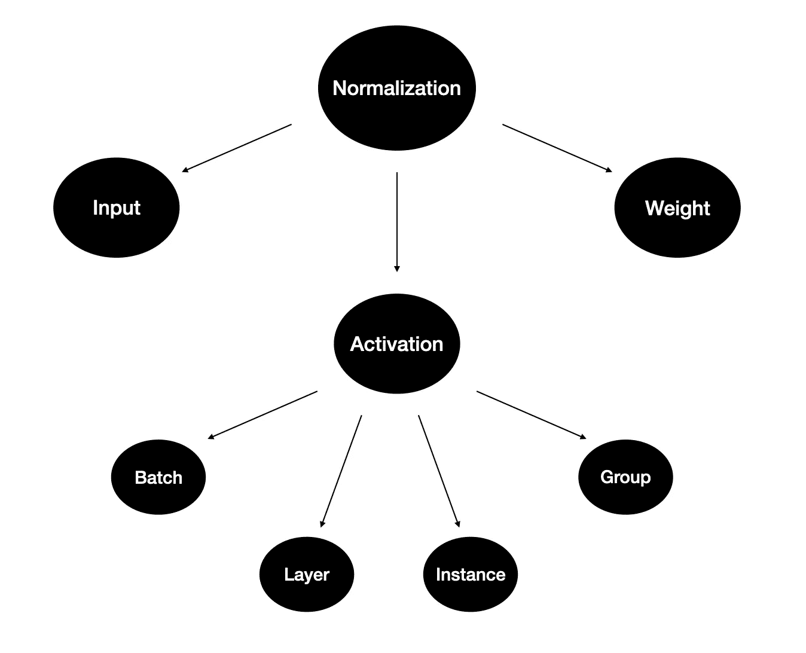

不同类型的标准化

在这篇博客中，我将使用类比和形象化的方法来回顾每一种方法，这将帮助你理解它们背后的动机和思维过程。

# 为什么要正常化？

假设我们有两个特征和一个简单的神经网络。一个是范围在 0 到 65 的**年龄**，另一个是范围在 0 到 10 000 的**工资**。我们将这些特征输入模型并计算梯度。

n —示例

不同规模的输入导致不同的权重更新和优化步骤的最小值。这也使得损失函数的形状不成比例。在这种情况下，我们需要使用**较低的学习速率**以避免超调，这意味着学习过程较慢。

解决方案是输入标准化。它通过**减去**平均值**(居中)并除以**标准偏差**来缩小特征。**

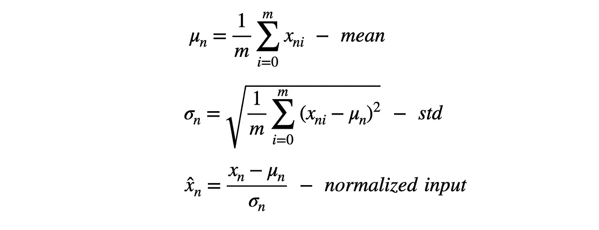

n —示例

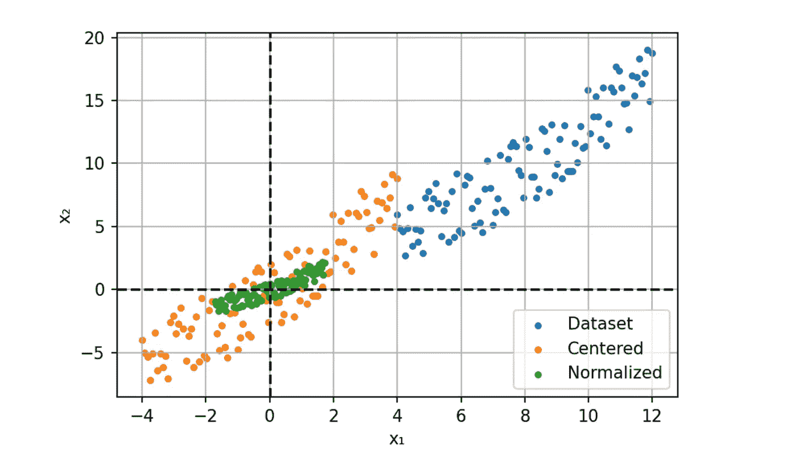

这个过程也被称为'*白化*，其中值具有 0 均值和*单位*方差。它提供**更快的收敛**和更**稳定的训练**。

这是一个如此简洁的解决方案，那么我们为什么不将网络中每一层的激活规范化呢？

# 激活

## 批量标准化

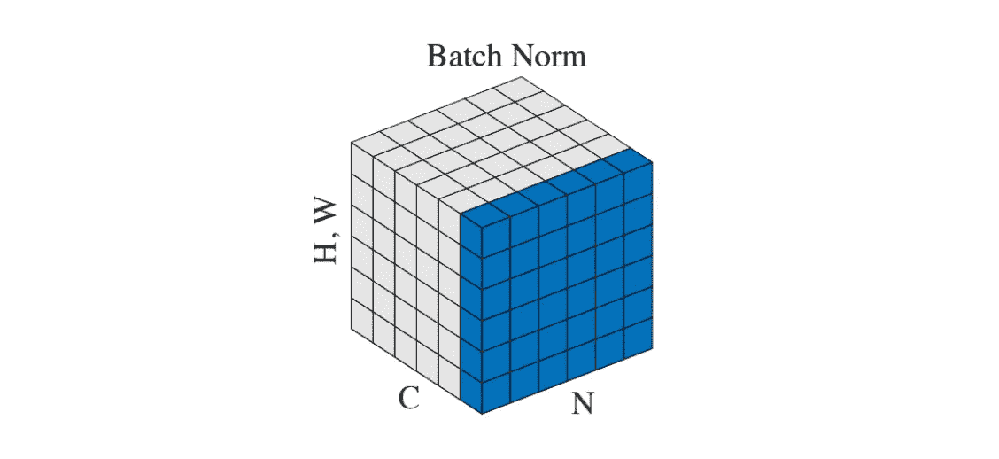

N —批次，C —通道，H，W—空间宽度和高度。[来源](https://arxiv.org/pdf/1803.08494.pdf)

2015 年，Sergey Ioffe 和 Christian Szegedy[3]提出了解决内部协变量转换问题的想法。用简单的英语来说，这意味着输入层分布**由于权重更新而不断变化**。在这种情况下，下一层总是需要适应新的分布。导致收敛较慢，训练不稳定。

批量标准化提供了一种方法，即**控制**和**优化**每一层之后的分布。该过程与输入归一化相同，但是我们添加了两个**可学习的**参数， **γ** 和 **β** 。

我没有把所有的数学方程式放进去，而是创建了一些代码片段，我觉得这些代码片段可读性更强，也更直观。

这两个参数是使用反向传播沿着网络学习的。它们通过**缩放** (γ)和**移动** (β)激活来优化分布。

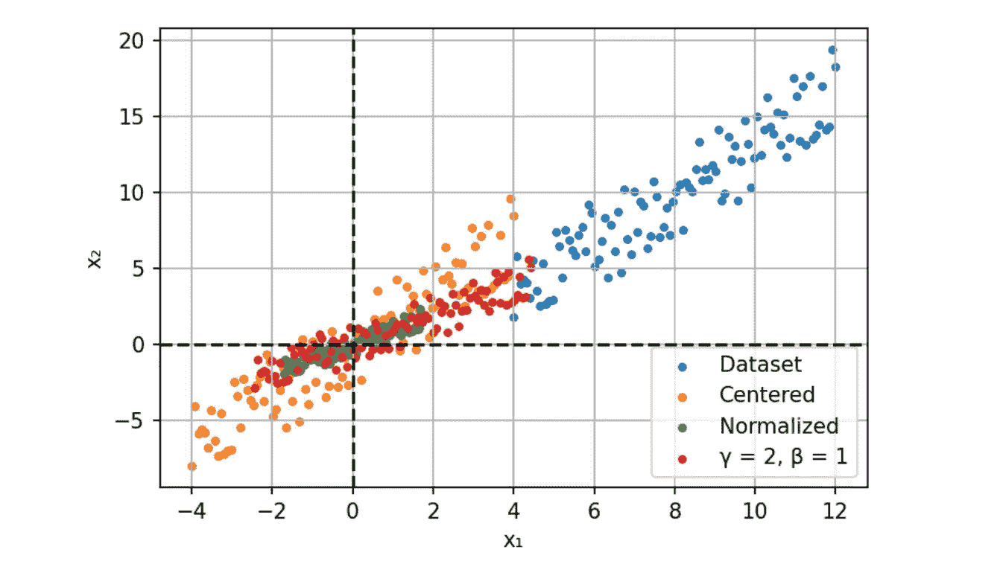

伽玛和贝塔效应

由于我们有固定的分布，我们可以增加学习率和加快收敛。除了计算上的提升，BN 还作为一种**正则化**技术。数据集统计数据近似值产生的噪声消除了漏失需求。

但这是一把双刃剑。这种估计只适用于较大的批量。当示例数量较少时，性能会急剧下降。

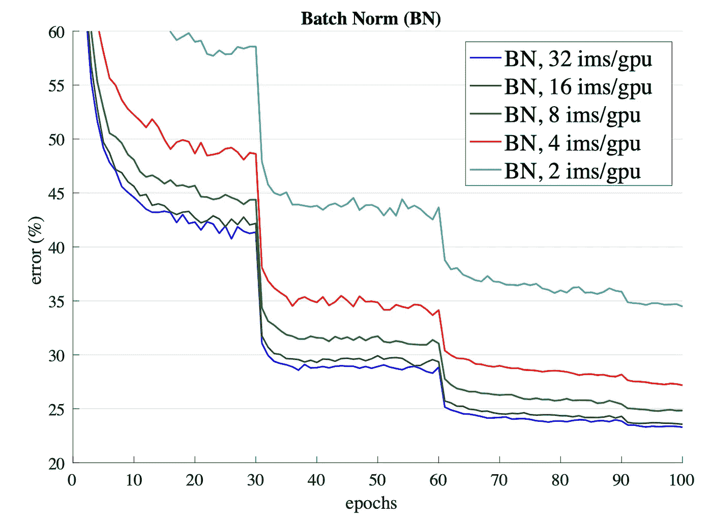

ResNet50 验证的错误。[来源](https://arxiv.org/pdf/1803.08494.pdf)

BN 的另一个缺点是**测试时间**。我们以自动驾驶汽车为例。你传递的是行驶过程中摄像机记录的单帧，而不是一批图像。在这种情况下，网络必须使用预先计算的训练均值和方差，这可能会导致**不同的结果**。

这个问题的重要性促使社区创建替代方法来避免对批处理的依赖。

## 图层规范化

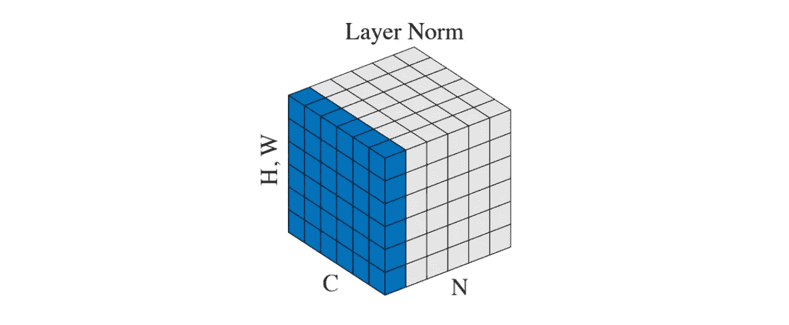

[来源](https://arxiv.org/pdf/1803.08494.pdf)

这是 Geoffrey E. Hinton 等人在 2016 年[4]首次尝试减少批量约束。主要是因为递归神经网络，不清楚如何将 BN 应用于它们。

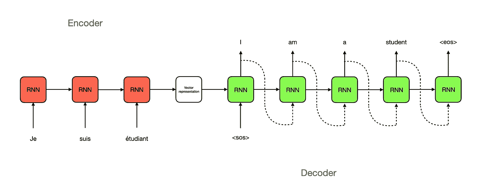

RNN 建筑

在深度神经网络中，很容易存储每个 BN 层的统计数据，因为层数是固定的。然而，在 RNNs 中，输入和输出形状的长度不同。因此，在这种情况下，最好使用单个时间步长(示例)的统计数据进行归一化，而不是整个批次。

在此方法中，batch(N)中的每个示例都在[C，H，W]维度上进行归一化。像 BN 一样，它可以加速和稳定训练，但是没有批量的限制。此外，该方法可用于批次等于 1 的**在线学习**任务。

## 实例规范化

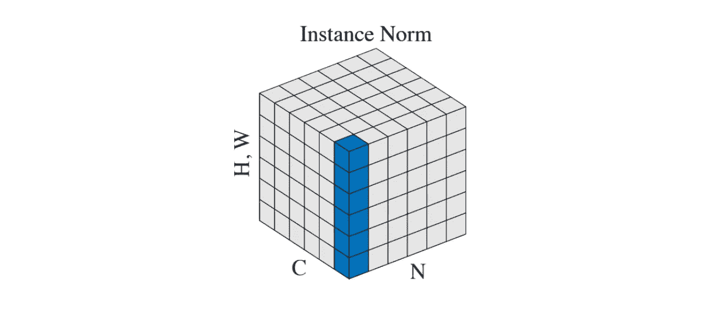

[来源](https://arxiv.org/pdf/1803.08494.pdf)

Dmitry Ulyanov 等人在 2016 年的论文[5]中介绍了实例标准化。这是减少对批处理的依赖以改善**样式传输**网络的结果的另一种尝试。

跨批次和通道的标准化允许从图像中移除特定的对比度信息，这有助于**一般化**。

这种方法在像 Pix2Pix 或 CycleGAN 这样的**生成**模型中流行起来，并成为著名的 StyleGAN2 中使用的自适应实例规范化的先驱。

## 群体规范化

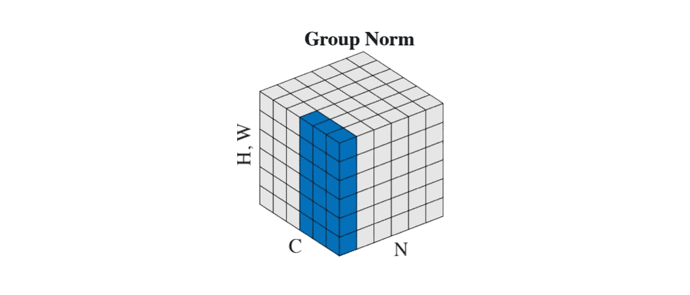

[来源](https://arxiv.org/pdf/1803.08494.pdf)

2018 年[1]的论文中介绍了组标准化，它直接解决了 CNN 的 BN 限制。主要指责是**分布式学习**，批量拆分成很多机器。这些都是在少数例子上训练出来的，比如 6-8，在某些情况下，甚至是 1-2。

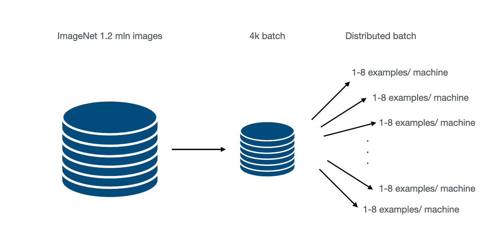

分布学习

为了解决这个问题，他们引入了层和实例规范化的混合。GN 将通道分成**组**并在它们之间进行标准化。这种方案使得计算与批量大小无关。

GN 优于在小批量上训练的 BN，但是不能胜过大批量的结果。然而，这是一个很好的起点，导致了另一种方法，它与 GN 相结合，超过了 BN 的结果。

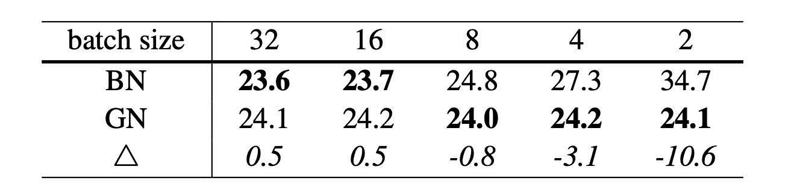

ResNet-50 在 ImageNet 上的验证错误。[来源](https://arxiv.org/pdf/1803.08494.pdf)

# 砝码

## 重量标准化

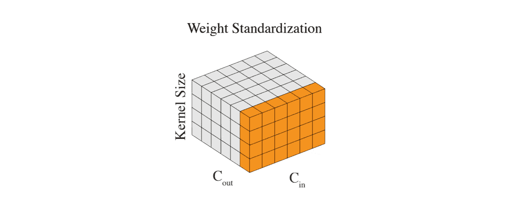

[来源](https://arxiv.org/pdf/1903.10520.pdf)

我们已经标准化了输入和层输出。唯一剩下的就是重量。它们可以不受任何控制地**变** **大**，尤其是当我们无论如何都要标准化输出的时候。通过标准化权重，我们实现了更平滑的损失景观和更稳定的训练。

正如我之前提到的，体重标准化是群体标准化的绝佳伴奏。将这些方法结合起来比每台机器仅使用一个样品的 BN(大批量)产生更好的结果。

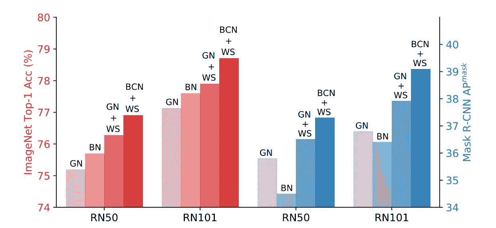

红色代表 ImageNet，蓝色代表 Coco 数据集。[来源](https://arxiv.org/pdf/1903.10520.pdf)

他们还提出了被称为批量通道标准化的 BCN 方法。简而言之，每一层同时使用 BN 和 GN。

# **结论**

规范化是深度学习中的一个基本概念。它加快了计算速度并稳定了训练。这些年来发展了许多不同的技术。希望您已经理解了它们背后的潜在思想，并且现在已经确定地知道了为什么以及在您的项目中何处使用它们。

查看我的 [**中型**](https://maciejbalawejder.medium.com/) 和 [**Github**](https://github.com/maciejbalawejder) 简介如果你想看我的其他项目。

# 参考

[【1】](https://arxiv.org/pdf/1803.08494.pdf)分组归一化

[【2】](https://arxiv.org/abs/1903.10520)批次通道归一化和权重标准化的微批次训练

[【3】](https://arxiv.org/pdf/1502.03167.pdf)批量规格化:通过减少内部协变量转移加速深度网络训练

[【4】](https://arxiv.org/pdf/1607.06450.pdf)图层归一化

[【5】](https://arxiv.org/pdf/1607.08022.pdf)实例规范化:快速风格化缺少的要素

[【6】](https://arxiv.org/abs/1512.03385)用于图像识别的深度残差学习