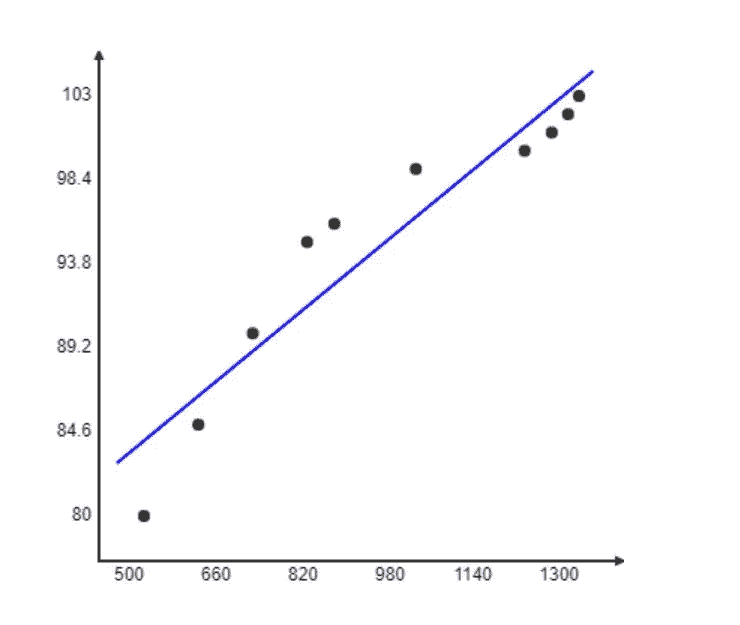
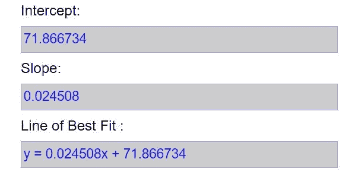

# 简单线性回归概述

> 原文：<https://medium.com/nerd-for-tech/overview-of-simple-linear-regression-d51cd1205def?source=collection_archive---------0----------------------->

在统计学中，线性回归是两个变量之间因果关系的线性近似。这个模型有一个自变量和一个因变量。只有一个因变量的模型称为简单线性回归。

线性回归用于预测、预报和减少误差。

该模型还可以用来建立解释变量和响应之间的量化关系。

这个模型可以解释为，

这里 Y '是预测值(因变量)

x 是独立变量

b 是常数

a 是估计误差

*注:回归线的(y-y')**2 值是线性回归模型中最小的。* *换句话说，回归线是最接近观察值的线。*

让我们通过一个例子来理解这个模型:

有一家很受欢迎的冰淇淋店召开了一次高管会议，会上突然激增的销售额引起了他们的注意，他们试图了解原因。他们发现温度的上升导致了他们销售额的增加。他们试图利用这些信息来预测他们的业务。现在，当他们试图量化变量之间的关系时，线性回归模型出现了。

在这里，温度和销售额之间的关系可以使用这个回归模型来定义，这反过来又帮助他们预测他们的销售额。

如果使用这些变量为样本信息绘制图表，则如下所示:

*注意:在构建模型时，始终要考虑变量的度量单位。*

从上图可以看出，温度和销售额之间建立了一种量化的关系，并且可以根据温度来预测销售额。

尽管预测中存在误差，但简单线性回归是机器学习中最基本和最有用的模型，因为它能有效地建立变量之间的量化关系，这有助于预测和预报。

*原载于 2020 年 9 月 7 日 https://www.numpyninja.com**[*。*](https://www.numpyninja.com/post/overview-of-simple-linear-regression)*