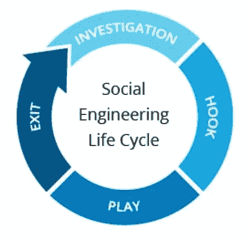
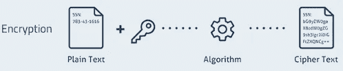
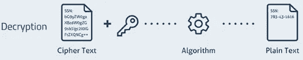

# 社会工程概述

> 原文：<https://medium.com/nerd-for-tech/overview-of-social-engineering-5d94530a96cf?source=collection_archive---------13----------------------->

由 [Unsplash](https://unsplash.com?utm_source=medium&utm_medium=referral) 上的 [vipul uthaiah](https://unsplash.com/@vipul_uthaiah?utm_source=medium&utm_medium=referral) 拍摄的照片

**社会工程**是一种通过利用**人类弱点来影响个人以获取**机密信息**如密码、银行详情等的艺术。这些攻击不是利用技术漏洞，而是利用人类的弱点，如感情、信任和习惯，来获取人们的机密信息。尽管这不如其他网络攻击策略先进，但社会工程会对受害者造成严重伤害。**

# 社会工程是如何工作的？

社会工程骗局主要关注人们如何思考和行为。一旦攻击者知道是什么触发了用户的操作，他们就可以很容易地操纵它们。大多数社会工程骗局依赖于攻击者和受害者之间的直接沟通。攻击者不会使用暴力破解数据，而是试图说服用户妥协。

以下是典型社会工程攻击循环中的步骤:

社会工程生命周期

**调查:**攻击者会选择一个受害者，对他们进行背景调查，确定一种攻击方式。

**Hook:** 攻击者会通过建立关系，获得信任来拉近与受害者的距离。

**玩法:**一旦发展关系，攻击者就会操纵受害者，获取必要的信息。

**退出:**当攻击者收到必要的信息或者用户执行了想要的动作，攻击者就会结束与受害者的交流，转移到新的目标。

> **为什么是社会工程？如果攻击者知道你在用你女朋友的名字作为你的密码，他很容易得到你的密码，而不是通过高级技术黑客来破解你的密码。😜**

# 流行的社会工程攻击

## 网络钓鱼攻击

网络钓鱼攻击者会伪装成值得信任的组织或个人，以迫使您透露个人信息。这种方法包括向大量人员随机发送欺骗电子邮件、电话或短信，要求他们提供机密信息。为了欺骗人们放弃密码和其他个人信息，他们的通信将看起来来自合法的组织。无论是直接交流还是通过虚假的网站形式，您分享的任何内容都会直接进入骗子的口袋。

## 鱼叉网络钓鱼

这是一种更具针对性的网络钓鱼骗局，攻击者以特定的人或公司为目标。然后，他们进行背景研究，并根据受害者的特征、职位和联系方式定制他们的信息，以建立信任，使他们的攻击不那么透明。

## 稀缺软件

Scareware 是一种通过发送虚假警报并以虚构的攻击威胁受害者来操纵受害者的技术。用户被愚弄，相信他们的设备感染了病毒，并被要求下载和安装没有实际好处的软件(除了对攻击者)。当用户单击链接或安装软件时，攻击者就可以访问用户的数据。

## 下料

诱饵攻击使用诱饵通过引发受害者的好奇心来引诱他们。诱饵是用于窃取受害者机密信息的实物或非实物物品，如 pendrives、带有公司标志的 CD 等。攻击者将诱饵留在公共区域，如停车场、浴室等。一旦受害者出于好奇拿起诱饵并将其注入工作或家用电脑，该设备就会自动感染恶意软件。

## 托辞

通过冒充同事、警察、银行职员或其他有知情权的人，攻击者通常会获得目标的信任。攻击者会假装他们需要受害者的机密信息来完成一项关键任务。攻击者将通过说出一系列非常详细的谎言来获取机密信息。

# 社会工程预防

每个组织都有人性的一面。人类天生好奇，有时会在情感的引导下做出轻率的决定。因此，知道如何避免社会工程攻击非常重要。以下是防止社会工程攻击的几个步骤。

1.  **不要打开来自未知发件人的电子邮件或附件** —如果您不认识发件人，您无需回复。即使你认识他们并怀疑他们的信息，你也可以仔细检查并确认来自其他来源的信息，比如电话。
2.  **使用多元认证** —用户凭证是对攻击者最有用的信息之一。多因素身份验证有助于保护您的帐户，如果攻击者知道您的凭据的一个因素，就可以阻止他访问您的帐户。
3.  **使用强密码(和一个密码管理器)**——你的每个密码都应该是独一无二的，不容易被猜到。尽量使用各种字符形式，如大写字母、数字和符号。确保您的密码包含 8 个以上的字符(随着长度的增加，强密码也会增加)。您可以使用密码管理器来安全地存储和记住您的所有自定义密码。
4.  避免分享你的第一位老师、宠物、出生地或其他个人信息。 — 您可能无意中泄露了您的安全问题的答案或部分密码。如果您的安全问题很容易记住但不正确，您会发现攻击者很难访问您的帐户。
5.  **非常谨慎地建立网上友谊。** —虽然互联网可以成为与世界各地的人们联系的有用工具，但它也是社交工程攻击的流行平台。
6.  在公共场所不要让你的电脑不上锁。永远确保你的电脑和移动设备被锁定，尤其是当你在工作的时候。在机场和咖啡店等公共场所使用手机时，请始终将手机拿在手中。

# 开发人员如何保护他们客户的密码？

无论用户如何保护他们的密码，**由于缺乏经验的开发人员构建的系统存在漏洞**，用户的密码最终可能会落入攻击者手中。黑客会发现，如果密码存储在没有修改的纯文本**中，窃取数据会容易得多。密码保护应由开发人员妥善处理。开发人员有许多保护客户密码的选择。有些是，**

1.  加密
2.  散列法

让我们简单看一下每一个。

## 加密

加密是一种将数据转换成不可读格式的方法。转换后的不可读形式称为**密文**。这个密码文本与原始信息不同，它是一个完全不同的信息。加密算法使用**加密密钥**从纯文本生成密码文本。由于发送者使用加密算法，并以密码文本的形式发送他们的数据，黑客将无法读取这些数据。

加密机制—图片 by- [guru99](https://www.guru99.com/difference-encryption-decryption.html)

当我们加密某个东西时，我们可以解密它，并在稍后读取原始消息。解密是将密文转换成人类或计算机可读的明文的过程。

解密机制—图片 by- [guru99](https://www.guru99.com/difference-encryption-decryption.html)

## 散列法

哈希是加密中使用的单向计算。它们接受任意长度的数据串，并总是返回一个预定长度的输出。这个输出被称为**“哈希值”**。无论您输入的是 1000 个字母还是 2 个字母，哈希值的长度都是相同的。

因为这些函数不使用键，所以给定输入的结果总是相同的。因此，如果两个哈希值相同，那么真实文本也相同。因此，在将密码存储为哈希值时，如果两个人具有相同的哈希值，则他们拥有相同的密码。为了避免这个缺点，引入了**加盐**。

Salting 是一种在散列之前将一段**随机数据**应用于现有密码的方法。盐指的是应用的随机数据。当算法生成 salt 时，它为每个密码生成一个**唯一 salt** 。所以密码将在最后用加盐值散列。因此，在一天结束时，每个密码都有唯一的哈希值。

# 参考

 [## 什么是社会工程？

### 社会工程是一种操纵，哄骗某人放弃机密信息，如…

www.forcepoint.com](https://www.forcepoint.com/cyber-edu/social-engineering)  [## 什么是社会工程|攻击技术和预防方法| Imperva

### 社会工程是一个术语，用于描述通过人类互动完成的各种恶意活动…

www.imperva.com](https://www.imperva.com/learn/application-security/social-engineering-attack/)  [## 什么是社会工程？

### 社会工程是一种操纵技术，利用人为错误来获取私人信息、访问权或…

www.kaspersky.com](https://www.kaspersky.com/resource-center/definitions/what-is-social-engineering)