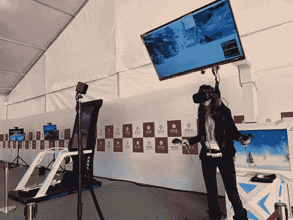
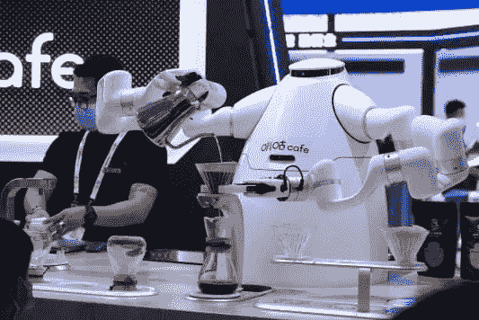

# 第四届中国国际进口博览会综述:从 VR、AR 到机器人自动化

> 原文：<https://medium.com/nerd-for-tech/overview-of-the-4th-china-international-import-expo-from-vr-ar-to-robot-automation-5e3f1645b19c?source=collection_archive---------5----------------------->

[http://www.45fan.com/article.php?aid = 19110559151923265726704040](http://www.45fan.com/article.php?aid=19110559151923265726704040)

从精彩的娱乐体验到工业制造的自动化浪潮，高科技的影响力抓住了人们的好奇心。

第四届中国国际进口博览会于 2021 年 11 月 5 日在上海举行。展会期间，国内外企业带来的一些高科技产品一一亮相。

## **VR 和 AR**

你可以戴上一副眼镜和一副控制器，进入实际的音乐场景，体验打鼓的乐趣。在博览会上，高通带来了虚拟现实(VR)产品。其中，搭载 Primulon XR2 平台的 Pico Neo 3VR 一体机推出了全新的游戏世界，让很多人体验了一把。

高通所在的集成电路区是博览会的亮点。据了解，该板块展览规模超过 7000 平方米，涵盖上游材料、中游加工、下游应用领域，三星、Asimer、高通等知名企业参展。

## **机器人自动化**

在这次博览会期间，许多公司将常见的制造场景搬到了展厅。日本工业机器人制造商 NACHI 展示了超大型重型搬运机器人和细长臂协作机器人等各种产品。多个机器人产品，激光切割，来自深圳的制造，韩的机器人有限公司也在展厅中可见。这些产品的落地离不开技术和场景的结合。

[https://new.qq.com/rain/a/20210528a06xc400](https://new.qq.com/rain/a/20210528a06xc400)

2.2 号馆里，两个外形各异的咖啡机器人正忙着冲咖啡，挥舞着机械臂。空气中收集的压缩氮气通过专门开发的设备被冲入冷煮的咖啡中。密集的气泡向上翻腾。虽然没有加牛奶，但是口感同样的浓稠爽滑。

“机器人承担了 70%的工作，员工主要负责准备材料和服务客户。一个人一台机器，50 秒就能生产出一种饮料。”创始人陈小波希望建立一个移动咖啡馆，并开发新技术来提高效率和客户体验。

过道的另一边是一个全自动的咖啡屋。通过补充咖啡豆、水等物料，可以实现无人值守运行。大厅的许多角落都有这样的机器人。在咖啡领域，更多细分类型的机器人正在推出。

两个六轴机械臂可以控制机器人的力量抓取纸杯，完成冲泡咖啡的动作。“根据咖啡种类，我们设定冲泡时间和曲线，精确制定程序，让咖啡口感稳定、品质上乘。”东帝汶国家馆的执行主任说:“在同样的时间内，机器人可以比工作人员多煮两杯咖啡，并且可以 24 小时提供服务。

## 人工智能对高质量数据的依赖

人工智能行业有一个重要共识:

训练数据的质量直接决定了最终 AI 模型的性能。数据的可伸缩性和准确性越高，算法就越稳健。

随着 AI 商业化进程的加快，以及辅助驾驶、客服聊天机器人等 AI 技术在各行各业的应用，人们对特殊场景下的数据质量的期望越来越高。高质量的标签数据将是人工智能公司的核心竞争力之一。

如果说之前的算法模型使用的一般数据集是粗粮，那么算法模型目前需要的是定制的营养餐。如果公司想要进一步提高某些模型的商业化，他们必须逐步从通用数据集向前发展，以创建独特的数据集。

# 结束

将你的数据标注任务外包给 [ByteBridge](https://tinyurl.com/mr3vkujy) ，你可以更便宜更快的获得高质量的 ML 训练数据集！

*   无需信用卡的免费试用:您可以快速获得样品结果，检查输出，并直接向我们的项目经理反馈。
*   100%人工验证
*   透明标准定价:[有明确的定价](https://www.bytebridge.io/#/?module=price)(含人工成本)

**为什么不试一试？**

来源:

1 https://www . 163 . com/dy/article/go 4j 10 kr 0552 k5u 1 . html 2 https://Baijia Hao . Baidu . com/sid = 1715817678398204409 & wfr = spider & for = PC