# OWASP 果汁店:第一层

> 原文：<https://medium.com/nerd-for-tech/owasp-juice-shop-level-1-2bb04f14375b?source=collection_archive---------2----------------------->

# 找到计分板

使用 [OWASP Juice Shop GitHub 库](https://github.com/bkimminich/juice-shop#deploy-on-heroku-free-0month-dyno)在 Heroko 上创建应用程序后，第一个任务是找到计分板。从最初的应用程序漫游提示来看，很明显我必须查看网页的源代码和其他 JS 文件。因此，我从源代码开始，搜索各种术语，如 *dash、dashboard、score* 和 *scoreboard* ，但什么也没找到。接下来要看的是 JS 文件。

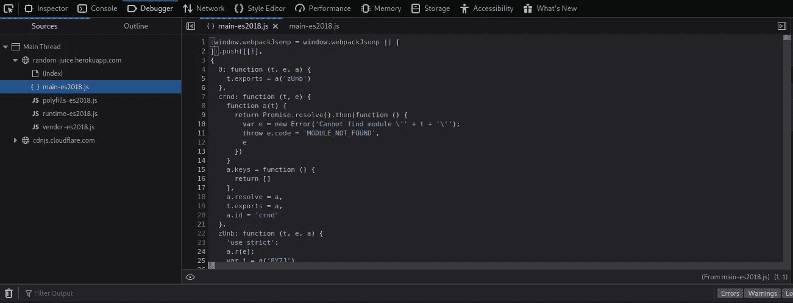

第一个可以看到的文件是`main-es2018.js`。当我们**再次搜索像 *dash、dashboard、score* 和 *scoreboard*** 这样的术语时，我们可以在这里找到一些结果。

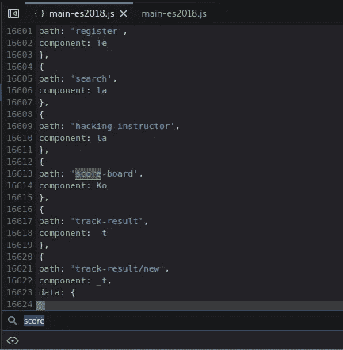

> 尽可能尝试搜索半个术语，因为如果我们在这里搜索“记分牌”，我们不会找到任何结果，因为还有一个连字符！

# 给商店一个毁灭性的零星级反馈

每当我们遇到任何要求我们给出一些评级的平台时，都有一个最小值和一个最大值。在果汁店的情况下，最小值为 1，最大值为 5，我们被要求给 0 分。

要完成这项任务，我们需要从左侧菜单进入[客户反馈页面](https://random-juice.herokuapp.com/#/contact)。一旦在页面上，我们可以写评论，并解决验证码的价值。

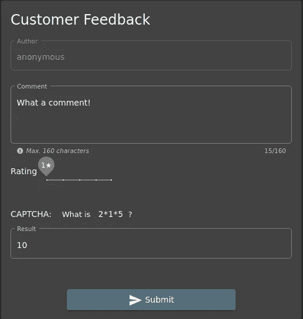

但是我们不能输入低于 1 的评分。但是我们肯定可以使用 Burp Suite 通过**拦截和修改正在传递的值**来动态修改值。

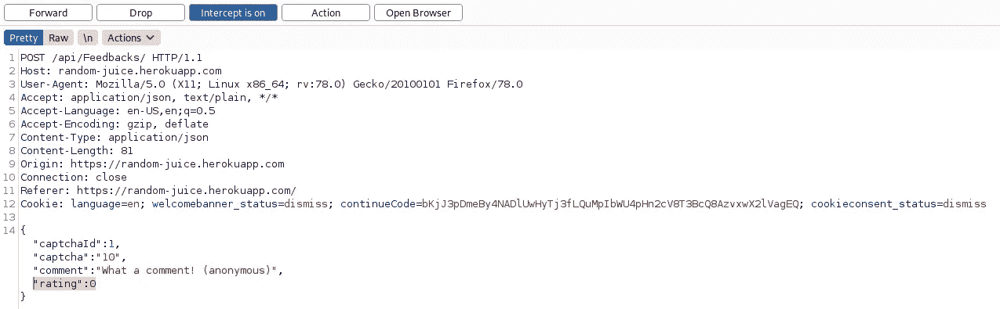

现在，当我们转发此请求时，已发送的额定值为 0。

**外卖:**

*   **这表明服务器没有验证评级值，在这种情况下，客户端验证是完全可信的，可以很容易地绕过。**

# 阅读我们的隐私政策

为了解决这个挑战，我们可以首先尝试探索网站上的每一个可能的链接，因为隐私政策的链接通常会在一些菜单中或网页的底部提供。但在这种情况下，我们找不到任何直接链接(剧透:如果你还没有登录！).因此，我们可以再次采用我们在寻找记分牌时采用的相同方法，开始在源代码和 JS 文件中寻找术语 *privacy* 。

在源代码中，我们什么也找不到，但是在`main-es2018.js`文件中，我们可以看到术语 *privacy* 的多个结果。仔细查看结果，我们可以发现两条路径:

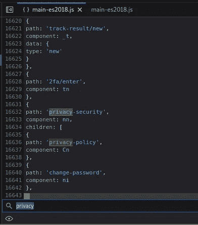

现在，如果我们仔细观察，可以发现页面`privacy-policy`是`privacy-security`的子页面。因此，要访问隐私政策，我们需要访问链接:[https://random-juice . heroku app . com/#/* * privacy-security/privacy-policy](https://random-juice.herokuapp.com/#/**privacy-security/privacy-policy)。**

> 如果您已登录，可以在右上角的“帐户”选项卡下找到隐私和安全相关信息

**外卖:**

*   **隐私政策等重要信息应放在易于获取的位置，因为这些是重要的链接。**

# 查阅机密文件

同样，对于这个任务，我们需要从其他工具获得帮助，例如 [FFUF](https://github.com/ffuf/ffuf) 。我们可以在域上运行目录遍历攻击，以获得一些有趣目录的列表。然后我们可以开始探索这些目录，看看它们是否包含一些机密文件。

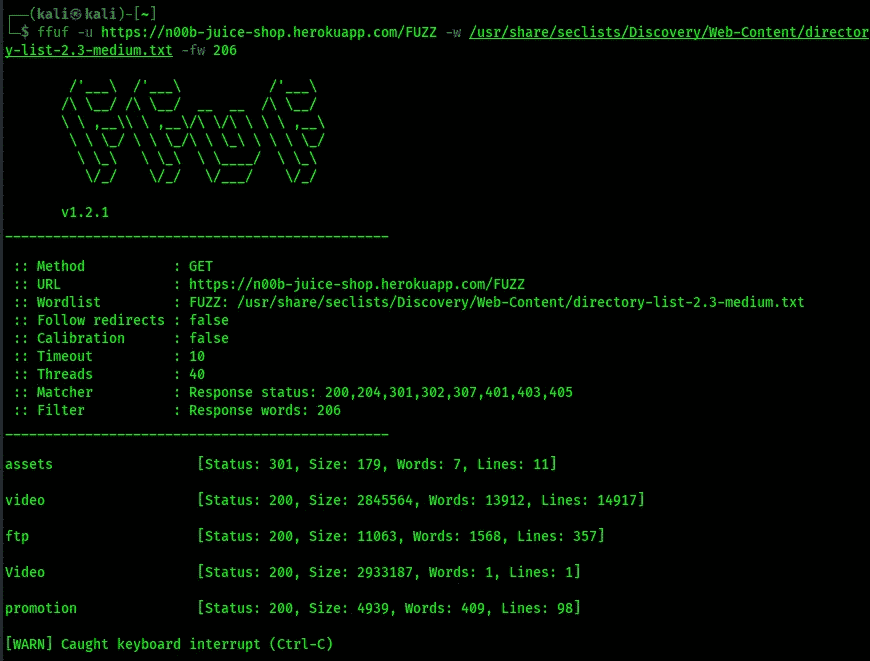

> `-fw` 用于过滤字数为 206 的结果，因为即使目录不存在，服务器也会返回 200 的响应。但是对于所有这些不存在的页面，200 响应的字数是 206。

在这里，我们可以看到一个名为`ftp`的目录被检测到。在浏览目录时，我们可以找到许多存储在那里的文件。我们可以试着把它们一个一个打开，检查它们是否包含一些机密信息。

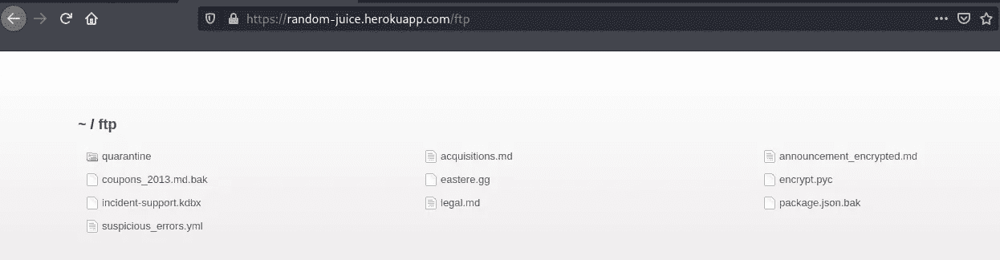

在所有这些文件中，名为`[acquisitions.md](<http://acquisitions.md>)`的文件包含一行文字说明**这是一份机密文件**。

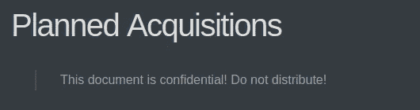

**外卖:**

*   **机密文件不应存放在此类公开目录中。**
*   **必须正确实施访问控制，以便非预期用户可以访问此类文件。**

# 引发了一个处理得既不优雅也不一致的错误

在同一个`/ftp`目录下，当打开所有文件时我们可以找到一个名为`coupons_2013.md.bak`的文件。当我们试图打开这个文件时，它抛出一个错误，只说明。md 和。允许 pdf 文件。

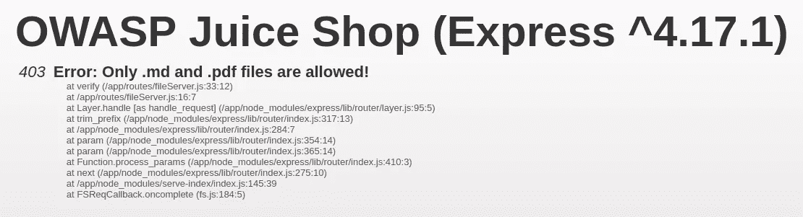

**外卖**

*   必须妥善处理错误。应该通过实现在配置级别处理的全局错误来向用户返回一般响应。
*   与此同时，所有此类错误都应该记录下来，只有必要的管理员才能访问。

# 注册用户时遵循 DRY 原则

**干代表不重复自己。**如果我们查看注册页面，我们会发现我们需要重复两次密码。所以，也许我们需要以某种方式绕过它。

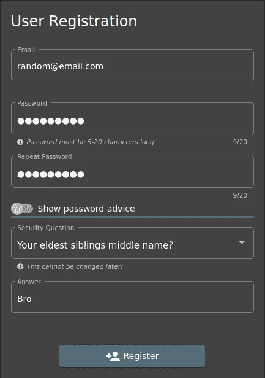

同样，要做到这一点，我们可以使用 Burp Suite 并修改我们的请求，就像我们处理评级值的情况一样。我们需要做的就是拦截 Burp Suite 上的注册请求，并修改两个值之一，即*密码*或*密码重复*。

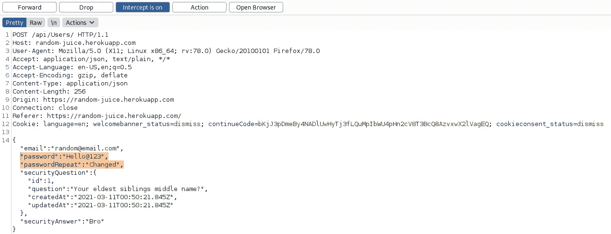

现在，当我们转发这个请求**时，即使两个密码值不同，它也会被接受**。

**外卖**

*   **输入不仅要在客户端进行验证，还要在服务器端进行验证。**
*   **信任客户不是一种好的做法。**

# 让我们将您重定向到我们的一个加密货币地址，该地址不再促销

同样，我们可以采用相同的方法来搜索加密相关的关键字，如*bit、crypto、currency、coin 等。* * * * *通过源代码和 JS 文件。由于过去在`main-es2019.js`文件中查找链接，我们可以直接只从那个文件开始搜索这些关键字。

在那里，我们可以找到多个关于术语 *bit 的**结果，其中一个还包含一个比特币钱包的 URL**。*

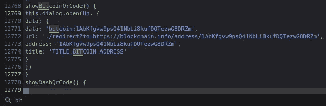

# 找到为流行的监控系统收集的使用数据提供服务的端点

这里，我们给出了一个名为 [Prometheus](https://github.com/prometheus/prometheus) 的系统和服务监控系统的参考链接。我们可以直接在谷歌上搜索“Prometheus endpoints ”,然后进入它的[文档页面](https://prometheus.io/docs/prometheus/latest/getting_started/#starting-prometheus),在这里我们可以发现所有的指标都可以在`localhost:9090/metrics`访问。所以，可以做同样的事情并尝试**访问******其中提供了使用数据**。**

****外卖:****

*   ****不应直接访问系统指标的重要链接。****
*   ****访问控制应该到位，以确保只有被允许的用户才能访问此类关键信息。****

# **从支持聊天机器人接收优惠券代码**

**即使浏览了所有可用的链接，我们也找不到聊天机器人的任何链接。因此，它可能只对已登录的用户可用。因此，我们可以创建一个帐户，登录并寻找聊天机器人。**

**正如所料，支持聊天选项出现在左侧菜单中。现在，我们的任务是从这个机器人那里得到优惠券。别忘了这个任务有一个*蛮力*的标记。因此，我们可以不断地发送消息*优惠券*一次又一次，看看我们是否能从机器人那里得到一些东西。**

**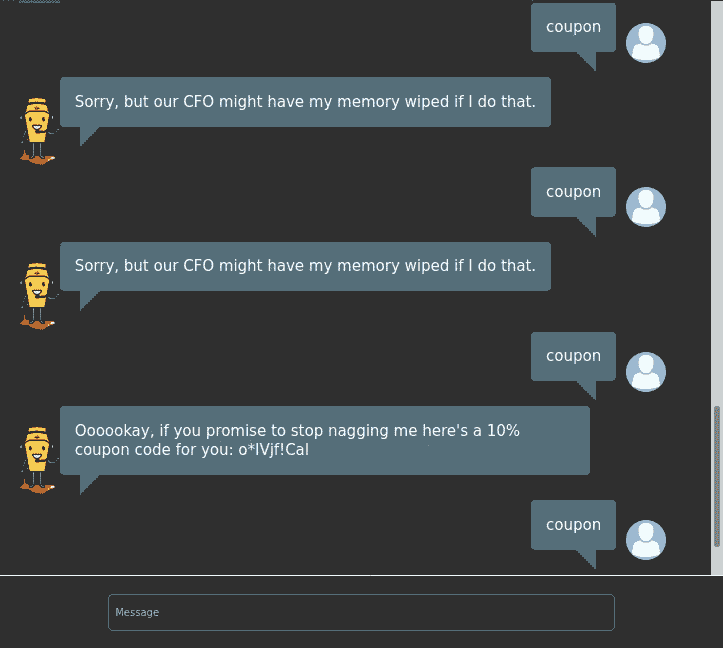**

****外卖:****

*   **聊天机器人背后运行的引擎必须经过适当的训练，并且不应该容易受到任何此类暴力攻击。**

# **用`<iframe src="javascript:alert('xss')">`执行一次多姆 XSS 攻击**

**我们知道，XSS 通常在用户传递一些非法输入时执行。因此，我们需要寻找一些点，在那里我们可以输入提供的有效载荷。**

**我们可以看到，我们有一个搜索栏，可以从中搜索可用的产品。因此，我们可以在那里输入提供的有效载荷，并检查它是否工作。**

**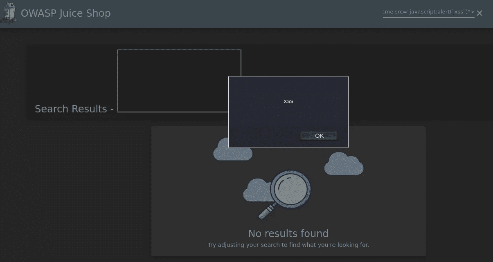**

****外卖:****

*   ****来自用户的输入决不能被信任，因此不应被直接处理。****
*   ****始终对用户输入和字符编码进行净化，以避免此类 XSS 攻击，因为它们可能导致恶意重定向，甚至窃取敏感信息。****

# **在多姆 XSS 挑战赛中使用奖励有效载荷`<iframe width="100%" height="166" scrolling="no" frameborder="no" allow="autoplay" src="[<https://w.soundcloud.com/player/?url=https%3A//api.soundcloud.com/tracks/771984076&color=%23ff5500&auto_play=true&hide_related=false&show_comments=true&show_user=true&show_reposts=false&show_teaser=true>](<https://w.soundcloud.com/player/?url=https%3A//api.soundcloud.com/tracks/771984076&color=%23ff5500&auto_play=true&hide_related=false&show_comments=true&show_user=true&show_reposts=false&show_teaser=true>)"></iframe>`**

**对于这个挑战，我们需要做的就是将提供的有效负载粘贴到搜索栏中，并在理解有效负载如何放置 iframe 的同时收听 song！**

**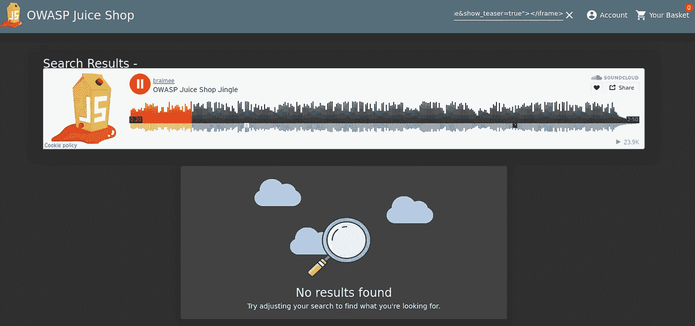**

# **检索比约恩的猫在“近战战斗模式”的照片**

**在浏览所有链接时，我们可以回忆起有一个*照片墙*。我们可以快速转到该页面，看到有一个图像没有正确加载。这似乎是我们需要访问的图像。**

**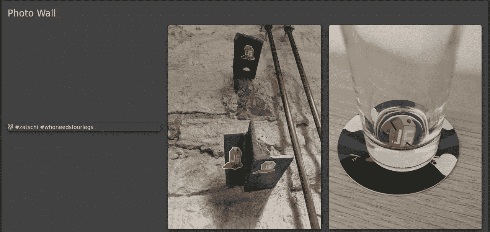**

**我们可以检查源代码，将它的代码与其他图像的代码进行比较，但找不到任何有用的东西。但是，如果我们看得清楚，可以看到图像路径包含表情符号(😼)在里面。这可能是网站无法处理的情况。**

**在谷歌上做了一些研究后，我们可以发现这些被称为 punycodes，它们也可以用在 URL 中。但是我们仍然可以尝试[将这个 punycode 转换成 unicode](https://www.punycoder.com/) ，在图片路径中用 unicode 替换表情符号，然后尝试访问图片。但即使这样也不起作用。**

**这意味着表情符号没有问题，但网址中有其他东西。**

**我们可以搜索“URL 中允许的字符”并找到[这个页面](https://www.urlencoder.io/learn/)，在这里我们可以了解 URL 的不同部分。在这里，我们可以看到字符 hash(#)在 URL 中起着重要的作用，因为它定义了页面上的片段。在我们的文件名中也有两个散列。这意味着浏览器将哈希后的内容解释为页面上的片段。**

**为了解决这个问题，我们需要对散列进行 URL 编码，然后尝试访问该 URL。**

**因此，我们需要做的就是在 URL 中用%24 替换#**,然后我们的 URL 看起来就像这样:****

**[https://random-juice . heroku app . com/assets/public/images/uploads/😼-% 23zatschi-% 23who needs four legs-1572600969477 . jpg](https://random-juice.herokuapp.com/assets/public/images/uploads/%F0%9F%98%BC-%23zatschi-%23whoneedsfourlegs-1572600969477.jpg)**

# **参考链接:**

1.  **OWASP 果汁店 GitHub 资源库:[https://github.com/bkimminich/juice-shop](https://github.com/bkimminich/juice-shop)**
2.  **普罗米修斯 GitHub 库:[https://github.com/prometheus/prometheus](https://github.com/prometheus/prometheus)**
3.  **普罗米修斯文档:[https://Prometheus . io/docs/Prometheus/latest/getting _ started/# starting-Prometheus](https://prometheus.io/docs/prometheus/latest/getting_started/#starting-prometheus)**
4.  **将 Punycode 转换为 Unicode 的工具:[https://www.punycoder.com/](https://www.punycoder.com/)**
5.  **博客上的网址编码:[https://www.urlencoder.io/learn/](https://www.urlencoder.io/learn/)**

**继续第二关挑战:[https://0x nirvana . medium . com/owasp-juice-shop-Level-2-2 EAD 67 a 77 b 5 e](https://0xnirvana.medium.com/owasp-juice-shop-level-2-2ead67a77b5e)**

**一定要看看我在 https://github.com/0xNirvana 的其他作品和评论**