# OWASP 果汁店:第二层

> 原文：<https://medium.com/nerd-for-tech/owasp-juice-shop-level-2-2ead67a77b5e?source=collection_archive---------1----------------------->


完成所有第一关的挑战后，现在是第二关的时候了。第二级的挑战肯定比第一级的要难一些，但是通过努力可以很容易解决。

# 登录到管理员帐户

每当涉及管理时，我们首先想到的应该是默认凭证、简单的 SQLi 或暴力攻击。首先，我们可以转到登录页面，尝试一些基本用户名和密码的组合，例如:

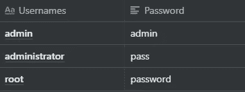

但显然这些都不起作用。因此，我们可以尝试一些简单的 SQLi，比如:

```
1' OR 1=1;
' OR TRUE;
```

这是可行的，所有需要做的就是在用户名中输入任何上述有效负载和任何随机密码(因为它与该有效负载无关)，然后我们登录到 admin 帐户。

所以，这里发生的是:

*   通常，当创建一个用户数据库时，创建的第一个条目属于管理员，当我们输入上面的有效负载时，它的执行有点像:

`SELECT * FROM users WHERE username='1' OR 1=1;' AND password='<passed value>'`

*   其中原始查询类似于:

`SELECT * FROM users WHERE username='<passed username>' AND password='<passed password>'`

*   现在，由于有效载荷中的`OR 1=1`部分，查询结果总是为真。(此外，这将返回存储在表中的第一个条目)
*   下一部分是`;`，这个分号基本上标志着 SQL 语句的结束，其后的任何内容都被视为注释，因此`' AND password='<passed password>`被作为注释处理，而不是检查是否传递了正确的密码。

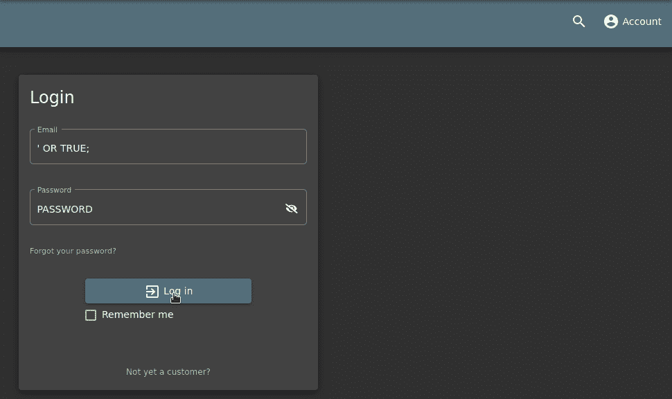

通过一个简单的 SQLi，我们可以以管理员的身份访问。

# 访问商店的管理部分

现在，我们可以访问 administrators 帐户了，我们可以开始寻找 administration 部分了。我们可以直观地检查所有对我们可见的链接，并检查我们是否可以找到到管理部分的链接，但不能找到任何直接的链接。因此，就像一些 1 级任务一样，我们可以去检查`main-es2018.js`文件，看看是否有路径指向管理部分。

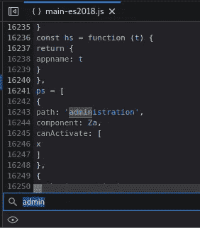

只需简单地搜索“admin”这个词，我们就可以找到管理部分的路径。

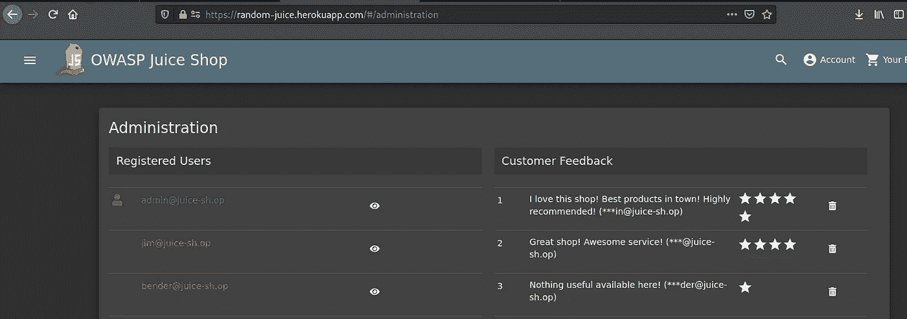

# 消除所有五星级客户反馈

这是一些真正具有破坏性的工作:p .从前面的挑战中，我们能够到达管理部分，在那里我们可以看到所有的客户反馈。现在，我们需要做的就是从管理页面中删除所有的五星反馈！

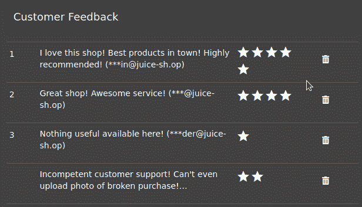

# 在行动之前，表现得像任何“白帽子”应该表现的那样

所以，这个问题的答案看起来非常简单。任何 pentester 在开始 pentest 之前都应该做几件事，它们是:

*   阅读目标的隐私政策
*   通知当局关于圣灵降临节的事
*   开始之前获得适当的批准

对于果汁店，我们可以从第 1 级中的隐私政策页面查看隐私政策。在那里，我们可以找到一封电子邮件，邮件可以发送到那里，但在那里找不到任何与 pentest 相关的内容。即使挖掘了很多，也找不到有用的信息。

但是当我们查看 OWASP 果汁店的官方指南时，他们提到了一个名为`security.txt`的文件。当我们**转到链接:**[**【https://random-juice.herokuapp.com/security.txt】**](https://random-juice.herokuapp.com/security.txt)**时，我们会发现隐私政策中也有相同的细节。**

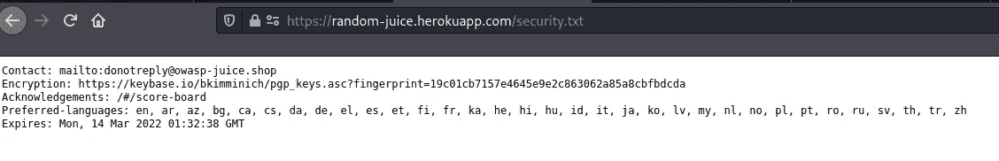

# 使用未正确关闭的不推荐使用的 B2B 接口

现在，我们已经探索了 web 应用程序的整个 UI，我们可以得出一个明确的观点，即该应用程序旨在用于 B2C 目的，即企业对客户。但这里的挑战是找到一个与 B2B 相关的端点，即企业对企业的接口。因此，寻找这一点的最佳方法是对 web 应用程序运行目录遍历攻击，以检查和查找是否有任何页面或门户以前用于任何 B2B 目的。同时，我们可以手动检查 JS 文件中的关键字，如 *B2B、shutdown、closed 等*。

仅通过第一次搜索，我们可以发现有一个为 B2B 订单上传 XML 文件的选项。**因此，我们需要做的就是转到投诉部分，上传任意一个 XML 文件作为发票。**

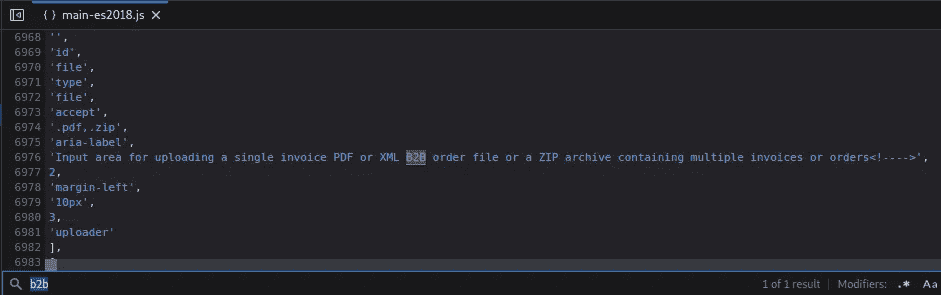

# 查看另一个用户的购物篮

最好的方法是访问别人的购物篮，首先了解我们自己的购物篮是如何装载的。为了进行同样的测试，我们可以在自己的篮子中添加一些项目，然后在访问我们的篮子时拦截流量。

**步骤:**

*   创建一个新帐户，并使用该帐户登录
*   将项目添加到购物篮
*   去篮子那里
*   检查访问篮子链接时产生的流量

在检查访问购物篮时产生的流量时，可以找到一个 URL，其中提到了“ **basket** ”。因此，可能的情况是，它被用来根据传递给它的值访问正确的篮子。

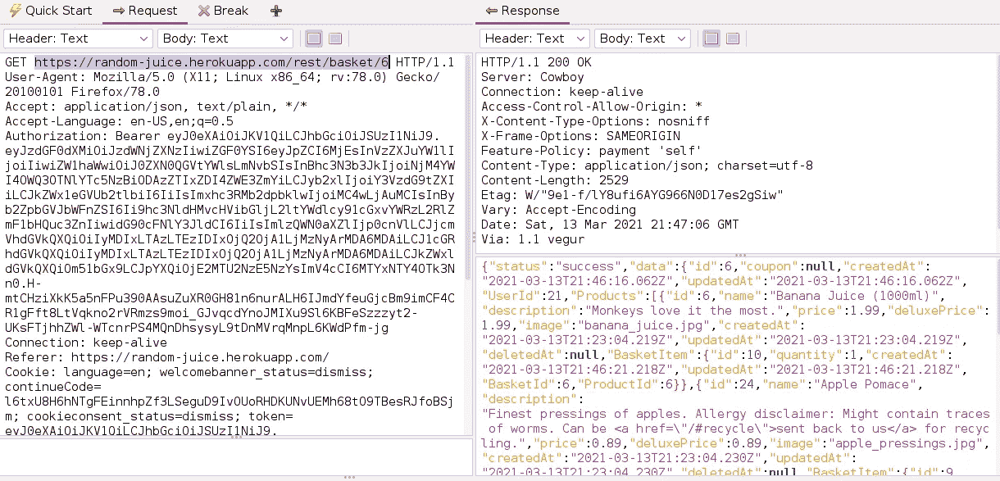

因此，我们可以尝试更改 URL 中`/basket/<value>`旁边的值，并检查我们是否可以访问其他人的购物车。但是当我们试图从浏览器访问 URL 时，它返回 401 错误。

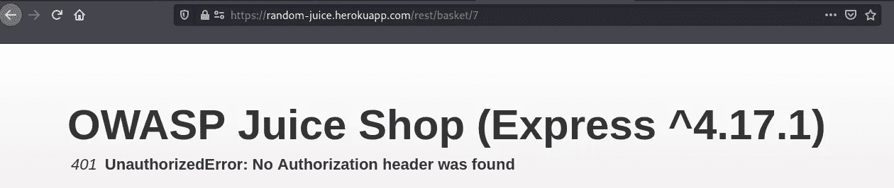

为了解决这个问题，我们可以向购物篮请求添加一个断点，操纵它，转发它，并检查是否返回了其他人的购物篮。

在下面的 GIF 中，篮子首先显示我们自己的篮子。当我们刷新购物篮页面时，请求在 OWASP Zap 上被拦截，我们可以将购物篮值从 6 更改为 1，然后在网页上我们可以看到 1 号购物篮的内容。

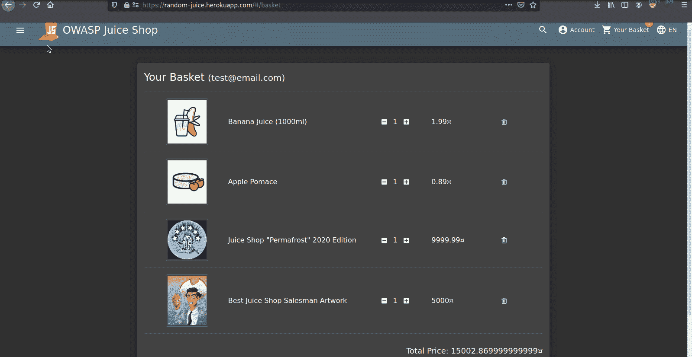

# 使用管理员的用户凭据登录，无需事先更改或应用 SQL 注入

因此，在第一个 2 级挑战中，我们以管理员身份使用 SQLi 登录，但这里 SQLi 不在范围内，我们需要找到该帐户的正确密码。所以，我们唯一的选择就是猜测正确的密码或者强行破解相同的密码。要做到这一点，我们可以通过使用一些默认凭证的列表来运行暴力攻击，从而将这两件事结合起来。

**需要注意的一点是，管理员帐户的用户名是** `**admin@juice-sh.op**` **，这是我们使用 SQLi** 以管理员身份登录时发现的

要执行暴力攻击，可以使用 OWASP Zap。我们需要做的就是捕获一个登录请求，并开始用一个密码列表来模糊密码值。


在那里，我们通过暴力破解获得了管理员帐户的密码。

> *我使用的列表是* `*seclists/Passwords/cirt-default-passwords.txt*` *，可以在*[*https://github . com/danielmiessler/sec lists/blob/master/Passwords/cirt-default-Passwords . txt*](https://github.com/danielmiessler/SecLists/blob/master/Passwords/cirt-default-passwords.txt)找到

# 通过查看 Emma 上传到照片墙的照片来确定她的安全问题的答案，并使用它通过忘记密码机制来重置她的密码

首先，我们需要找到艾玛的电子邮件地址，然后我们才能登录她的帐户。现在我们已经可以访问“**管理部分**”，我们可以从那里获得她的电子邮件地址，然后进入“**忘记密码**”页面，在那里我们可以看到安全问题“你成年后第一次为哪家公司工作？”输入艾玛的邮箱地址后。现在，我们需要从艾玛上传到照片墙上的照片中找到这个问题的答案。


当有图像时，首先想到的是检查它的 Exif 数据。所以，我们可以保存图像并把它传给`exiftool`，检查它是否有一些有用的信息。

```
┌──(kali㉿kali)-[~/Downloads]
└─$ exiftool IMG_4253.png 
ExifTool Version Number         : 12.16
File Name                       : IMG_4253.png
Directory                       : .
File Size                       : 6.0 MiB
File Modification Date/Time     : 2021:03:11 16:18:48-05:00
File Access Date/Time           : 2021:03:13 18:53:26-05:00
File Inode Change Date/Time     : 2021:03:11 16:18:48-05:00
File Permissions                : rw-r--r--
File Type                       : PNG
File Type Extension             : png
MIME Type                       : image/png
Image Width                     : 2270
Image Height                    : 3022
Bit Depth                       : 8
Color Type                      : RGB
Compression                     : Deflate/Inflate
Filter                          : Adaptive
Interlace                       : Noninterlaced
SRGB Rendering                  : Perceptual
Gamma                           : 2.2
Pixels Per Unit X               : 3779
Pixels Per Unit Y               : 3779
Pixel Units                     : meters
Image Size                      : 2270x3022
Megapixels                      : 6.9
```

但是这里找不到有用的信息。我们也可以使用 Yandex 和 Google 图片搜索来找到任何类似的照片，但这张照片没有什么特别的，因此我们可以在反向图片搜索后看到大量与同一栋建筑相似的结果，但没有一张是我们的解决方案。

还有一件事我们可以做，就是目测图像。与此同时，我们可以看到其中一扇窗户上写着“IT Sec”，这可能是我们问题的答案。此外，无法从图像中解读出其他有意义的信息。所以，我们可以试着输入这个作为问题的答案，看看是否可行。它不能直接工作，所以我们可以尝试修改大写字母和空格，然后尝试:

```
IT Sec
ITSec
IT sec
ITsec
```

有效的是“ITsec ”,通过它我们可以更改 Emma 的密码并登录她的账户。

# 通过查看 John 上传到照片墙的照片来确定他的安全问题的答案，并使用该答案通过忘记密码机制来重置他的密码

同样，我们首先需要从管理部分获得约翰的电子邮件地址，然后我们可以检查他的安全问题"**你最喜欢去哪里徒步旅行？**”来自“忘记密码”页面。现在我们知道了问题，我们可以开始分析他上传到照片墙上的图像。

这一次，我们也可以遵循与 Emma 相同的过程，首先检查 Exif 数据。

```
┌──(kali㉿kali)-[~/Downloads]
└─$ exiftool favorite-hiking-place.png 
ExifTool Version Number         : 12.16
File Name                       : favorite-hiking-place.png
Directory                       : .
File Size                       : 651 KiB
File Modification Date/Time     : 2021:03:13 19:10:07-05:00
File Access Date/Time           : 2021:03:13 19:10:07-05:00
File Inode Change Date/Time     : 2021:03:13 19:10:07-05:00
File Permissions                : rw-r--r--
File Type                       : PNG
File Type Extension             : png
MIME Type                       : image/png
Image Width                     : 471
Image Height                    : 627
Bit Depth                       : 8
Color Type                      : RGB
Compression                     : Deflate/Inflate
Filter                          : Adaptive
Interlace                       : Noninterlaced
Exif Byte Order                 : Little-endian (Intel, II)
Resolution Unit                 : inches
Y Cb Cr Positioning             : Centered
GPS Version ID                  : 2.2.0.0
GPS Latitude Ref                : North
GPS Longitude Ref               : West
GPS Map Datum                   : WGS-84
Thumbnail Offset                : 224
Thumbnail Length                : 4531
SRGB Rendering                  : Perceptual
Gamma                           : 2.2
Pixels Per Unit X               : 3779
Pixels Per Unit Y               : 3779
Pixel Units                     : meters
Image Size                      : 471x627
Megapixels                      : 0.295
Thumbnail Image                 : (Binary data 4531 bytes, use -b option to extract)
GPS Latitude                    : 36 deg 57' 31.38" N
GPS Longitude                   : 84 deg 20' 53.58" W
GPS Position                    : 36 deg 57' 31.38" N, 84 deg 20' 53.58" W
```

在这里，我们发现了一个非常有用的信息，那就是图片被点击位置的 GPS 坐标。但是首先我们需要把这些六十进制坐标转换成十进制坐标。为此，我们可以使用许多在线工具，其中一个就是[这个](https://www.gps-coordinates.net/gps-coordinates-converter)。我们需要做的只是输入我们从图像细节中获得的 GPS 坐标，我们将获得十进制坐标。我们需要这样做，因为谷歌地图只理解十进制坐标。

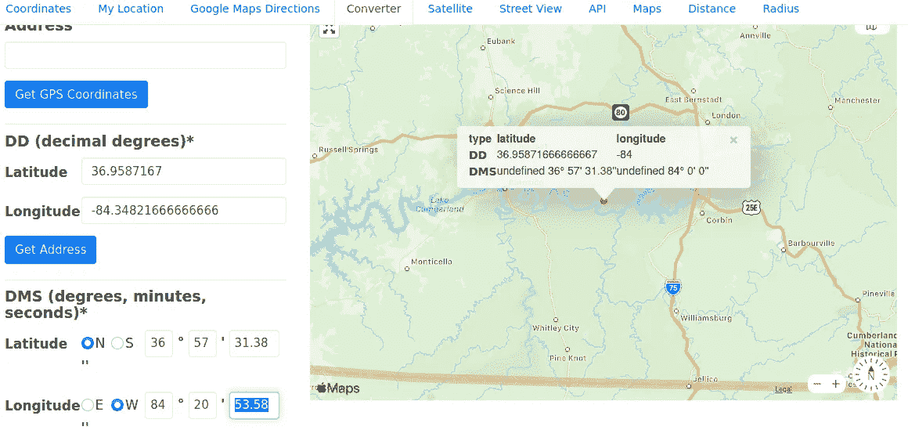

现在，我们可以复制十进制度数，并在谷歌地图中搜索相同的度数。

但是当我们在谷歌地图中寻找位置时，可以看到这个位置是在一些偏远的林区，接近坐标的地方并不多。因此，我们可以列出附近所有的地方，然后将它们传递给 OWASP Zap Fuzzer。靠近坐标的一些位置是:

```
Laurel County School District
Laurel County School
Laurel County 
Scuttlehole Trailhead
Goodin Branch
Dutch Branch
Rockcastle Campground
Daniel Boone National Forest
Holly Bay Campground
Mt Victory
Cumberland River
```

经过模糊处理后，我们得到了这个问题的正确答案是“**丹尼尔·布恩国家森林**”，用它我们可以重设约翰的密码。

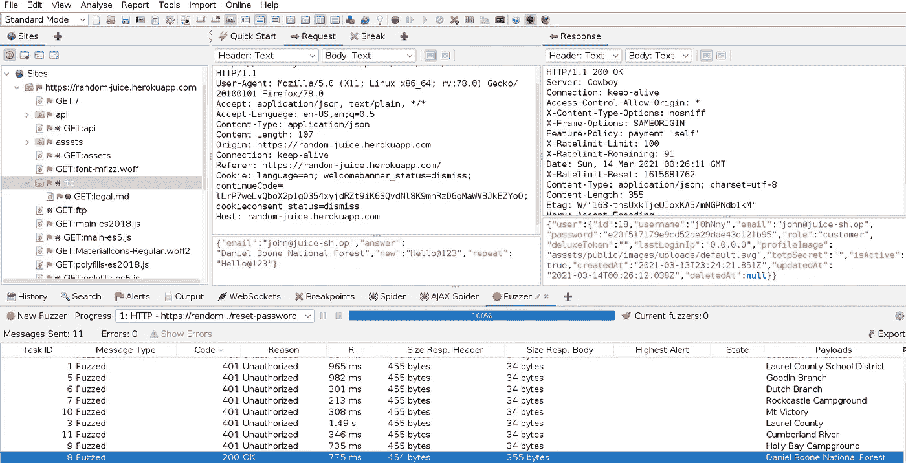

# 使用 MC SafeSearch 的原始用户凭据登录，无需应用 SQL 注入或任何其他旁路。

这个挑战有点不同，也很有趣！

同样，我们首先需要的是 MC SafeSearch 的电子邮件，它可以在“管理部分”找到，但这次我们没有任何图像或除用户名本身之外的任何东西。所以，我们需要开始寻找这个人本人，看看能不能找到一些关于他的有用信息。

显然，在谷歌上快速搜索的第一个链接是 MC SafeSearch 的一首歌，名为“[保护你的密码(2014)](https://www.youtube.com/watch?time_continue=12&v=v59CX2DiX0Y&feature=emb_logo) ”。所以，我们可以边听这首歌边阅读描述和评论。

在听这首歌的时候，SafeSearch 会在歌词中说出自己的密码

> *为什么不用你最喜欢的宠物的名字。*
> 
> *我的是我的狗面条先生*
> 
> *知道不知道也没关系*
> 
> *因为我很狡猾，用零替换了一些元音*

所以，现在我们知道他的宠物的名字是面条先生，他已经用 0 代替了密码中的 0。所以，正确的密码是“**n 00 dles 先生**”，用这个密码我们可以登录 MC SafeSearch 的账号！

# 告知商店某个算法或库绝对不应该以这种方式使用。

这个有点棘手，因为我们还没有遇到任何算法或库。因此，我们可以随机尝试一些算法，如 MD5，SHA1，RSA 等。并通过客户反馈页面发送。显然，MD5 解决了这个问题。

# 参考链接:

1.  OWASP 果汁店一级:[https://0x nirvana . medium . com/OWASP-Juice-Shop-Level-1-2bb 04 f 14375 b](https://0xnirvana.medium.com/owasp-juice-shop-level-1-2bb04f14375b)
2.  CIRT 默认密码:[https://github . com/danielmiessler/sec lists/blob/master/Passwords/cirt-Default-Passwords . txt](https://github.com/danielmiessler/SecLists/blob/master/Passwords/cirt-default-passwords.txt)
3.  六十进制到十进制坐标:[https://www.gps-coordinates.net/gps-coordinates-converter](https://www.gps-coordinates.net/gps-coordinates-converter)
4.  MC safe search—Protect Ya password z(2014):[https://www.youtube.com/watch?time_continue=12&v = v 59 CX 2 dix 0y&feature = emb _ logo](https://www.youtube.com/watch?time_continue=12&v=v59CX2DiX0Y&feature=emb_logo)

一定要看看我在 https://github.com/0xNirvana 的其他作品和评论