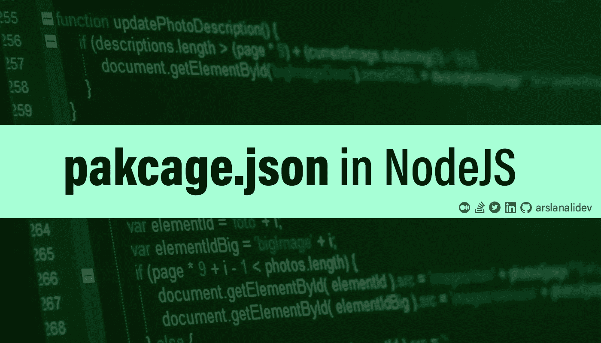
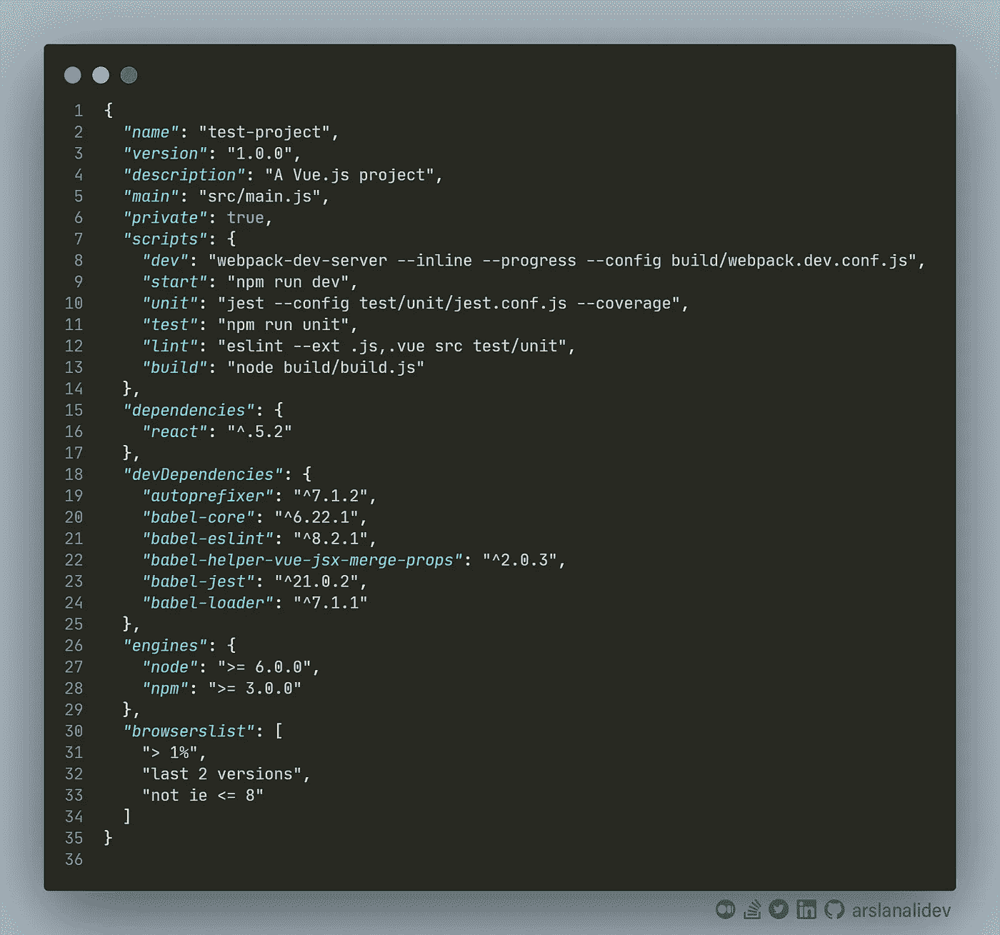

# 包裹。NodeJS 中的 JSON 文件

> 原文：<https://medium.com/nerd-for-tech/package-json-file-in-nodejs-408a782b33fe?source=collection_archive---------24----------------------->

每当我们使用节点项目或前端项目时，项目的根目录下都会有一个名为“package.json”的文件。这个文件包含关于项目的各种元信息。它包含我们项目中安装的所有包，以及其他元信息，如名称、作者、脚本等。这就是为什么 npm 和 yarn 在这个文件中存储所有包的详细信息。

空的包 JSON 文件

震惊地看到它是空的，是的，对于一个应用程序来说，package.json 文件没有固定的模式。唯一的要求是，它应该根据 json 格式。否则，它将在运行时抛出错误。

通常情况下，包 json 文件在不同类型的项目中包含以下公共属性。让我们大致了解一下通用软件包 json 文件中的不同属性。

示例包 JSON 文件

> **版本**给我们提供当前版本。
> 
> **名称**设置应用/包名称
> 
> **描述**我们可以在这里提供包装的简要描述。
> 
> **main** 为我们的 app 设置入口点。
> 
> **private** 如果我们将其设置为 true，将阻止应用程序或包在 npm 上发布。
> 
> **脚本**我们想要在项目中运行的节点脚本列表。
> 
> **依赖关系**:将我们项目中的所有 npm 包显示为依赖关系。
> 
> **devDependencies** :将我们项目中的所有 npm 包显示为开发环境依赖项。
> 
> **引擎**:设置节点的版本。JS，这个包会有用的。
> 
> **浏览器列表**:显示您想要支持的浏览器。