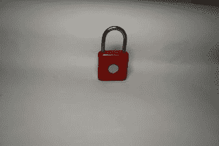
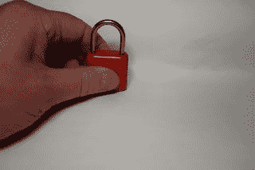
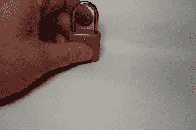
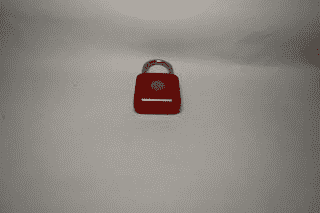

# 用小猫把手指锁起来

> 原文：<https://medium.com/nerd-for-tech/padlock-those-fingers-with-a-kitty-e70d39ff3e37?source=collection_archive---------3----------------------->

这是又一款由优典做的小米(供应链)产品，Kitty 智能触摸/指纹挂锁。它有 4 种颜色(珊瑚红、云母蓝、金色、青石绿)，宽 33 毫米，高 15 毫米，不到 60 毫米(包括钢锁)。主体为锌合金，具有 IPX2 防水性能。

指纹检测器直径约 1 厘米。

在工厂重置状态(装运时)，任何触摸传感器的手指都会解锁挂锁。解锁时，应存储管理员指纹。将所需的手指放在传感器上 8 秒钟，直到传感器上方的 LED 变为蓝色，然后 5 次成功的指纹读取将作为管理员存储指纹。

锁定挂锁现在将只允许管理员手指打开它(锁将打开，LED 将变成绿色)。

如果挂锁解锁，然后管理员将手指放在传感器上，直到 LED 变为蓝色，则可以存储另一个指纹(同样需要 5 次成功读取)。最多可存储 20 个指纹。

不能删除个人指纹，但可以通过解锁将挂锁重置为出厂默认设置，将管理员手指放在传感器上，直到 LED 变红，然后将其移除并再次放在传感器上。所有存储的密码将被删除。

里面有一个 100 毫安时/3.7V(钴聚合物)电池，优电声称它可以提供一年的待机时间(即让挂锁上锁，在一年内返回时它应该仍然可以解锁)。多次解锁将减少时间，因此可能值得不时充电(LED 将保持红色，直到充满电)。它通过 micro USB 充电，并包含一根 USB-A 电缆。

挂锁工作正常，用非注册的手指无法打开。当你不想带着钥匙到处跑，不想锁电动滑板车或自行车(甚至行李)时，这非常有用。挂锁非常安全，尽管如果需要的话，它可能很容易被打破。

它可以在你通常的中国网站上买到，价格约为 15 英镑(不含增值税等)。

*最初发表于*[*【http://eurotechnews.blogspot.com】*](https://eurotechnews.blogspot.com/2022/05/padlock-those-fingers-with-kitty.html)*。*