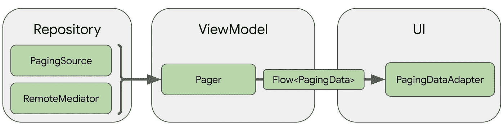

# Android 中的分页，带有分页 3、翻新和 kotlin 流

> 原文：<https://medium.com/nerd-for-tech/pagination-in-android-with-paging-3-retrofit-and-kotlin-flow-2c2454ff776e?source=collection_archive---------0----------------------->


在 [Unsplash](https://unsplash.com?utm_source=medium&utm_medium=referral) 上由 [BENCE BOROS](https://unsplash.com/@benceboros?utm_source=medium&utm_medium=referral) 拍摄的照片

你难道没问过脸书、Instagram、Twitter、Forbes 等等是如何让你“无限滚动”而不到达其应用程序中信息的“尽头”的吗？难道你不想实现这样的东西吗？

这种“无休止的滚动”特性通常被称为“分页”，这并不是什么新鲜事。简而言之，分页有助于加载与“页面”索引相关联的数据块。

让我们假设您有 200 个项目要显示在您的 RecyclerView 中。您通常要做的只是执行您的请求，获取响应项，并将您的列表提交到您的适配器。我们已经知道 RecyclerView 本身是[为“回收我们的视图”而优化的](https://blog.mindorks.com/how-does-recyclerview-work-internally)。但是我们真的需要立即得到那 200 个项目吗？如果我们的用户从未进入前 100 名或前 50 名会怎样？其余未显示的项目仍保留在内存中。

分页所做的(与我们的 [API](https://developer.atlassian.com/server/confluence/pagination-in-the-rest-api/) 一起)是让我们建立一个页码，以及每页我们可以加载多少项。这样，当我们到达 RecyclerView 的底部时，我们可以只请求下一页的项目**和**。

# 非图书馆方法

在分页 3 之前，您可以通过向 RecyclerView 添加一些侦听器来实现分页，当您到达列表底部时，这些侦听器将被触发。有一些很好的例子，这里有一个视频有非常详细的解释(这是在 Indi 上，但它是可以理解的)。

一个真正的生产就绪的例子是在格子应用。看看他们的[infintescrollistener](https://github.com/nickbutcher/plaid/blob/main/core/src/main/java/io/plaidapp/core/ui/recyclerview/InfiniteScrollListener.kt)类。

# Android Jetpack 寻呼 3 和流程

今天，您将学习如何使用 android jetpack 库中的[分页 3](https://developer.android.com/topic/libraries/architecture/paging/v3-overview?hl=es-419) 来实现分页。令我惊讶的是，第 3 页的代码实验室是我做过的最简单的代码实验室之一。[弗洛里纳·蒙特内斯库](https://medium.com/u/d5885adb1ddf?source=post_page-----2c2454ff776e--------------------------------)对 codelab 的每一步都做得很好，去看看吧，试一试。如果您想直接查看示例代码，请查看这个 [pull 请求](https://github.com/ChristopherME/movies-android/pull/17/commits/86393b67a286903b715b5f841b92bac055426d86)，并一步一步地了解我是如何在这个项目中实现分页 3 的。

[](https://github.com/ChristopherME/movies-android) [## Christopher me/电影-android

### Movies 是一个简单的项目，可以学习和使用一些 android 组件、架构和 Android 工具…

github.com](https://github.com/ChristopherME/movies-android) 

# 逐步地

为了使用分页 3，首先我们需要在我们的应用程序级梯度文件中添加依赖关系:

```
dependencies { def paging_version = "3.0.0" //current version at the time

  implementation "androidx.paging:paging-runtime:$paging_version"

  // alternatively - without Android dependencies for tests
  testImplementation "androidx.paging:paging-common:$paging_version"

  // optional - RxJava2 support
  implementation "androidx.paging:paging-rxjava2:$paging_version"

  // optional - RxJava3 support
  implementation "androidx.paging:paging-rxjava3:$paging_version"

  // optional - Guava ListenableFuture support
  implementation "androidx.paging:paging-guava:$paging_version"

  // Jetpack Compose Integration
  implementation "androidx.paging:paging-compose:1.0.0-alpha08"}
```

为了实现我们的“无限滚动”功能，我们基本上需要 4 个类。

*   **分页数据** —分页数据的容器。每次数据刷新都会有一个单独对应的`PagingData`。这是您将要从存储库中返回的内容(如果使用存储库模式的话)。
*   **paging source**—`PagingSource`是将数据快照加载到`PagingData`流中的基类。在这里，您将从服务(通常是翻新的)中检索您的项目，并将它们打包成 LoadResult 类型返回。
*   **Pager.flow** —构建一个`Flow<PagingData>`，基于一个`PagingConfig`和一个定义如何构造已实现的`PagingSource`的函数。
*   **PagingDataAdapter** —一个在`RecyclerView`中呈现`PagingData`的`RecyclerView.Adapter`。页面加载时，`PagingDataAdapter`监听内部`PagingData`加载事件，并在后台线程上使用`DiffUtil`计算细粒度更新，因为更新的内容是以新的`PagingData`对象的形式接收的。



来自第 3 页[文档的图像。](https://developer.android.com/topic/libraries/architecture/paging/v3-overview)

好了，现在我们已经熟悉了这些类，让我们开始吧！我们要做一个应用程序，加载电影，像网飞。我们将使用 [TMDB API](https://developers.themoviedb.org/3/getting-started/introduction) ( *要使用 API，不要忘记注册并请求您的开发者 API 密钥*)。

# 1.翻新的电影服务🎬

让我们定义一个返回电影列表的简单翻新服务。(改进实施与本主题无关，因此在本博客中未提及)。

# 2.实现 PagingSource📖

为了构建我们的 PagingSource，首先我们需要指出分页键的类型和要加载的数据类型。

`PagingSource<*Type_Of_Paging_key*, *Type_of_Data_to_load*>`

> 在这种情况下，分页键的类型是 **Int** ，因为我们的页面索引是基于数字的。我们要加载的数据类型是 **MovieResponse** 类型。

我们需要从“某处”获取信息，这就是`MovieService`进入游戏的地方。这是我们的`MoviesPagingSource`最终的样子。

这个类的实现通常与几乎所有用例中的实现相同。欲了解更多信息，请查看 codelab。

我们必须在这里重写两个方法。`load()`和`getRefreshKey()`。

*   **load(params:load params<Int>)**—这个函数将被分页库调用，以异步获取更多数据，以便在用户滚动时显示。`LoadParams`对象保存与加载操作相关的信息。我们将使用`params.key`来获取当前页面索引。如果这是第一次调用 load，`params.key`将是`null`。在这种情况下，我们必须用常量`TMDB_STARTING_PAGE_INDEX`定义初始页面键。最后，`params.loadSize`是请求加载的项目数。
*   **getRefreshKey()** —刷新键用于对`PagingSource.load()`的后续刷新调用。

# 3.构建和配置分页数据🛠️

我们成功地创建了我们的`PagingSource`。但是现在我们需要一种方法来发出`PagingData`的流。为了这个任务，我们需要一个`PagingData`建造者。在我们的`repository`或`dataSource`中，我们必须创建一个`Page`的实例，它将接受一个`PagingConfig`和一个`pagingSourceFactory`。

这个远程数据源稍后被注入到一个存储库中。如果您只使用存储库，而没有远程或本地数据源，那么您可能应该直接在该类上创建分页器。

`PagingConfig`有两个参数，网络页面大小和 enablePlaceHolders。在这种情况下，这将是错误的，因为我们不需要这个样本的“微光”效果。稍后，我们需要定义我们的`pagingSourceFactory`，这将是我们的`MoviesPagingSource`。

# 4.在视图模型/演示器中请求您的数据

我们就快成功了，现在我们只需要在 ViewModel / Presenter 中调用我们的`getMovies()`方法。

# 5.将它集成到你的用户界面⛓️中

到目前为止，我们正在设置如何获取数据。但是现在是时候渲染 UI 了。我们将使用库中的`PagingDataAdapter`，它是`ListAdapter`类的另一个实现。

MovieAdapter、MovieDiffCallBack 和 MovieViewHolder

最后，在你的片段/活动中

这样你就有了一个功能性的“无限滚动”效果。尽管有一些缺失的东西。显示空视图，当我们请求更多项目时显示进度，等等。你可以在 paging 3 [codelab](https://developer.android.com/codelabs/android-paging#0) ( **我真的鼓励你这么做**)或者检查开头提到的示例项目中找到如何实现所有这些。

# 最后的想法

我喜欢 paging 3 库，但是我觉得它把你附加到了它们的实现上，你失去了灵活性。在这个项目的主要分支中，我使用[T5 或者](https://github.com/ChristopherME/movies-android/blob/feature/movies-paging3/functional-programming/src/main/java/com/christopher_elias/functional_programming/Either.kt)密封类来包装我的接口方法，并自己处理可能的失败或成功数据，由于需要返回一个`PagingData<UiObject>`，我不能再这样做了。此外，我实现了一个安全的改进包装器，用于在调度程序上执行[调用](https://github.com/ChristopherME/movies-android/blob/feature/movies-paging3/core/network/src/main/java/com/christopher_elias/network/utils/Extensions.kt)。IO 上下文并避免在我的所有`remoteDataSources`中重复同样的事情，但那也消失了，因为改造服务的执行是在`PagingSource`中完成的，并且必须显式返回一个`LoadResult`，正如你所看到的，异常也在那里处理。是的，您可以修改调用扩展并让它们返回一个 LoadResult，但是像简单登录这样的其他用例呢？🙃

👉检查分支 [***特征/电影-分页 3***](https://github.com/ChristopherME/movies-android/tree/feature/movies-paging3) 以获得完整的实现。

试试图书馆，告诉我你过得怎么样！

回头见！👋