# 粉刷瓷砖——分层至关重要

> 原文：<https://medium.com/nerd-for-tech/painting-tiles-layering-is-vital-65a5f6c60f4?source=collection_archive---------5----------------------->

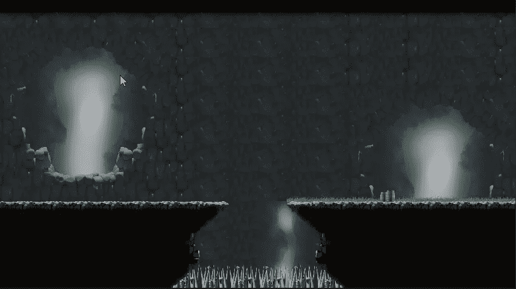

**目标**:学习如何利用层次感在多个磁贴上绘制磁贴

在本教程中，我们将学习**瓷砖绘画**工具和使用图层来实现美丽的效果。

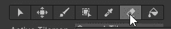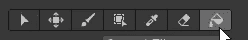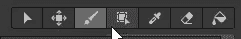

当你打开调色板窗口/标签时，你会看到一些**绘画工具**，它们与绘图程序中的工具非常相似:笔刷、矩形、填充、橡皮擦…

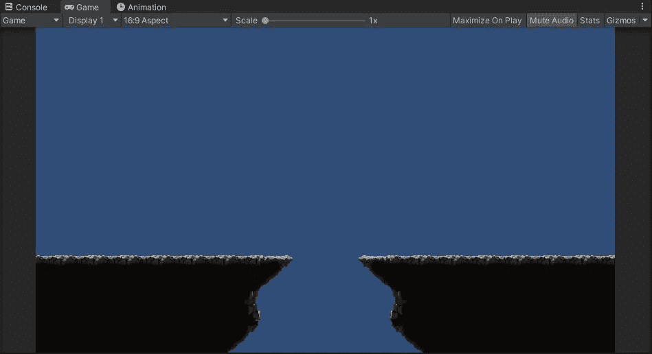

开始之前，我添加了几个调色板，以有更多的瓷砖选择。作为第一个尝试，我画了两个被悬崖隔开的平台，主要使用笔刷(平铺)和矩形(相当明显的效果)工具。

我觉得很酷。现在，如果我们想在那些平台后面画一些东西呢？这个想法是模仿我们用类似 Photoshop 的程序所做的:在这个图层后面添加一个新的**图层**，并在上面绘画。

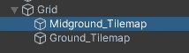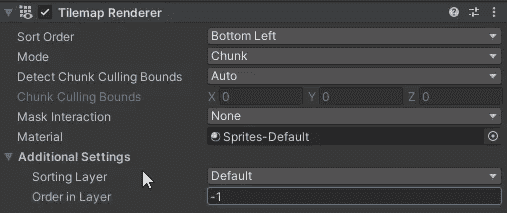

在我们的例子中，分层是通过两个简单的动作完成的:创建一个**新的 tilemap** ，设置它的 **order-in-layer** 整数值(值越大，层越接近)。为了在我们的平台后面绘制，我们应该使用一个比地面图块小的值(默认为零)。

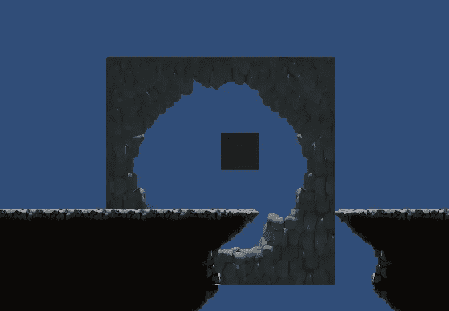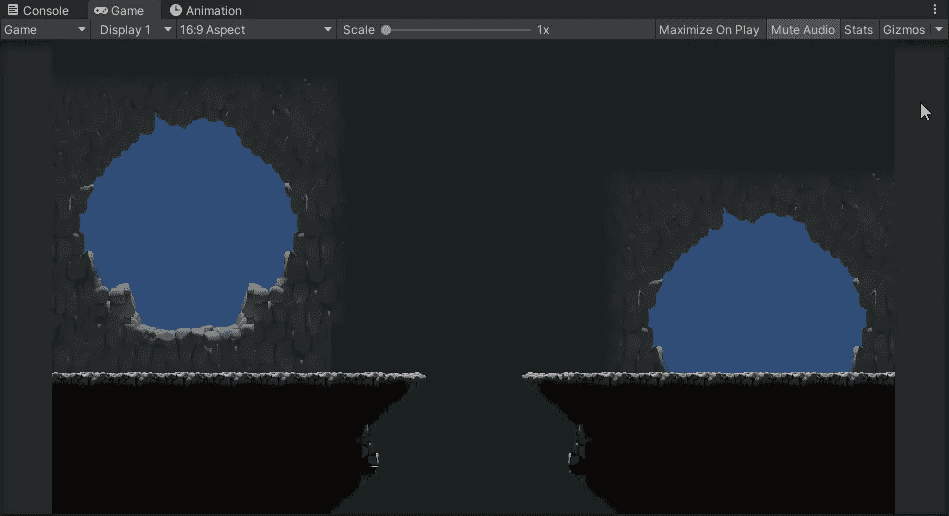

现在我们可以从我们想要的调色板中画出我们想要的任何东西。一切都会出现在后面。

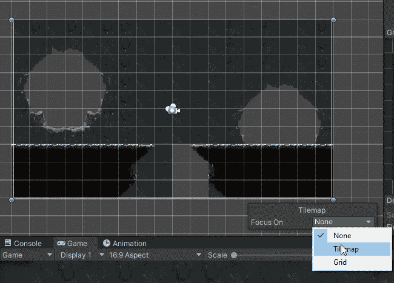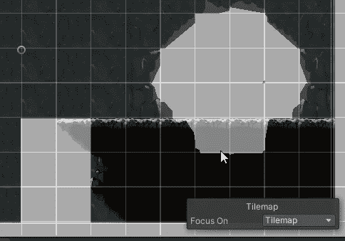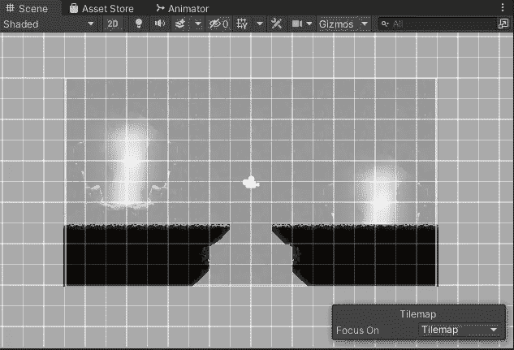

如果平台以任何方式阻碍了你的创造力，你可以使用**聚焦磁贴**选项。通过这种方式，绘制图层时的空白瓷砖将显示为灰色，让您知道您可以在那里进行绘制。

现在玩得开心，在你想要的所有图层上画画吧！这是第三层，甚至更远。

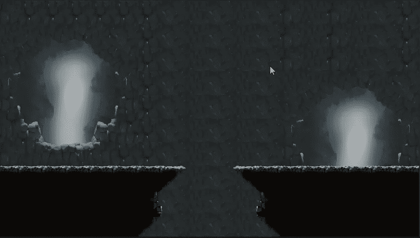

可能性是数不胜数的，同样的，我们可以画出包含物体或植物的装饰瓷砖。再来学点别的招数吧！

在一个新的 tilemap 中，让我们在其中一个平台上放一些草，使用一个专用的植被调色板。

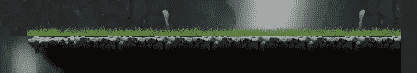

即使结果看起来不错，也不是最好的:你可以注意到草地和地面之间的一点空间，这是由于两个精灵最初的设计。不要担心，我们有很多工具，所有的东西都不像它可能出现在矩形 tilemap 中那样固定！！

Tilemaps 仍然是游戏对象，所以它们仍然有一些共同的属性(组件)，比如**变换**。我们可以把所有的 tilemap 下移一点，让它按照我们的意愿出现！

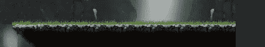

一个有用的最佳实践是让**不止一层**用于植被和其他装饰:例如，如果我们有两层，我们可以让玩家“穿过”植被，一层在玩家后面，另一层在上面。

我就是这样完成关卡的，在崖底加了一些桶和尖刺。

