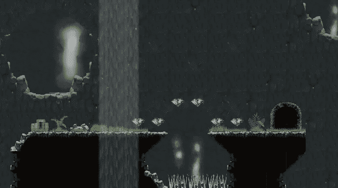
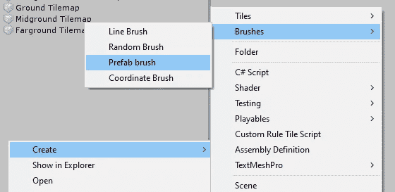
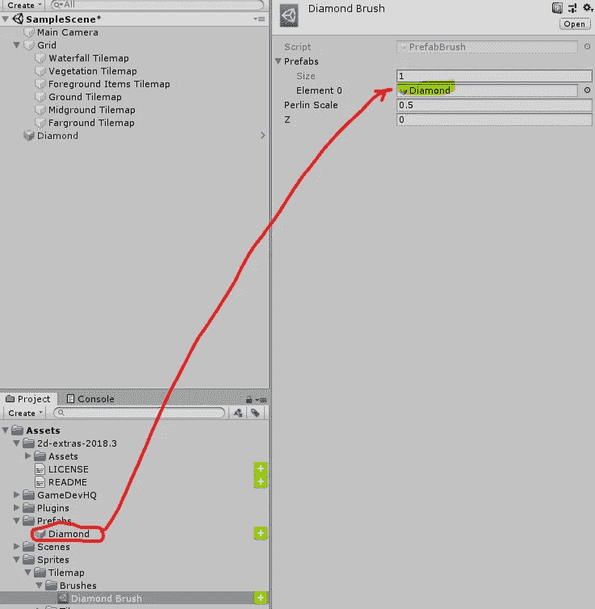
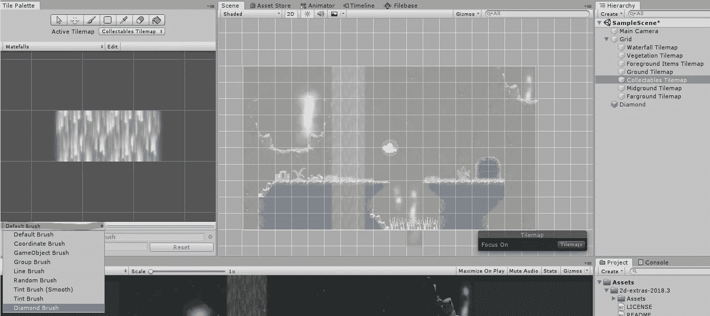
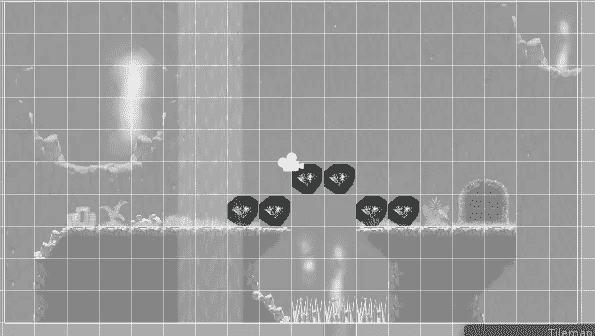

# 用预制品绘画

> 原文：<https://medium.com/nerd-for-tech/painting-with-prefabs-28ce039a9eaf?source=collection_archive---------21----------------------->

**目标:**创建一个画笔，这样我们就可以在游戏中“画”出收藏品。

我们将开始创建一个新的*预制笔刷*。

接下来，我们将把我们的收藏品拖到画笔的*预设*属性中。

我们将为收藏创建一个新的 tilemap，并在 *Tile Palette* 选项卡中选择我们的新笔刷。

我们现在可以快速轻松地绘制收藏品了！

