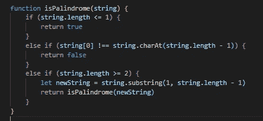
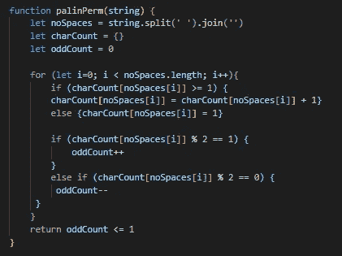

# 回文的

> 原文：<https://medium.com/nerd-for-tech/palindramatic-99ce8712101a?source=collection_archive---------13----------------------->

## 深入探究寻找回文的戏剧。

如果你曾经在市场上寻找软件工程方面的工作(就像我写这篇文章的时候一样)，并且遵循似乎每个人的建议来温习你的数据结构、算法以及如何驯服它们的知识，你肯定会遇到关于一个叫做回文的人的问题。

她是谁？一位穿着相配的帽子和鞋子，颜色与每件衣服从裙子到上衣到腰带都很协调的漂亮女士。也就是说，如果你上下上下打量她，她看起来还是一样的。
在编程术语中，回文是一个字符串(单个单词或短语),从每一端到中点有相同顺序的相同字母。举几个例子:“赛车”、“安娜”、“塔可猫”，你就明白了。

既然我们在面对回文这个词时都在同一页上，我们被要求理解什么，让我们想想为什么使用回文很有趣(不管是好是坏)。这里要认识的关键是，回文单词中的任何字母都不应该没有对应的字母。而如果有，也应该只有一个，即:《赛车》中的“e”。当我们讨论一些解决回文问题的策略时，请记住这一点。

这些问题有几种不同的表达方式，它们将决定最有意义的策略。

# "写一个函数来判断一个字符串是否是回文"

从这个问题的措辞中，我们可以有把握地假设，如果给定的字符串实际上是一个回文，那么它的字母已经按照适当的顺序排列好了。这里一个有趣的策略是使用递归来确定字符串是否是回文。

1.  检查字符串的长度，看它是 1 还是 0，如果是，返回 true。从技术上讲，这将是我们的基本情况，因为一旦字符串变得这么小，它将满足所有的回文标准！更多关于为什么接下来…
2.  接下来，如果字符串的长度是 2 或更多，我们确定第一个和最后一个字母是否相同。如果不是，我们知道可以立即返回 false，因为这是回文的基本标准之一。
3.  现在，如果字符串的长度都大于 1，并且第一个和最后一个字母相等，我们需要检查其余的字母是否有对应的字母。幸运的是，我们已经在编写的函数可以为我们做到这一点！我们可以简单地用一个新字符串调用`isPalindrome`，这个新字符串是旧字符串减去它的第一个和最后一个字母。然后，该函数将递归运行，直到我们剩下一个长度为 0 或 1 的字符串，我们已经确定该字符串将返回 true。

最终的代码可能如下所示:

递归策略

像老板一样解决了！

# "写一个函数来确定一个给定的字符串是否是一个回文的排列"

这个问题不是问字符串是否已经是一个回文，而是问它的字母是否可能被重新排列来创建一个。不幸的是，这意味着我们将无法使用递归策略(可悲，我知道)。是时候记住我们之前说过的，没有偶数个字母的回文不会超过一个字母。

这里要采取的策略是:

1.  删除字符串中的空格，这样我们的函数就可以处理回文短语。

2.初始化一个我们称之为`charCount`的空对象

3.将`oddCount`变量设置为 0

4.遍历字符串并创建字母-数字-键值对来计算每个字母的出现次数。当我们迭代时，如果每个字母已经存在，我们将更新它的值，如果不存在，我们将添加一个新的对。

5.下一项工作可以在第一项工作完成后在另一个循环中完成，或者作为我们已经开始的循环的第二部分。我把它写成第二种方式，因为它在我的大脑中更有意义，但是两种方式在时间复杂度方面都没有优势(它们都是线性 O(n)复杂度)。
实际发生的是，我们对每个值进行均匀性检查，方法是对其取 2 的模，如果余数等于 1(表示奇数),则将`oddCount`加 1。如果值能被 2 整除，因此是偶数，则我们递减`oddCount`。

6.最后，我们返回一个表达式，该表达式将解析为真/假值，指示 count 是否大于 1 `oddCount <= 1`。

也许您的最终代码如下所示:

计数和取模策略

嘣！

将来当你遇到关于回文的问题时，你可以…