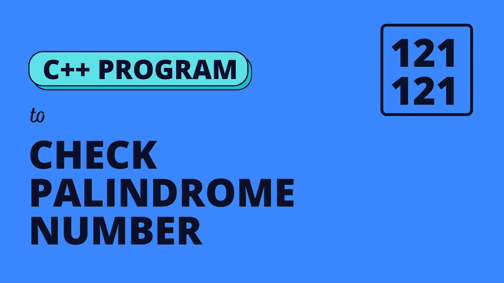
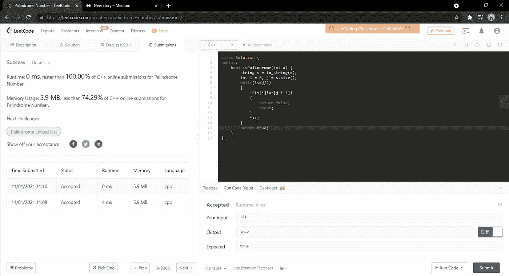

# 回文数

> 原文：<https://medium.com/nerd-for-tech/palindrome-number-8289ca5b5adc?source=collection_archive---------2----------------------->

(LeetCode easy 问题的解决方案)



给定一个整数`x`，如果`x`是回文整数，则返回`true`。

当一个整数向后读和向前读一样时，它就是一个回文。例如，`121`是回文，而`123`不是。

**例 1:**

```
**Input:** x = 121
**Output:** true
```

**例 2:**

```
**Input:** x = -121
**Output:** false
**Explanation:** From left to right, it reads -121\. From right to left, it becomes 121-. Therefore it is not a palindrome.
```

**例 3:**

```
**Input:** x = 10
**Output:** false
**Explanation:** Reads 01 from right to left. Therefore it is not a palindrome.
```

**例 4:**

```
**Input:** x = -101
**Output:** false
```

**约束:**

*   `-2^31 <= x <= 2^31 - 1`

# **强力方法**

这是一个基本的方法，我将把整数转换成字符串，我将从索引 0 到 n/2 遍历字符串，其中 n 是字符串的大小。我将简单地比较第一个字符串元素和最后一个字符串元素，如果不满足，我将返回 false，否则我将继续增加 I 的值并继续检查。

**时间复杂度:O(|n|)** 其中 n 是字符串的长度

**空间复杂度:O(1)**

下面是给出的代码。

```
**class Solution {
public:
    bool isPalindrome(int x) {
        string s = to_string(x);
        int i = 0, j = s.size();
        while(i<=j/2)
        {
            if(s[i]!=s[j-i-1])
            {
                return false;
                break;
            }
            i++;
        }
        return true;
    }
};**
```



这是最简单的解决方案，你可以从这里开始解决问题。我希望你尝试优化上述解决方案，减少时间复杂度。评论你的解决方案，让我们看看哪个是最有效的解决方案！

请继续关注，直到那个时候继续练习！！祝你好运！！！💻🙌

如果你喜欢看我的博客，为什么不给我买杯咖啡，支持我的工作呢！！[https://www.buymeacoffee.com/sukanyabharati](https://www.buymeacoffee.com/sukanyabharati)☕