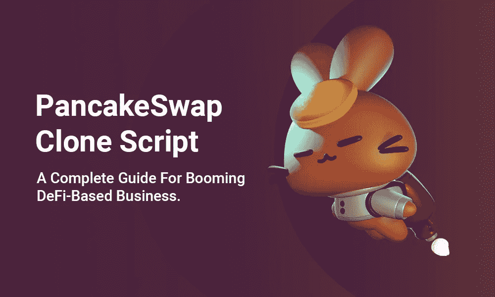

# PancakeSwap 克隆脚本-蓬勃发展的 DeFi 为基础的业务完全指南。

> 原文：<https://medium.com/nerd-for-tech/pancakeswap-clone-script-a-complete-guide-for-booming-defi-based-business-dfcca807ece2?source=collection_archive---------3----------------------->

嗨，伙计们，

有大量的基于 Defi 的协议被创建，但 PancakeSwap 克隆是目前密码领域最流行的。这是因为加密空间的增长和他们在平台中的创造性想法。PancakeSwap clone 也是一个基于食品的自动做市商(AMM)平台，在币安智能链(BSC)的帮助下安全运行。

在本文中，我们将看到如何在 48 小时内使用 PancakeSwap 克隆脚本启动一个 Defi 平台。这将有助于成功地与全球竞争对手竞争，并创造有利可图的业务。

# 什么是 PancakeSwap 克隆脚本？

PancakeSwap 克隆脚本是原始 PancakeSwap 的 trending Defi 交换平台的精确副本。这个 PancakeSwap 克隆脚本在 binancesmartchen(BSC)的帮助下运行。它获得了 PancakeSwap 的所有高效特性和功能。

PancakeSwap 克隆脚本-蓬勃发展的 DeFi 为基础的业务完全指南。

# PancakeSwap 概述:

PancakeSwap 是一个运行在币安智能链(BSC)上的分散式交换。它为以太坊的巨额煤气费问题提供了解决方案。它帮助用户交换密码或令牌，就像其他 UniSwap Defi AMM 协议一样，在以太坊上工作。Defi 农业选项的集合，如打桩、借贷等。现在，据估计，它推出后已锁定约 10 亿美元的总价值(TVL)。

关于 PancakeSwap 有趣的事情是，它为那些下注其本地令牌“蛋糕”的人提供奖励。蛋糕是 20 便士的代币。如果你赌蛋糕，那么计算是这样的，你以 1:1 的比例得到糖浆。如果你保持一种糖浆，你可以相当于分配蛋糕排放的 25%。

# PancakeSwap 克隆获取核心组件:

我们的 PancakeSwap 克隆是用定义货币加密领域标准的核心组件创建的。

*   交换模块
*   安全 API
*   智能合同
*   加密钱包
*   流动性池
*   交换 API
*   区块链网络
*   支付网关
*   身份和隐私

**PancakeSwap 清单:**

1.  交易所类型:基于 Defi 的分散式交易所(DEX)
2.  土特产:蛋糕
3.  在交换期间，支持的令牌:BEP20
4.  区块链网络；币安智能连锁(BSC)
5.  交易所模式:自动做市商(AMM)。

# 如何创建类似 PancakeSwap 的 DEX Exchange？

一般来说，有两种不同的方法来启动类似于 PancakeSwap 的 Defi 交换。

1.  从头开始创造。
2.  从一个著名的脚本提供者那里获得一个 PancakeSwap 克隆脚本。

**白手起家:**

scratch 技术是最好的选择之一，因为它允许你从产品想法和个人需求开始。你也可以投资刮刮乐方法，让它对所有商业企业都有利。使用 PancakeSwap 克隆软件，甚至爱好者和 Defi 投资者可以开始自己的 Defi 交换业务。

**从著名的脚本提供者处获得 PancakeSwap 克隆脚本:**

凭借其所有的基本特性和功能， [**PancakeSwap 克隆脚本**](https://www.alwin.io/pancakeswap-clone-script) 完美地模仿了像 PancakeSwap 这样的 Defi 交换。你可以使用这个脚本技术在一周内建立你的 Defi 交易所，它是 100%定制的和安全的，允许你建立你自己的利润丰厚的 Defi 交易所业务。

# 创建一个像 PancakeSwap 这样的 Defi 交易所要花多少钱？

启动基于 Defi 的交易所的成本是企业家已经考虑的重要事情之一，成本是根据开发过程的方法和您给出的需求特性来决定的。PancakeSwap 克隆脚本的成本大约为 5000 美元，包括核心功能，成本可能会有所不同，因为您根据自己的业务需求定制了这些功能。与其他方法相比，这个 PancakeSwap 克隆脚本更具成本效益。

# PancakeSwap 克隆的开发过程:

这里是在 PancakeSwap 克隆脚本的开发期间，Defi 专家团队的一步一步的完整过程

*   分析业务需求
*   LP(流动性池)开发
*   打桩和产量农业平台创建
*   交换平台创建
*   彩票计划条款
*   可替换和不可替换令牌集成
*   带有测试用例的智能合同审计
*   安全协议实现和部署

# 我们 PancakeSwap 克隆软件的高级功能:

*   糖浆池。
*   高产农业。
*   彩票。
*   代币交换。
*   打桩。
*   桥接。
*   多钱包支持。
*   IFO(首次农业上市)。
*   奖励。
*   交换过程。
*   NFTs。
*   投票系统。
*   侧写更新。

# 获得 PancakeSwap 克隆脚本的好处:

在 PancakeSwap 克隆脚本的帮助下，您将获得巨大的收入，同时为企业带来更多的利益。下面，我给出了 PancakeSwap 克隆脚本的一些好处

*   高效智能合同
*   除去 KYC
*   多钱包集成
*   ROI 计算器
*   轻松配对
*   低交易成本
*   高回报
*   优化交易
*   维护支持成本将会非常低
*   立即获得目标受众

我希望，现在你对 PancakeSwap 克隆脚本及其特性有了一些有价值的了解

# 为什么选择 WeAlwin Technologies 来构建像 PancakeSwap 这样的基于 Defi 的 DEX 平台？

这些都集中在 PancakeSwap 克隆脚本的优点和特征上。如果你想找一家公司建立 Defi 交易所。在加密领域，有许多提供 Defi 协议的解决方案提供商，但是选择哪一个适合您的业务需求。不要被迷惑，用我有希望的知识的深入研究。对于你的业务，我建议你去 WeAlwin Technologies，这家顶级的 Defi 开发公司。在世界各地，我们已经完成了 200 多个成功的项目。