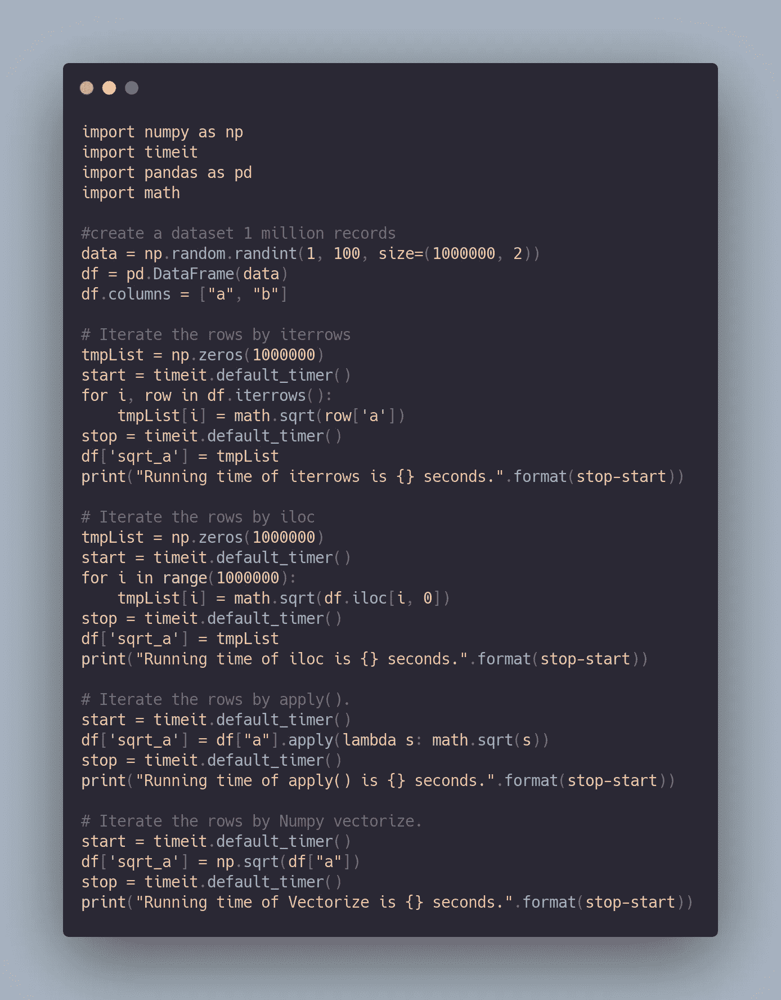

# Pandas 色谱柱操作的最佳实践

> 原文：<https://medium.com/nerd-for-tech/pandas-best-practices-for-column-operations-e686aecb7073?source=collection_archive---------1----------------------->

在数据处理中，有时我们对数据帧中的某些列进行整体操作。pandas 提供了一系列处理列操作的方法，在本文中，我们将介绍相同的最佳实践。

照片由[乔纳森史密斯](https://unsplash.com/@jpsmithuga?utm_source=medium&utm_medium=referral)在 [Unsplash](https://unsplash.com?utm_source=medium&utm_medium=referral) 上拍摄

当我们处理庞大的数据集时，性能会被认为是无用的，对生产力有很大的影响，而且我们会浪费资源。

**Pandas** 提供以下方法对列进行操作

*   由`iloc`进行迭代。
*   通过`.iterrows()`进行迭代。
*   `apply()`功能。
*   像 Numpy 一样矢量化。

让我们通过执行一个任务来获得性能指标，该任务计算 100 万条记录的 ad 数据集中特定列的数字`sqrt`，并观察上述方法的性能。下面是用于 [replit](https://replit.com/join/ojxxidyjdq-dinirockz93) 中性能测试的代码片段

这是相同的输出。

对于不同的环境设置和配置，上述来自 [repl.it](https://replit.com/) 的结果可能会有很大不同。从输出我们可以推断出`Vectorize`是最快的，`iterrows()`是执行列操作最慢的方法。

`Vectorize`比`iterrows`快大约 5000 倍，所以下次当您执行列操作时，请考虑使用 vertorize 方法来获得最佳性能，干杯！