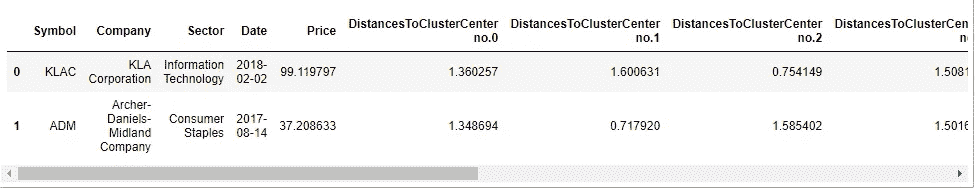
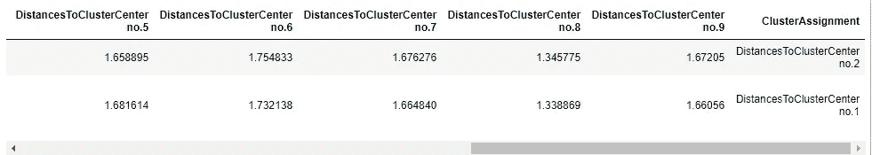
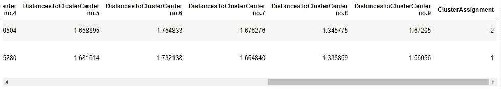
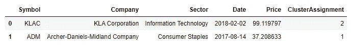

# 熊猫:查找数据帧中每行的最小/最大值列

> 原文：<https://medium.com/nerd-for-tech/pandas-find-column-with-min-max-value-for-each-row-in-dataframe-a2f2d2b2ea7a?source=collection_archive---------4----------------------->

有时您有多列度量用于一个目的，但是您只想保留根据您的需要执行的那一列。


[(来源)](https://pixabay.com/photos/entrepreneur-idea-competence-vision-1340649/)

在本演示中，我们将分析一个合成聚类模型输出数据集。诀窍在于，我们有到每个聚类中心的距离的列，但没有带有聚类分配本身的列。换句话说，进一步分析模型预测变得很困难。



数据帧预览

因此，我们有了一个股票数据聚类模型的数据框架。符号、公司、部门、日期和价格列是用于预测的特征。

模型输出剩余的十列“DistancesToClusterCenter no .”列。这些表示数据点离每个聚类质心有多远。

但问题来了。该数据帧不包括具有单个聚类分配的列，仅包括质心距离。我们如何创建一个这样的列？

答案是`idxmin`函数。根据文档中的[，该函数根据指定的轴返回具有最小值的单元格的索引或列名。我们对具有最小值的列感兴趣，因此我们可以调用:](https://pandas.pydata.org/docs/reference/api/pandas.DataFrame.idxmin.html?highlight=idxmin#pandas.DataFrame.idxmin)

```
df["ClusterAssignment"] = df.idxmin(axis="columns")
```

这将为每行在新的 ClusterAssignment 列中保存具有最小值的列。然而，这需要一个调整:只在质心距离列上调用`idxmin`,而不是所有可用的列。

```
names = [f"DistancesToClusterCenter no.{i}" for i in range(0, 10)]df["ClusterAssignment"] = df[names].idxmin(axis="columns")
```

`names`是质心距离列的列表。第二个`idxmin`只在那个子集上被调用，而不是所有的列。这是结果。



idxmin 输出

我们可以更进一步，在 ClusterAssignment 中只保留集群号，而不是完整的列名。

```
df["ClusterAssignment"] = df["ClusterAssignment"].map(lambda value: value.split(".")[-1])
```

对于每个名称，将字符串拆分为点(。)并保留最后一个子串，即簇号。



已清理的集群分配

我们已经得到了我们想要的，所以我们可以删除质心距离列。谢天谢地，我们已经把它们保存在`names`列表中，以便于`drop`呼叫。

```
df= df.drop(names, axis="columns")
```



最终数据帧

我们已经达到了所需的数据框架:模型预测的输入要素和聚类。

作为一个额外的提示，您可以使用`idxmax`对具有最大值的列重复这个过程，例如，离数据点最远的质心。

```
df["MostDistantCluster"] = df[names].idxmax(axis="columns")df["MostDistantCluster"] = df["MostDistantCluster"].map(lambda value: value.split(".")[-1])df["MostDistantCluster"] = df["MostDistantCluster"].map(lambda value: value.split(".")[-1])
```

这将导致这个数据帧。


idxmax 的结果数据帧

这是这个演示的完整脚本。

为数据帧中的每一行查找具有最大/最小值的列