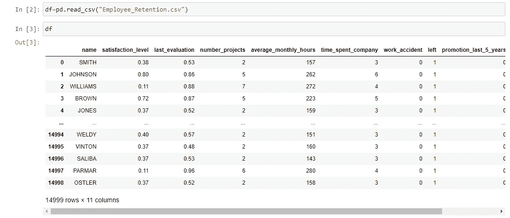
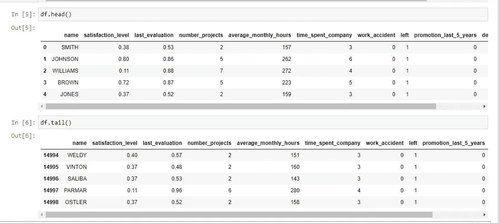
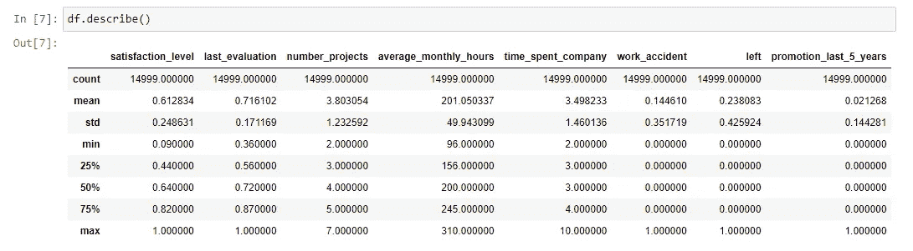
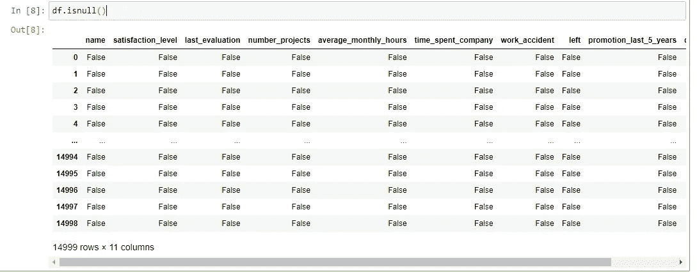
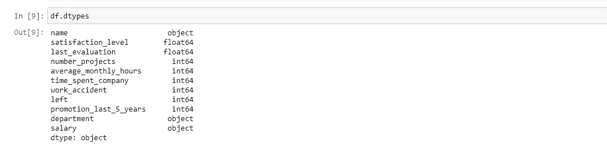

# 用于数据分析的熊猫

> 原文：<https://medium.com/nerd-for-tech/pandas-for-data-analysis-9eae396a0b65?source=collection_archive---------14----------------------->

Pandas 是 Python 中的一个库，对于数据分析非常有用，它被广泛用于探索性数据分析。对于数据分析和操作，它快速、强大且易于使用。Python 和熊猫被广泛应用于学术和商业领域，包括金融、经济、统计、分析等。

首先，我收集了员工留任数据。

因此，首先，我们必须导入库，即

进口熊猫作为 pd

在导入库之后，我们将读取我们所获取的文件。

如您所见，我们已经读取了该文件，它显示了前 5 行和后 5 行。

现在假设如果我们只想要前 5 行，那么我们将使用 Head 函数，如果我们想要后 5 行，那么我们将使用 Tail 函数。

现在假设我们需要数据的描述，那么我们将使用 describe 函数。

当我们使用 describe 函数时，它会分别告诉我们每一列的计数、平均值、标准偏差、最大值和最小值。

现在如果我们想检查数据集中是否有空值。

如您所见，我们的数据集没有任何空值。如果假设我们的数据集有空值，那么我们可以使用 **dropna()删除那些有空值的行。**

如果我们想检查所有列的数据类型，那么我们可以使用 dtypes，它将返回一系列列的数据类型。

结论，在这篇文章中，我介绍了非常基本的数据框架概念，在下一篇文章中，我将对这个数据集进行探索性的数据分析。

**谢谢**