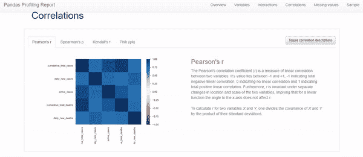
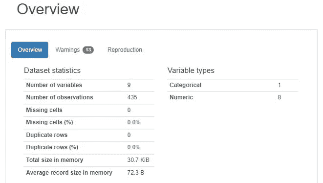
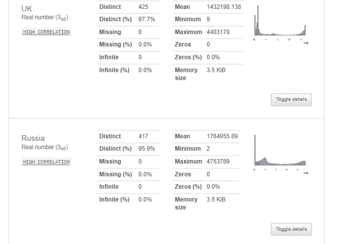
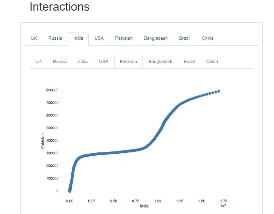
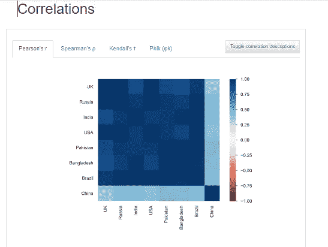
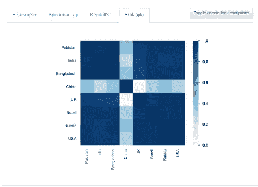
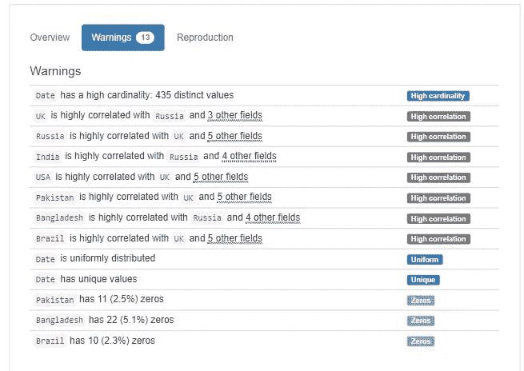
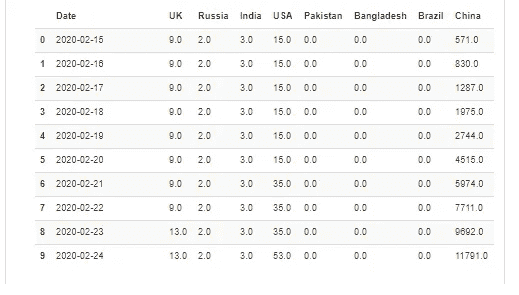
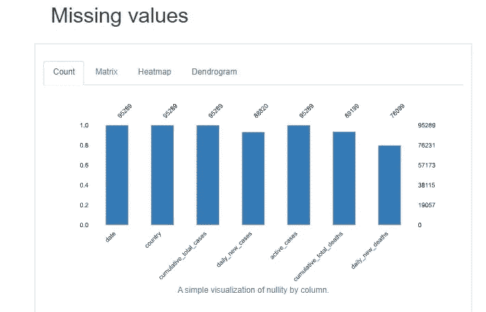
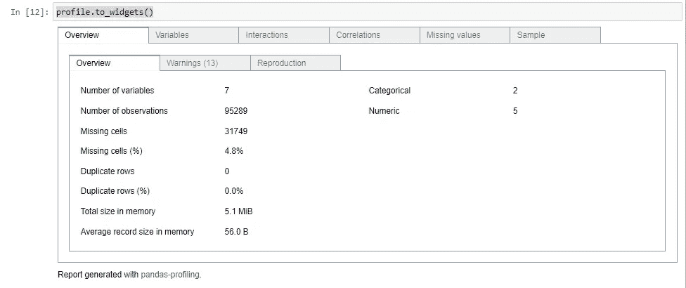

# 使用 Pandas Profiling 在几秒钟内了解数据集

> 原文：<https://medium.com/nerd-for-tech/pandas-profiling-4cc99cbc0df5?source=collection_archive---------1----------------------->

## 一次性完成整个数据集的 EDA。超级容易！不信，自己做！！



按作者输出图像

> 在这个博客中，我们将看到熊猫档案生成的令人惊叹的迷你报告和 EDA 类型，我们如何从中分析数据，如何将报告保存为 HTML 和其他格式，以便能够即时展示并从中驱动令人惊叹的数据分析。

## 关于熊猫简介:

# 关于熊猫简介:

Pandas profiling 是 Pandas 的一个包，可以让你对你的数据库进行探索性分析。很像 pandas `df.describe()`函数(它执行基本的 EDA) `[pandas_profiling](https://pandas-profiling.github.io/pandas-profiling/docs/master/index.html#pandas_profiling)`用`df.profile_report()`扩展数据帧的分析，以获得完整的报告。

Pandas Profiling 是一个令人难以置信的开源工具，每个数据科学家都应该考虑使用它进行数据探索。

通过提供深入的描述性统计数据、可视化分布图和一组关联工具，这是消化和分析不熟悉的数据集的有效方法。

## 熊猫概况报告提供:

*   完整的数据集概述
*   报告每个属性和变量
*   分析了属性之间不同类型的相关性
*   显示警告:数据集中有不准确、重复的地方，您可能需要处理
*   变量类型:分类、数值等
*   报告丢失的值和零(带图表)
*   创建超快速、详细的报告
*   不同的值、共同的值、基数、内存使用，
*   统计报告:描述性，分位数

还有更多……

## 您可以切换每个子报告的更多细节，所有这些都在几行代码中提供！！

有了 Pandas profiling，我们只需几行代码就可以快速进行探索性的数据分析。

如果这还不足以说服我们使用这个工具，它还可以生成 web 格式的交互式报告，可以呈现给任何人，即使他们不知道如何编程。

简而言之，熊猫概况分析所做的是为我们省去可视化和理解每个变量分布的所有工作。它会生成一份报告，其中包含所有易于获取的信息。

# 安装:

## 使用画中画:

```
pip install pandas-profiling[notebook]
```

**来自 GitHub:**

```
pip install [https://github.com/pandas-profiling/pandas-profiling/archive/master.zip](https://github.com/pandas-profiling/pandas-profiling/archive/master.zip)
```

## 使用 conda:

您可以使用 conda 软件包管理器通过运行

```
conda install -c conda-forge pandas-profiling
```

## 证明文件

`You can find the documentation of [pandas_profiling](https://pandas-profiling.github.io/pandas-profiling/docs/master/index.html#pandas_profiling)` [此处](https://pandas-profiling.github.io/pandas-profiling/docs/master/rtd/)。

## 使用熊猫轮廓

```
#pip install pandas_profiling
```

## 导入库

```
import pandas as pd
import pandas_profiling
```

# 数据库实践:

你可以在我的 Jupyter 笔记本上查看完整的干净代码和数据集:[*https://github.com/shelvi31/Pandas-Profiling*](https://github.com/shelvi31/Pandas-Profiling)

该数据集包含以县为单位报告的新冠肺炎病例。

代码:

```
import pandas as pd
import pandas_profilingdf2 = pd.read_csv("corona_dataset")
profile2 = df2.profile_report(title="Corona Small dataset report")
profile2
```

# 这是输出

1.  **输出数据集概述:**Profile 报告给出了我们完整数据集的统计概述。包括分类变量和数值变量、重复变量和缺失变量的数量。它基本上是数据库的统计快照。与我的 covid 数据库相关的统计数据，



作者图片

**2。关于变量的输出报告:**概要报告为我们提供了关于每个变量的单独的详细报告。它非常详细，我们几乎不需要看其他任何东西。



作者图片

**3。输出:交互报告**

简档报告生成所有个体实体之间的交互报告。图像中显示的是印巴新冠肺炎病例之间的输出相互作用报告。您可以为数据库中的任何列集找到这些交互。



作者图片

**4。输出报告关联矩阵:**

变量之间的关系。您可以随时切换以获取更多详细信息。



作者图片

报告开发的其他相关图:



Phik 关联:作者图片

5.**发出输出报告警告:**

概要文件报告在我们可能需要对数据库进行操作或者我们可能必须小心的地方发出警告和警报，包括高基数、高相关性等



作者图片

**5。输出数据集样本:**随机选取的数据集值，给出详细视图、第一行、最后一行等



作者图片

**6。缺失值的输出报告:**

配置文件报告显示每列的缺失值，这里是每个国家/地区的缺失值



作者图片

**尝试更大的数据集:**

你可以在这里找到数据集:[【https://github.com/shelvi31/Pandas-Profiling】T21](https://github.com/shelvi31/Pandas-Profiling)

```
df = pd.read_csv("worldometer_coronavirus_daily_data.csv")
```

Python 中的 pandas_profiling 库包含一个名为 ProfileReport()的方法

## 为大型数据集生成配置文件报告

```
pandas_profiling.ProfileReport(df)
```

输出:


按作者输出的 GIF

转换为 Jupyter Widget



作者图片

# 保存生成的报告的方法:

# Jupyter 小工具

```
profile.to_widgets()
```

# Iframes

```
profile.to_notebook_iframe()
```

# 作为字符串

```
json_data = profile.to_json()
```

# 作为文件:

```
profile.to_file("report.json")
```

# 作为 HTML 文件:

*profile . to _ file(" profile . html ")*

## 将我的报告转换成 Jupyter 窗口小部件:将会产生类似这样的结果

```
profile2.to_widget
```

你可以在我的 Jupyter 笔记本上查看完整的干净代码和数据集:[*https://github.com/shelvi31/Pandas-Profiling*](https://github.com/shelvi31/Pandas-Profiling)

还要在您的实时服务器上检查输出报告:[*https://raw . githubusercontent . com/shelvi 31/Pandas-Profiling/main/Output . html*](https://raw.githubusercontent.com/shelvi31/Pandas-Profiling/main/output.html)

*…如果你喜欢这篇文章，请随意留下一些由衷的掌声:)*