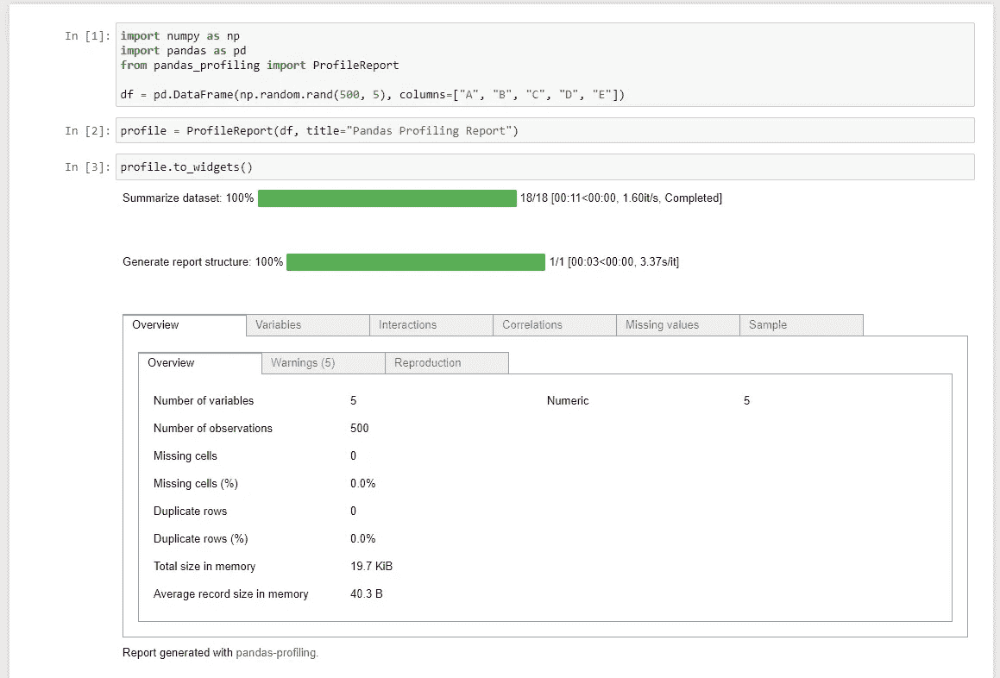
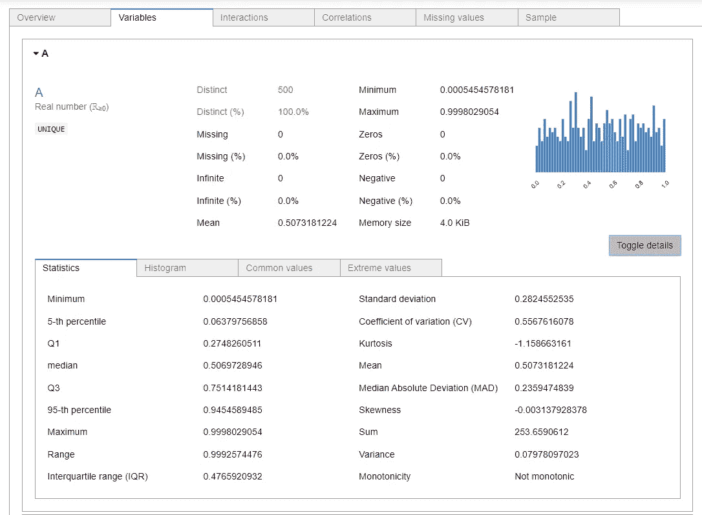
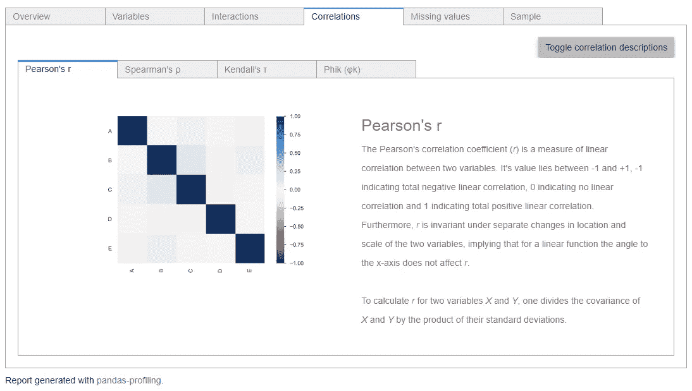
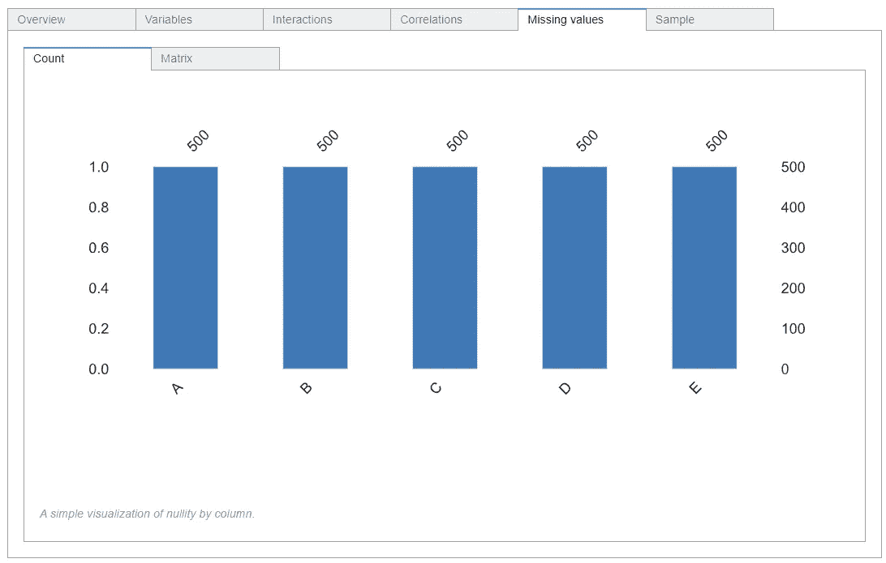
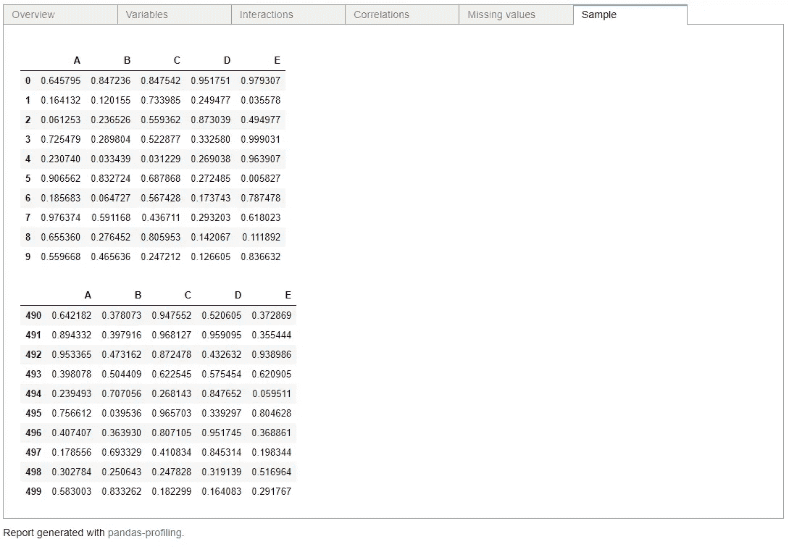

# 熊猫概况:探索性数据分析

> 原文：<https://medium.com/nerd-for-tech/pandas-profiling-exploratory-data-analysis-9a2e3ef5471c?source=collection_archive---------5----------------------->


图片来源:[https://github.com/pandas-profiling/pandas-profiling](https://github.com/pandas-profiling/pandas-profiling)

在这篇文章中，我想分享一个工具，它只用两行代码就可以从 Python 中的 pandas 数据帧生成 profile 报告！是的，你没听错，你的大部分探索性数据分析只用了 Python 中的两行代码。

这个工具叫做熊猫轮廓，由西蒙·布鲁格曼(【https://github.com/pandas-profiling/pandas-profiling】)创造。尽管它于 2016 年首次在 GitHub 上开源发布，但今年我开始听到越来越多关于熊猫的描述，我保证它可以节省大量时间来生成您需要的所有可视化和探索性统计数据！

**安装**

您可以通过运行以下命令，使用 pip 软件包管理器进行安装:

```
pip install pandas-profiling
```

或者通过运行以下命令使用 conda 软件包管理器:

```
conda install -c conda-forge pandas-profiling
```

**入门**

建议使用 Jupyter Notebook 来充分利用该工具，并享受 pandas-profiling 的交互属性。让我们创建一个简单的数据帧，并使用两行代码生成我们的分析器！

如下图所示，分析器提供了 6 个主要类别(概述、变量、交互、相关性、缺失值、样本)，解释如下:

概述:提供关于数据框中缺失值和重复值的详细信息，这是对机器学习应用程序的重要评估！



变量:关于每个特征的分布和进一步的统计(最小值、最大值、中间值、普通值、极值等)。



交互作用:数据框中两个变量之间的关系，如散点图。


相关性:Pearson、Spearman、Kendall 和 Phik 通过进一步解释相关性描述得出的特征之间的相关系数。



缺失值:数据框中每个要素缺失数据的详细信息。



Sample:来自 dataframe 的样本，与通过 df.head()和 df.tail()方法获得的 dataframe 样本相同。



如前所述，pandas-profiling 将大多数不同的数据探索方法(数据统计、分布、相关系数、交互等)整合到一个简单易用的工具中。

**熊猫——大数据分析**

这种方法的唯一缺点是当数据集很大的时候！该工具中的一些计算是计算开销很大的(例如相关或重复行检测)。为了节省探索性分析的时间，可以将 minimal 设置为 True，这将禁止使用以下代码进行昂贵的计算:

在 GitHub 上关注我:[https://github.com/sercangul](https://github.com/sercangul)

**关注我，了解更多关于 Python、统计学和机器学习的信息！**