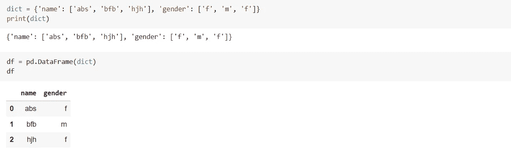
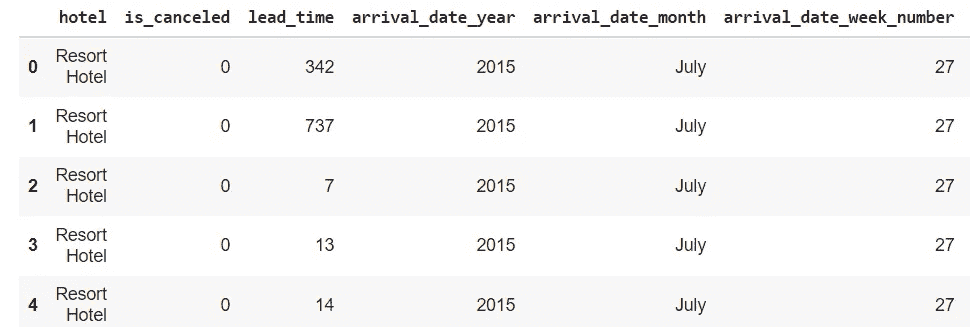
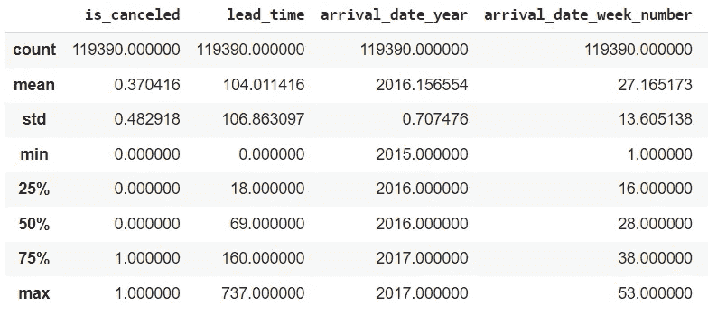
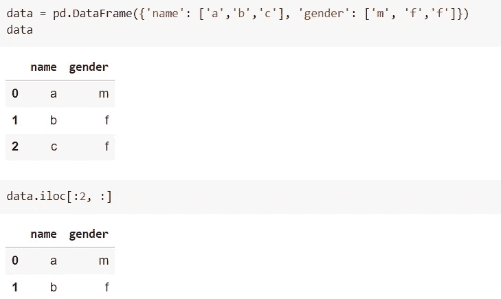
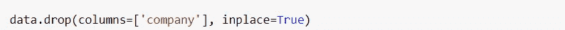
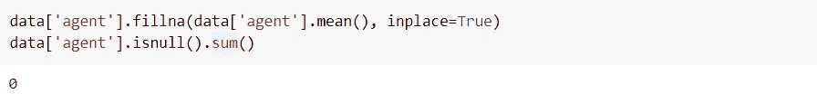
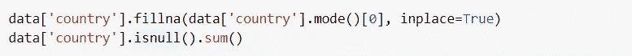
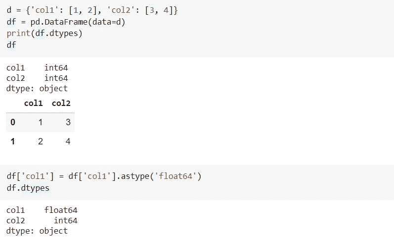
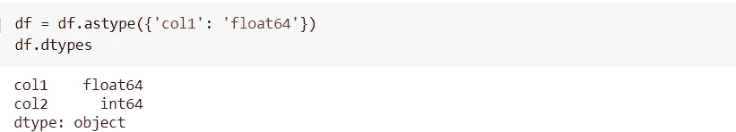

# 熊猫:Python 数据分析库

> 原文：<https://medium.com/nerd-for-tech/pandas-python-data-analysis-library-1d061c982fc8?source=collection_archive---------22----------------------->


> **Pandas** 是一款快速、强大、灵活且易于使用的开源数据分析和操作工具，构建于 [Python](https://www.python.org/) 编程语言之上。

**安装熊猫**

```
pip install pandas
```

**进口熊猫**

```
import pandas as pd
```

**创建数据帧**



**读取. csv 文件**

这里，我们将使用一个' *hotel_booking* '数据集来了解熊猫的各种功能。

```
data = pd.read_csv('hotel_bookings.csv')
data.head()
```



在数据集中给出的 32 列中，上面只显示了几列。

**读取前 5 行**

```
data.head()
```

**读取最后 5 行**

```
data.tail()
```

**数据帧的形状**

```
data.shape
```

**显示关于数据集的信息**

```
data.info()
```

**获取列名**

```
data.columns
```

**检查 NaN 值的数量**

这给出了数据集中存在的空值的数量。

```
data.isnull().sum()
```

**显示统计信息**

它给出分布的平均值、最大值、最小值、标准差、计数、25%等。

```
data.describe()
```



**分度**



*。iloc[start_row: end_row，start_col : end_col]* 将显示范围内的行

[开始行，结束行]和范围[开始列，结束列]中的列

**删除列**



**处理缺失值**

*用平均值填充缺失的数值*



*缺失的分类值用模式值*填充



**使用' *astype()'*** 更改列的数据类型



另一种方式:



要了解更多，请点击这里查看熊猫的官方文件。

快乐学习！