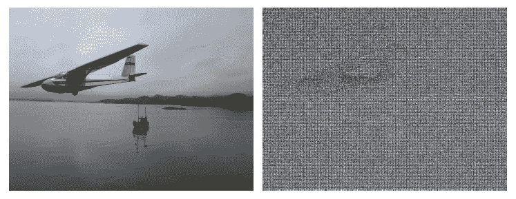
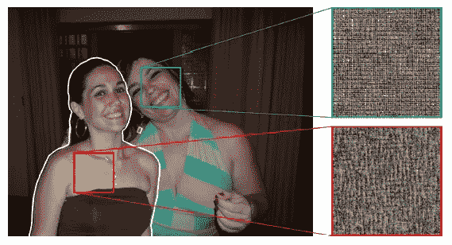
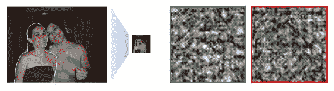
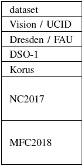
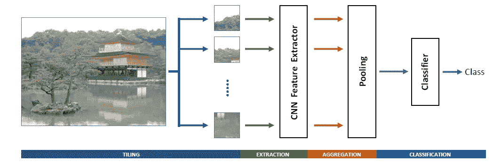
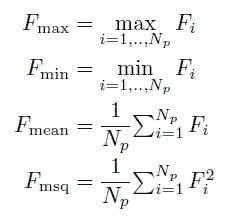
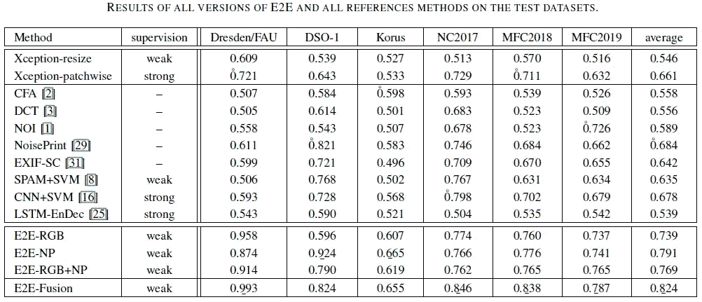
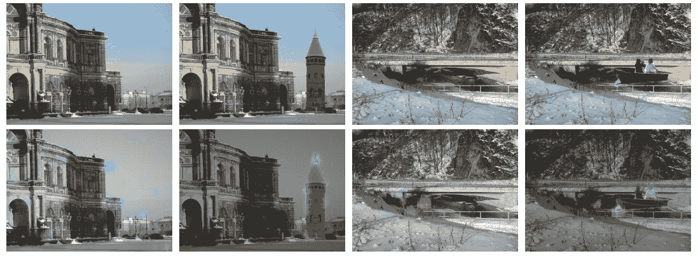

# 论文解释——用于图像伪造检测的全图像全分辨率端到端可训练 CNN 框架

> 原文：<https://medium.com/nerd-for-tech/paper-explained-a-full-image-full-resolution-end-to-end-trainable-cnn-framework-for-image-f33771c97c60?source=collection_archive---------15----------------------->

## 调整图像大小会导致对图像伪造检测至关重要的信息丢失；全分辨率网络更适合这项任务

Noiseprint (Noiseprint:一款基于 CNN 的相机型号指纹[https://arxiv.org/abs/1808.08396](https://arxiv.org/abs/1808.08396)

## 在本文中

*   Xception 用于从完整图像的小块中提取特征，而不需要任何大小调整。
*   使用各种池技术来执行特征聚合。
*   完全连接的层用于图像级的伪造检测。
*   Noiseprint 是作为 RGB 波段的附加功能进行实验的。
*   梯度检查点用于网络的内存管理。
*   该网络是端到端可训练的(E2E)。

[弗朗西斯科·马拉](https://scholar.google.com/citations?user=oIewU-0AAAAJ&hl=en)是论文的第一作者。多媒体取证是他的研究领域之一。全文可在 https://arxiv.org/abs/1909.06751 的[找到。](https://arxiv.org/abs/1909.06751)

## 概述

*   介绍
*   数据
*   提议的模型
*   损失函数
*   性能指标
*   结果
*   伪造本地化
*   履行

# 介绍

典型的计算机视觉模型依赖于图像中的宏观模式。但是在图像取证的情况下，微图案非常重要。大多数 CNN 分类器都需要调整图像大小，这可能会破坏这些信息。因此，对于取证任务，需要避免调整图像大小。

调整大小前后的纹理差异。由于调整大小，信息丢失。

然而，在不调整大小的情况下处理全尺寸图像在计算上是不可行的，这导致了 CNN 的流行。

可行的解决方案是，

*   逐块查看完整图像
*   从面片中获取特征，面片数量因图像而异
*   聚集这些特征以获得一致的特征维度，这成为特征描述符
*   最后，在聚合要素的基础上训练用于分类的完全连接的图层

在高层次上，这是本文遵循的方法。

# 数据

本文使用合成数据以及取证研究社区中可用的数据进行培训和实验。下面分享一下列表，详情参考论文。

使用的数据集

# 提议的模型

E2E:拟议的示范框架

重要的是要注意，这个模型不是设计来预测像素级的伪造，而是在图像标签。因此，该类表示图像(或图像的某个部分)是否是伪造的。在图像分类文献中，对于定位也是期望输出的情况，这也被称为弱监督。

但是，由于模型会查看补丁，因此它会了解哪些补丁与其他补丁相比更有区别，以便进行正确的预测。后来，这被证明是解释结果的有用信息。

## 特征抽出

从输入图像

*   使用异常从重叠面片中提取特征
*   此外，Noiseprint 与 RGB 波段一起作为功能添加。*“噪声印迹是高通图像残留，通过专用网络提取”*

## 特征聚合

要素聚合是通过一种或多种池化技术完成的，即最小值、最大值、平均值、平方平均值。注意，这些都是基于元素的操作。

汇集技术

本文中关于池化的有趣讨论描述了何时使用何种池化。引用下面的文章:

> *“最合适的统筹方式取决于利益问题。当信息分布在整个图像上时，平均汇集是合理的，而当区别信息集中在局部区域时，最小或最大汇集更合适"*

## 决定

最后，使用全连接层来解决分类问题。

## 内存管理

模型实现使用梯度检查点来节省内存。你可以在由[雅罗斯拉夫·布拉托夫](https://medium.com/u/5511064b4364?source=post_page-----f33771c97c60--------------------------------)撰写的名为[让更大的网络适应内存](/tensorflow/fitting-larger-networks-into-memory-583e3c758ff9)的优秀博客中读到它。

## 模型的设计选择

*   用相应的噪声印迹波段增强的输入 RGB 波段
*   作为特征提取器的例外
*   通过包含所有类型的池进行聚合
*   两个完全连接的层，大小 FC1=512，FC2=256，用于执行最终分类。

通过在验证集中展示性能，这些设计选择是合理的。结果如下表所示:

第一行是选择的模型。随后的每一行都表示一个变更，您可以将其解读为“变更->原始”。

## 融合模型

作者还创建了仅具有 RGB(E2E-RGB)、仅具有噪声印迹(E2E-NP)以及两者都作为输入(E2E-RGB+NP)的 e2e 模型的集合。他们使用三次预测的平均值作为最终结果。这被称为 E2E 聚变。

# 损失函数

没有明确提及，因此可以假设标准二进制交叉熵损失用于训练网络。

# 性能指标

AUC 用作所有模型比较的性能指标。

# 结果

通过许多基准测试方法，作者表明，在许多情况下，使用不同输入(仅 RGB、仅 noiseprint 或两者结合)的端到端训练表现更好。E2E 融合在相对更多的情况下给出更强的性能。这些结果列在下表中，

E2E 比较结果

# 伪造本地化

## 激活图

Grad-CAM(引导梯度加权类激活图)用于可视化使用激活图的结果。

引用论文中的话，*“没有操纵的时候，显著区域分散在整个图像上。相反，当拼接发生时，他们往往会专注于拼接对象的边界，这证明系统已经学会了查看这些补丁来做出决定。因此，当检测到伪造的图像时，这种激活提供了关于可能的操纵位置的提示。”*

示例图像(顶部)和激活图(底部)。原始图像在奇数列，伪造图像在偶数列。活动补丁以青色叠加到图像的灰度/红色版本上。

## 基于 ROI 的分析

作者表明，当可疑活动区域被选择并再次通过网络时，它预测在伪造的情况下伪造的概率高，而在原始情况下得分低。

考虑到网络是用弱标签(即图像级标签)进行本地化训练的，在本地化上的结果相当惊人！

# 履行

你可以在 https://github.com/FrancescoMarra/E2E-ForgeryDetection 的[找到作者的实现](https://github.com/FrancescoMarra/E2E-ForgeryDetection)

# 结束语

这是一篇有很多细节的有趣论文。它解决了图像级标签的伪造检测问题，但最终的网络也显示出能够学习定位。更多细节请参考这篇论文，我强烈推荐阅读它。

# 参考

1.  用于图像伪造检测的全图像全分辨率端到端可训练 CNN 框架(【https://arxiv.org/abs/1909.06751】T4)。
2.  Noiseprint:基于 CNN 的相机模型指纹([https://arxiv.org/abs/1808.08396](https://arxiv.org/abs/1808.08396))