# 论文解释 Pinterest 的通知音量控制和优化系统

> 原文：<https://medium.com/nerd-for-tech/paper-explained-notification-volume-control-and-optimization-system-at-pinterest-f4a85608d05c?source=collection_archive---------6----------------------->

## 最大回报的最佳通知量

## **本文**

*   通知量估计被建模为约束优化问题
*   有机的和通知驱动的用户参与是有区别的
*   根据活动预测、退订预测和退订长期效果模型来估计通知量的回报
*   通知的增量奖励用于通过爬山算法进行容量优化
*   根据全局约束，在用户级别估计最佳通知数量

全文可在[https://labs . Pinterest . com/user/themes/pin _ labs/assets/paper/notifications-KDD 18 . pdf](https://labs.pinterest.com/user/themes/pin_labs/assets/paper/notifications-kdd18.pdf)找到

## 概述

*   介绍
*   Pinterest 通知系统
*   问题定式化
*   数据
*   提议的算法
*   实验和结果

# 介绍

通知的目的是通过正确的渠道，在正确的时间向用户发送正确的内容，让用户参与到平台中来。除了内容、时机和渠道，通知的频率在提高与用户的长期互动中也起着至关重要的作用。下面列出了论文中一些重要而有趣的观点，

*   向点击率高的用户发送更多通知可能不是一个好策略。通常，最终目标是增加日活跃用户(DAU)或月活跃用户(MAU)等。
*   虽然网站参与度与通知参与度相关，但通知参与度的提高可能不会提高网站参与度指标。记住，相关性并不意味着因果关系！
*   实际上，向每个用户发送更多通知的回报是递减的。
*   简单地增加通知量可能会在短期内提高参与度，但从长期来看，这可能会导致退订电子邮件，将电子邮件服务标记为垃圾邮件，删除应用程序，从应用程序设置中禁用推送通知等。

因此，奖励或目标函数或兴趣度量以及通知的增量值对于确定用于改善用户体验和平台参与的最佳通知量都很重要。

图 Pin 建议电子邮件示例

在 Pinterest 中，可以发送 pin 推荐、董事会推荐、兴趣推荐等通知。图 1 显示了一个样本 pin 推荐电子邮件。

# Pinterest 通知系统概述

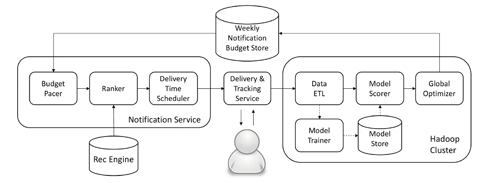

图 2: Pinterest 通知系统图

系统的重要组件如图 2 所示。

## **每周预算通知商店**

它确定每个用户的每周通知预算，并控制每个用户的最大通知数量。

## 通知服务

**Budget Pacer** 获取每个用户的每周通知预算，并为符合条件的用户安排每天的通知。调度或步调逻辑可以是一条规则或一个复杂的算法。

**Ranker** 对符合条件的用户的通知进行排名，并考虑通知渠道，如电子邮件或推送通知。

**交付时间调度器**
将通知安排在用户最有可能参与的时间，并在预定时间发送。交付后，跟踪服务会跟踪用户对已发送通知的响应。

## 卷优化工作流

一组 ETL 工作流计算用于模型训练/刷新的功能。预测被写入模型存储，模型评分工作流使用这些预测对用户进行评分。然后，全局优化器会根据这些分数和全局约束来确定每个用户的每周通知预算。

# 问题定式化

通知量优化可以被视为一个约束优化问题，但是目标函数的选择对于实现改进诸如每日活跃用户或每周活跃用户等指标的目标是重要的。

## 有机互动与通知驱动互动，CTR 与效用

CTR 驱动的方法乍一看似乎是合理的。这将导致向具有高点击率的用户发送更多通知。然而，平台上的参与可以有机地发生(通过直接访问网站或应用程序)或通过通知等干预。它可以表示为，

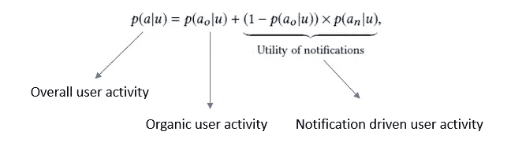

等式 1:整体用户活动

可以看出，通知的 CTR 仅导致对整体用户活动的增量贡献。

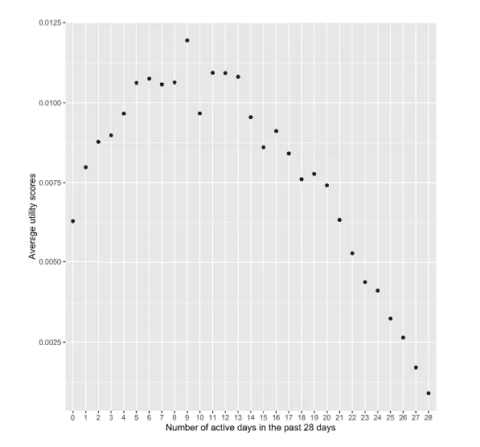

图 3(左):电子邮件点击率与用户活跃度。图 4(右):通知工具与用户活动水平。

上面的图 3 和图 4 表明，对于活跃用户来说，通知的效用并不高，尽管它们能产生很高的点击率！

因此，考虑每个附加通知的增量效用以确定用户的最佳通知量是很重要的。

## 约束优化问题

一般通知量优化问题可以表示为:

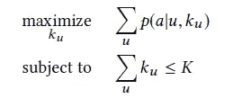

等式 2:受约束的通知量优化

这里 k_u 是用户 u 的每周通知量，K 是总体预算。

p(a|u，k_u)可以是任何相关的业务度量。作者发现每日活跃用户(DAU)比每周活跃用户(WAU)更适合优化。对于 DAU，p(a|u，k_u)被定义为用户每天至少访问网站一次的概率。

## 模拟长期效应

对于用户的通知量 k_u，如果动作集合被描述为 S，其中每个单独的动作由 S 给出，则用户活动性可以被表示为，

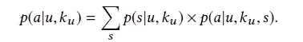

等式 3:S 中动作 S 的用户活跃度

请注意，这也可以被认为是平台从发送 k_u 周通知的用户那里获得的总回报。从等式 3 可以看出，总回报是对单个用户行为 s 的预期回报

为了保持问题的可处理性和简单性，作者认为只有两种可能的用户行为被认为是对通知量的反应，1)取消订阅通知和 2)继续订阅。

取消订阅的用户的活动通常会持续下降几周，直到它变得稳定。因此，需要估计未订阅用户的长期回报。对于订阅用户，估计一周内的奖励。总而言之，

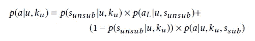

等式 4:取消订阅和继续订阅行为对用户活跃度的影响

这里的奖励的每个单独的组成部分，活动预测模型 p(a|u，k_u，s_sub)，退订预测模型 p(s_unsub |u，k_u)和退订长期效果模型 p(a_L |u，s_unsub)，可以使用标准的机器学习模型来估计。

# 数据

## 特征

直接引用该文件，其特点是，

*   用户资料:国家，性别，年龄，注册年龄等。
*   用户有机活动历史:他们在各种时间窗口中活动的天数，创建的引脚和电路板的数量等。
*   用户邮件活动历史:各个时间窗口的邮件打开率/点击率等。
*   用户推送通知活动历史:推送通知打开率、用户设备平台(由于不同平台的用户行为差异较大)等。

“对于活动预测模型和退订预测模型，周预算 k_u 也是模型中的一个特性。我们发现基于 k_u 创建明确的交互特征也是有帮助的，例如，预期的点击次数(即，用户历史点击率乘以 k_u)。”

## 标签

为了收集无偏见的训练数据，通知量对于一组用户是随机的，并且他们的响应被收集。对于具有周预算 k_u 的用户 u，标签确定如下:

**活动预测模型— p(a|u，k_u，s_sub )** 对于一周中的每一天，如果用户在网站上是活跃的，我们就有一个正例(+1，u，k_u)，否则有一个负例(—1，u，k_u)。

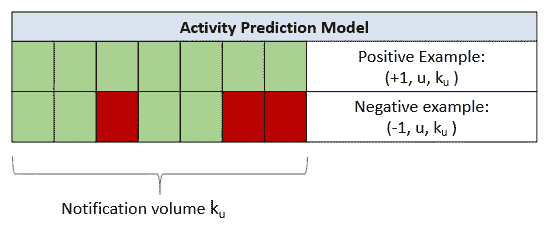

图 5:活动预测模型的标签。绿色表示订阅状态下的活动，红色表示订阅状态下的非活动。

**退订预测模型 p(s_unsub |u，k_u )** 如果用户在一周内退订，我们创建一个正例(+1，u，k_u)，否则创建一个负例。

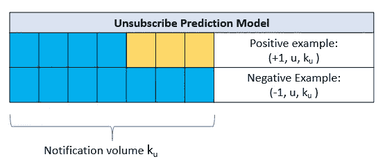

图 6:取消订阅预测模型的标签。蓝色表示继续订阅，黄色表示未订阅状态。

**退订长期效应模型 p(a_L |u，s_unsub )**
查看一周内退订通知的用户，收集他们在之后第 4 周的活跃天数，按照与活动预测模型相同的方式生成训练样本。

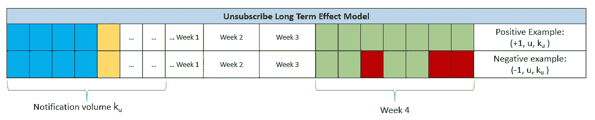

图 7:取消订阅长期效果模型的标签。请注意，第 1 周从取消订阅的第二天开始。蓝色表示继续订阅，黄色表示未订阅状态，绿色表示处于未订阅状态的活动，红色表示处于未订阅状态的不活动。

贴标签过程可以在图 5、6 和 7 中直观地看到。

# 提议的算法

## 活动和退订建模

GBDTs 用于模拟活动预测、退订预测和退订长期效应预测。特别是作者提到他们使用 XGBoost 来训练 GBDT 模型。

## 最优化算法

最佳通知量的优化算法需要以下信息，

1.  用户 u 的通知量 k_u 的效用或报酬。这是使用上面训练的三个 GBDTs 估计的。
2.  k_min 和 k_max —允许用户通知的最小和最大数量。这是一个全局约束。
3.  K —允许的总通知量。

**预算分配**

这个算法，

*   为每个用户在范围[k_min，k_max]内查找通知音量的效用。
*   它找到给予最大回报的通知量— i_max。
*   然后，它计算完成 i_max 通知所需的额外容量的平均增量效用增益。如果增量增益>阈值θ，则通知音量增加 1，否则返回当前通知音量。这类似于优化中的爬山法。

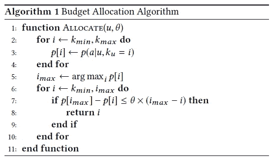

算法 1:预算分配

剩下的最后一个难题是确定阈值。

**阈值搜索**

*   执行线性搜索以找到用于比较预算分配算法中的平均增量增益的最佳阈值。
*   对于每个阈值，运行预算分配算法来确定每个用户的最佳通知量。
*   如果跨用户的总通知量满足总体预算约束，则选择相应的阈值。

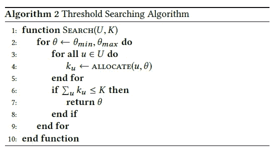

算法 2:阈值搜索

# 实验和结果

所提议的系统显著减少了通知量，同时提高了 DAU 的 CTR 和站点参与度指标(见下表 1)。

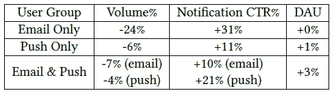

表 1: A/B 实验结果

所提出的系统将流量从较活跃的用户转移到较不活跃的用户，以实现这种改进，如下图 8 所示，

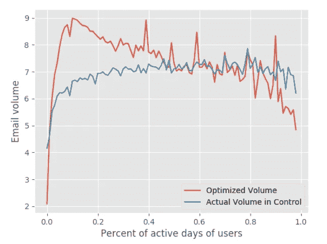

图 8:音量分布与用户活动水平

“我们可以清楚地看到，对于非常活跃或极度休眠的用户，优化的音量较低，而对于不太活跃的用户，优化的音量通常较高。”

# 结束语

在本文中，我们发现要优化的网站参与度和通知量控制是任何通知系统的重要方面，可以使用简单的算法进行线性搜索来优化。

这篇论文写得很好，值得一读。虽然我总结了论文的大部分内容，但它有很多想法和细节值得一读。

# 参考

*   Pinterest 上的通知音量控制和优化系统([https://labs . Pinterest . com/user/themes/pin _ labs/assets/paper/notifications-KDD 18 . pdf](https://labs.pinterest.com/user/themes/pin_labs/assets/paper/notifications-kdd18.pdf))