# 论文说明—面向电信运营商的实时客户体验预测

> 原文：<https://medium.com/nerd-for-tech/paper-explained-towards-real-time-customer-experience-prediction-for-telecommunication-operators-b2796b8bd82e?source=collection_archive---------20----------------------->

## 用于可解释预测的受限随机森林

消费者对 WhatsApp 等 OTT 服务的依赖和易用性已经缩减了电信运营商的收入来源。为了增长或至少保持当前的市场份额，良好的网络客户体验变得越来越重要。本文提出了一种方法来捕捉接近实时的移动客户体验，并访问导致用户向电信客户服务中心发出呼叫的条件。

# 概述

*   介绍
*   数据
*   数据探索
*   提议的技术—受限随机森林
*   可解释性
*   性能指标
*   实验和结果

# 介绍

本文要解决的核心问题是，如何在客户打电话给客户服务中心抱怨之前，主动评估客户的体验。

拥有一种能够近乎实时地预测用户体验的方法，可以帮助电信公司识别问题并主动解决它们。在最坏的情况下，当客户呼叫客户服务时，该信息可以作为呼叫发生的上下文传递给客户服务主管。

该论文提到，“我们假设用户的糟糕体验可以通过查看她使用特定移动应用和服务的网络性能来推断。”

因此，这种方法的目标用户群是那些经常使用移动数据的用户。

# 数据

与电子商务一样，电信数据中也没有明确的用户体验好坏的信号。如果没有呼叫客户服务，那么可以认为体验是好的，但是坏的体验呢？当致电客户服务部进行投诉时，这表明客户体验不佳。但是和网络的哪一笔交易应该和体验差有关联，哪一笔和体验好有关联呢？

这里再次假设，在呼叫客户服务之前与网络的交易是坏的，之后是好的，因为希望问题已经被解决。下面的图 1 中可以看到一个功能示例，

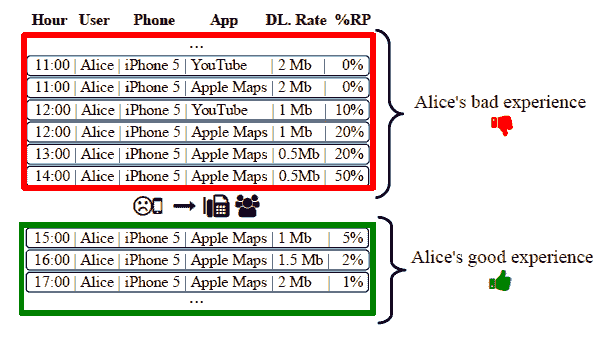

图 1:糟糕和良好的电信体验:。
来源—“面向电信运营商的实时客户体验预测

您可能已经注意到，这些功能被设计为用户每小时每个应用程序的总数据使用量。网络上的数据馈送给出了使用模式，客户服务呼叫的日志给出了功能的相应标签的信息。

从数据馈送中提取的特征如下图 2 和图 3 所示

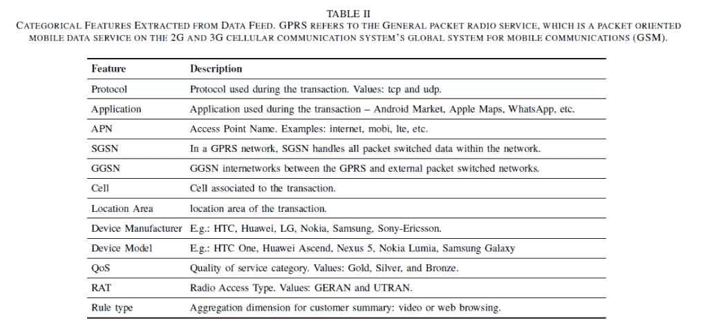

图 2 来自数据馈送的分类特征

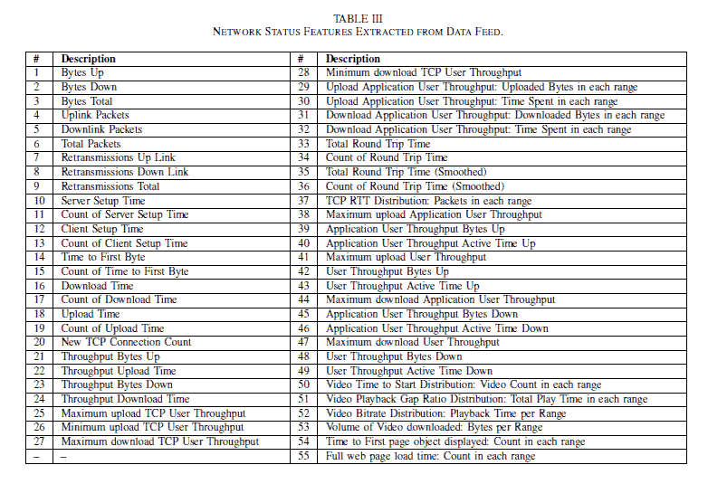

图 3 数据馈送中的网络状态

现在这个问题被简化为一个二元预测问题，即给定一个用户上下文，预测体验是好是坏。

# 数据探索

作者分享的数据中有一些见解。

## 空间分布

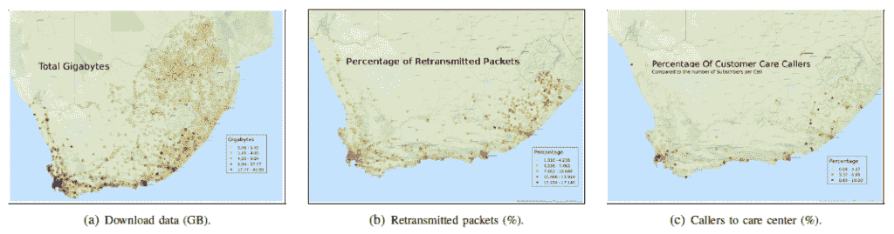

图 4 空间分布

上图显示，最拥挤的区域具有更高的重新传输率和更高的客户服务呼叫率。这个挺直观的。

## 呼叫的时间分布

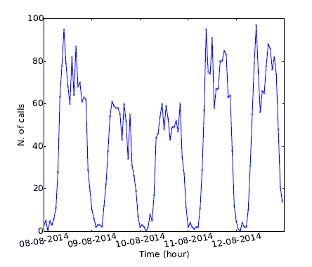

图 5 通话的时间分布

呼叫的时间分布也很直观。有一个高峰时间和非高峰时间的每日模式。

## 呼叫者与非呼叫者

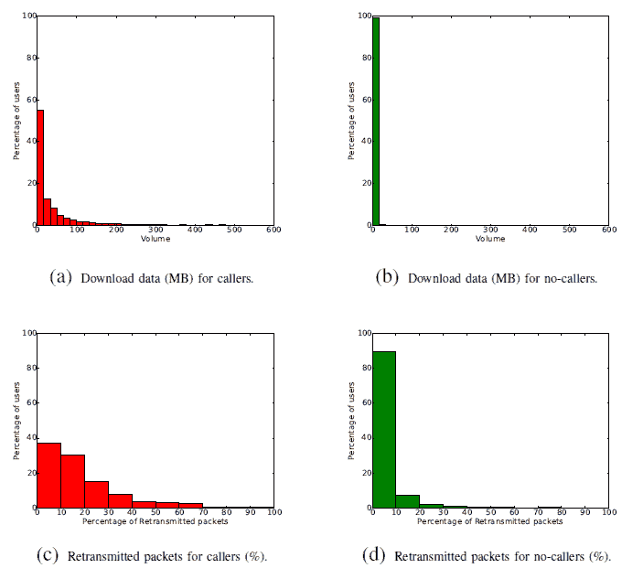

图 6 呼叫者与非呼叫者

图 6 中的曲线显示，与非呼叫者相比，呼叫者是数据的大量用户，并且具有更高的重新传输的数据包(注意长尾)。

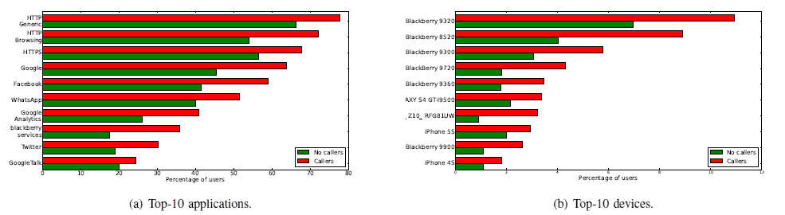

图 7 呼叫者和非呼叫者的应用程序和设备

图 7 示出了呼叫者与非呼叫者的应用和设备。我看不出这里有什么值得解释的(你看到什么有趣的东西了吗？).

# 受限随机森林(RRF)

限制随机森林(RRF)已经被作者提出用于二元分类任务。随机森林可以定义为，

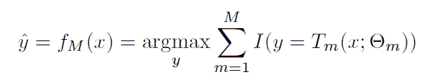

图 8 随机森林

其中 **M** 是树的数量， **I** 是将数据点 **x** 映射到类的指示函数， **T_m** 是带有参数**θ_ M**的第 M 棵树。

**RRF 的限制是在功能上。**对 RRF 来说，每棵树的特征选择不是随机的，而是由建模者控制的，以确保每棵树的解释能力。特征被分组到类别中，并且树被专门训练在一个类别的特征上。例如，本文中讨论的一些类别是，

1.  应用
2.  应用类型
3.  细胞
4.  位置区域
5.  设备型号
6.  设备制造商
7.  网络 KPI

# **可解释性**

对于 RRF 导致客户关怀呼叫或糟糕体验预测的情况，您可以查看也预测糟糕体验的组成树，并分析这些树以了解问题。由于每棵树都是在一类特征上训练的，所以它在本质上是可以解释的。为了解释，你必须找出，

1.  当数据通过决策树时，它的哪个叶节点被激活
2.  遵循决策路径来识别潜在问题。

例如，在图 11 所示的决策树中，如果客户关怀呼叫预测是树的第二个叶节点的结果，则问题可以被识别为由于苹果地图导致的高重传率。

# 性能指标

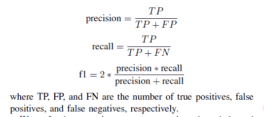

图 9 指标

由于问题的类别不平衡性质，精确度、召回率和 F1 分数是作者使用的度量标准。对于不平衡的情况，这是一个非常标准的选择。

# 实验和结果

为了解决类不平衡，负样本随机抽样替换，是实验的超参数。分类特征是一次性编码。

作者做了两个实验。在实验 1 中，使用每小时聚合特征，在实验 2 中，使用 24 个每小时聚合特征。

将 RRF 的性能与基线(基于历史类别分布的随机分配)、SVM、GBT 和随机森林进行比较。

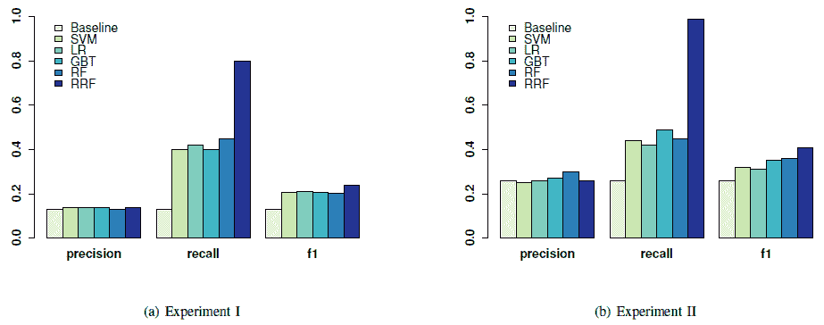

图 10 度量性能结果

*“使用方法 1 和方法 2，RRF 模型系综的 f1 得分分别比基线提高了大约 85%和 57%。在两个实验中，RRF 与最先进的分类器相比也表现不俗。”*

图 11 显示了构建在变量应用程序组上的一个树。

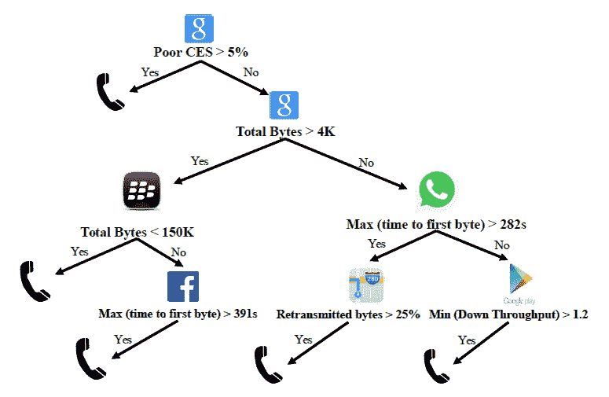

图 11 基于应用程序类别的功能树

该树给出了通向潜在客户服务呼叫的路径，但是该论文中并未明确如何使用这些树。是否有任何建议网络运营部门进行的诊断？如果是，诊断结果是什么？

# 结束语

本文提出了一种有趣的方法来标记在电信网络上有好的和坏的体验的特征，并提出了限制随机森林的思想来制作森林中可解释的树。然而，对可解释性的详细讨论将有助于更深入地了解这项技术。例如，当树变得太深时会发生什么？

这项工作的自然延伸将是使用 DNN 的来预测经验，但会以可解释性为代价。

你可以在[阅读关于电信运营商实时客户体验预测的完整论文](https://arxiv.org/pdf/1508.02884.pdf)。