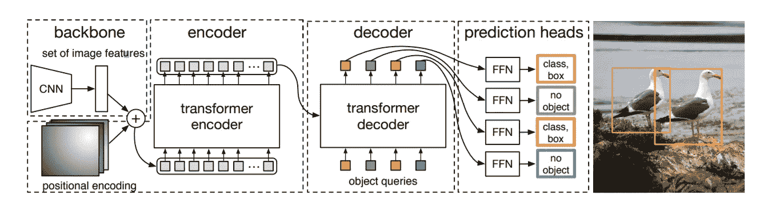

# 论文摘要:DETR —利用变压器进行端到端检测

> 原文：<https://medium.com/nerd-for-tech/paper-summary-detr-end-to-end-detection-with-transformers-e2cc6e416a32?source=collection_archive---------10----------------------->

所以，这篇论文摘要的目的是为你提供论文的主要思想，以便你获得一个概述，并且如果你想自己阅读所有的细节，能够做出明智的决定。论文: [DETR](https://arxiv.org/abs/2005.12872) 作者:尼古拉斯·卡里昂、弗朗西斯科·马萨、加布里埃尔·辛纳伊夫、尼古拉斯·乌苏尼尔·亚历山大·基里洛夫和谢尔盖·扎戈鲁科

建筑图片来自 [DETR](https://arxiv.org/abs/2005.12872) 报

# DETR 为什么有趣？

当脸书发布 DETR 时，它是第一个使用变压器进行物体检测和全景分割(识别和分类所有物体并制作分割图)的架构。此外，他们展示了一种对象检测方法，该方法减少了使用非最大抑制(NMS)、锚和其他手工设计的特征来执行对象检测的需要。较新的论文随后改进了他们的方法，在对象检测中实现了最先进的(SOTA)性能。

# DETR 的要点

DETR 模型在 MS-COCO 上被训练，并且该论文报告了与 fast-RCNN 的结果相当并且超过该结果。该模型具有卷积特征提取器，然后该特征与图像结构的位置编码一起被输入到变换器编码器-解码器结构。然后，变换器网络的输出通过前馈网络，然后模型输出固定数量的边界框。对于不对应于输入图像中的对象的边界框，模型应该将其分配到类别“无对象”。

DETR 与许多其他对象检测器的区别在于，边界框直接输出为标准化的中心坐标、宽度和高度。由于他们使用的架构和损失函数，他们的模型也不容易对同一物体进行重复预测。因此，它们可以避免将模型预测转换为边界框的后处理步骤以及应用非最大值抑制。

他们通过首先将检测与地面真实边界框配对来训练模型，以最小化它们之间的距离，然后他们为每个配对计算类损失和边界框损失。

# 模型架构

如上所述，模型体系结构被分成四个部分:卷积特征提取器、编码器层、解码器层和用于预测的前馈网络，并且所有部分都在端到端过程中被训练。

他们报告了使用预训练的 ResNet-50 和 ResNet-101 版本用于具有冻结批处理层且没有最后分类层的卷积网络。来自卷积网络的特征映射然后被整形为序列，并且与固定位置编码一起输入到变换器编码器-解码器网络。固定位置编码本质上是用正弦和余弦函数编码的特征映射值的位置(详情见其 Github:[位置编码的代码](https://github.com/facebookresearch/detr/blob/master/models/position_encoding.py))和所需的图像结构的输入信息，因为变换器是置换不变的。他们还向解码器输入学习的输出位置编码(上图中的对象查询)，这是模型输出的 N 个不同边界框中每一个的嵌入。位置编码也被输入到编码器和解码器中的每个多头自关注模块的网络中。

变压器网络结构几乎与原始变压器相同([注意是你需要的全部](https://arxiv.org/abs/1706.03762))，除了它们使用的位置编码如上所述。他们还对 transformer 网络中的编码器和解码器层数进行了实验，并报告了这如何影响 MS-COCO 上的 AP 分数。

最后，他们使用前馈网络将解码器输出转换成 N 个边界框和类别预测。如果边界框不对应于图像中的地面真实对象，则类别标签为“无对象”。

# 损失函数

在计算模型的损失之前，他们使用匈牙利算法在输出边界框和地面真实框之间执行二分匹配。这意味着它们会找到所有基本事实边界框和预测之间的匹配，从而最小化预测和标注之间的总距离。

然后，使用交叉熵损失来计算类别损失，并且对于不与基本事实边界框匹配的每个预测，类别标签是“无对象”。对于所有的预测和基本事实对，它们也会导致边界框丢失。该损耗是所有坐标的 L1 损耗和广义 IoU 损耗(GIoU)之和。他们的结果还表明，GIoU 损失对模型性能的贡献最大。

# 培训过程

他们端到端地训练整个模型，但是在卷积骨干网络中使用低一个数量级的学习速率。对于正则化，他们使用附加的丢失和权重衰减、裁剪和缩放增强，但也使用梯度剪裁。如前所述，对于每幅图像，它们总共输出 100 (N)个边界框，这意味着一幅图像中具有它们的配置的对象的最大数量是 100 个对象。

此外，它们还在每个解码器层之后训练辅助损耗。这意味着在训练期间，他们在每个解码器层后添加一个前馈网络，然后执行匈牙利算法来匹配预测和标签。他们进一步提到所有辅助前馈网络共享相同的权重。

重复他们的实验所需的训练过程的其余细节最好在论文中阅读。

# DETR 结果

这里只提到在目标检测基准 MS-COCO 上的结果，但是，本文也详细描述了全景分割的训练结果。

即使在出版的时候，DETR 也不是一个新的 SOTA 模式。然而，与新的和改进的更快的 RCNN 相比，它确实取得了有竞争力的结果。他们的最佳模型版本在 MS-COCO 达到 AP 44.9，当前(2021 年 5 月)SOTA 为 58.7。然而，如果我们试图将这篇论文放入上下文中，他们使用了一个相对简单的架构，并设法绕过了现代物体探测器(例如 NMS 和锚)的几个怪癖，但他们仍然设法获得了有竞争力的结果。这显示了基于变压器的网络在对象检测中的潜力，当前的研究现在从中获益。

# 结论

让 DETR 变得有趣的是，他们提出了一些使用变压器的物体探测器的想法。截至 2021 年 5 月，MS-COCO 的 SOTA 结果是通过变压器模型获得的，DETR 是第一个将变压器网络纳入物体探测的模型。

此外，他们的模型解决了以前的对象检测模型所处理的许多不便，例如使用锚点和需要非最大抑制边界框以避免重复预测。

为了进一步说明他们模型的简单性，他们在论文中提供了不到 50 行 PyTorch 代码的推理代码。这当然令人印象深刻，但我的感觉是，这掩盖了一个事实，即他们的训练成果更难获得。

希望你现在已经对 DETR 最重要的思想有了一些了解。如果你对这篇文章有任何想法，请发表评论！