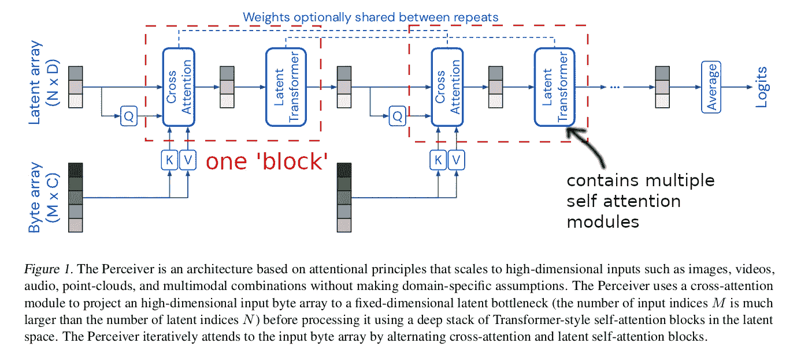
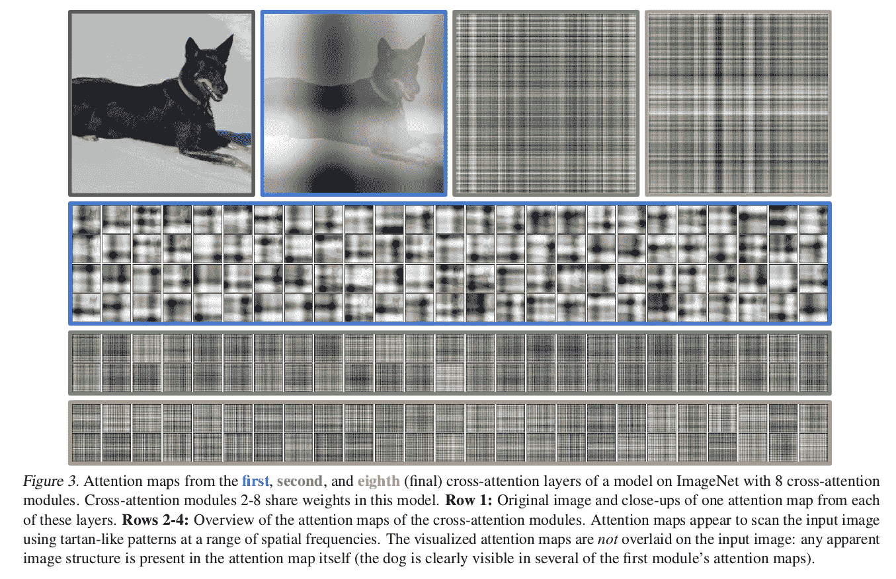

# 论文摘要:“感知者:具有重复注意的一般感知”

> 原文：<https://medium.com/nerd-for-tech/paper-summary-perceiver-general-perception-with-iterative-attention-6fd5c926f4fb?source=collection_archive---------7----------------------->

https://arxiv.org/abs/2103.03206

# 要点

*   在感知者架构的变压器模块中使用具有固定大小的可学习潜在阵列作为查询
*   原始输入可能很长，因为它将被用作转换器模块中的键和值
*   务必注意将输入数据融合到潜在数组中。这允许感知者将输入大小解耦到二次变换器复杂度
*   对潜在阵列进行自我关注
*   使用一个交叉注意和多个自我注意作为一个模块，并多次堆叠，我们得到了感知者架构。
*   如果输入数据需要，使用傅立叶特征进行位置编码
*   感知者适用于图像、视频、音频、3d 点云

# 提出感知者背后的想法

变压器不仅用于自然语言处理，还用于其他领域，如图像分类，特别是 VIT。

但到目前为止，将变压器应用于其他领域意味着定制整体架构以克服变压器的限制，最大的障碍是变压器的二次复杂度取决于输入序列的大小。

当使用图像、音频、视频等其他领域时，输入长度成为一个严重的问题，因为这些数据与文本相比非常大。

感知者试图克服这个二次复杂度问题，同时提出一种可以直接处理来自包括图像、音频、视频等各种域的输入的体系结构。

# 体系结构

由两个模块组成

1.  交叉注意模块
2.  自我关注模块

如果你熟悉变压器的内部结构，这两者之间的区别是显而易见的。

简单解释一下区别，两者共享核心思想。给定查询、键、值数组，值数组的权重通过将查询和键数组相乘来计算。两者的区别在于查询数组是否与键和值数组相同。

交叉注意模块是感知者避免二次复杂性策略的关键。冗长的输入数组(MxC)将被用作键和值数组。对于查询数组，使用潜在数组(NxD)。这个潜在数组的序列长度远小于输入数组，在本文中它使用 1024。因此，在这种情况下，复杂度是 O(MN)。

自我注意模块是通过对所有 Q、K、v 使用潜在阵列来完成的。因此，该模块的复杂度是 O(N)。

对于每一个在开始时由一个交叉关注和随后的几个自我关注模块组成的块，总复杂度变成 O(MN +LN)，其中 L 是潜在变换器内部的自我关注层数。通过将 N 的大小固定为比 M(输入阵列长度)小得多的值，即使输入阵列很长，感知者也可以使用多个变换器。

感知者像这样链接多个块，这允许潜在阵列可以与长输入阵列交互的多个点。人们可以将此解释为从输入数组中迭代提取信息的潜在数组。

块之间的权重可以共享，但不是第一个交叉注意模块，因为这样做会使训练不稳定。这是根据经验发现的。

对于交叉注意模块，输入采用层范数+线性层

学习初始潜在阵列，并使用均值=0、标准偏差= 0.02 和截断界限[-2，2]的截断正态分布随机初始化

未使用辍学

残留设计。在移动到下一个块之前，模块的输入与模块的输出相加。

# 使用傅立叶特征作为位置编码

图像、音频、视频、点云数据都需要索引信息，四特征是一种众所周知的位置编码方法。作者实验了可学习的位置嵌入，但它导致较低的性能。对于图像，当使用绝对坐标时，模型过度拟合。

# 其他领域的实验

用 LAMB 优化训练的模型。

## 图像

相比雷斯内特和 VIT，感知者显示出竞争结果。

作者展示了交叉注意模块的注意图以获得洞察力。

第一个交叉模块注意图类似于输入图像。但是其他共享权重的交叉模块显示出高频率的格子状图案。这被认为是由于 FF 位置编码，因为作者说这种类型的模式在使用习得的位置编码时没有显示出来。

## 音频和视频

视频辍学有所帮助。

音频+视频融合提供了比单一模态更好的性能。但低于使用晚期融合的 SOTA。

## 点云

每个模块使用 2 个交叉关注层和 6 个自我关注层的架构

使用比图像更高的最大频率来说明点云的不规则采样结构

使用 64 个频段。超过这一点会导致过度拟合

SOTA(pointnet++)是通过进行更复杂的增强和特征工程实现的。感知者的表现低于 SOTA 是合理的。但与其他与感知者接受相同水平增强训练的架构相比，感知者工作得最好。