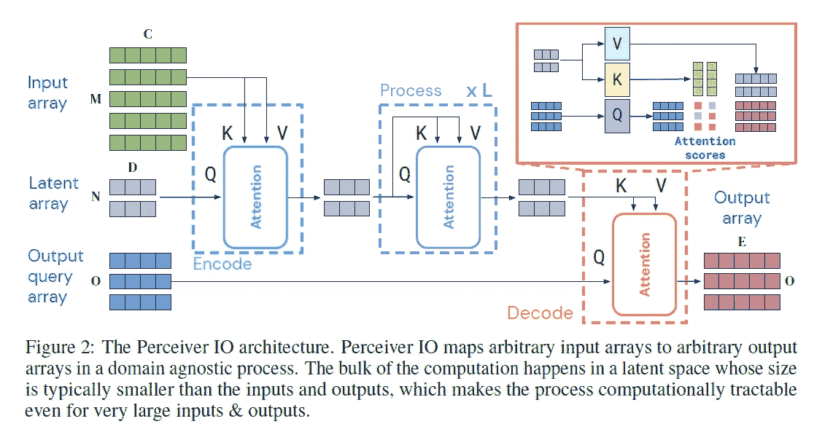
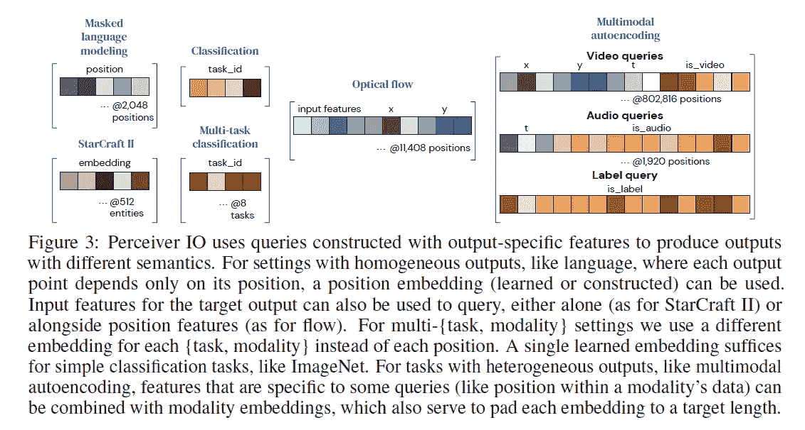

# 论文摘要“感知者 IO:结构化输入输出的通用架构”

> 原文：<https://medium.com/nerd-for-tech/paper-summary-perceiver-io-a-general-architecture-for-structured-inputs-outputs-8482ad22d7b7?source=collection_archive---------5----------------------->

https://arxiv.org/abs/2107.14795

# 要点

*   在感知者思想的基础上发展，感知者 IO 提出了一种类似感知者的结构，但是输出大小可以大得多，并且仍然保持整体复杂度线性。*(结账总结上感知者* [*此处*](/nerd-for-tech/paper-summary-perceiver-general-perception-with-iterative-attention-6fd5c926f4fb) *)*
*   与感知者一样，这项工作使用潜在阵列来保存输入信息，并通过多重自我注意来运行。因为潜在数组大小是固定的，所以复杂度不依赖于输入长度。
*   当产生输出时，使用潜在数组和“输出查询数组”之间的交叉注意，其长度与期望的输出大小相匹配。这种情况只发生一次，所以总体复杂度仍然是线性的。

# 背景

“感知者”是一个很好的提议，因为它允许转换器处理更长的序列长度。但是输出仍然受限于潜在数组大小，因此它只能用于分类任务。

感知者的主要优点是减轻了输入的长度限制。那么我们如何减轻输出的长度限制呢？

# 拟议结构

在第一步，交叉注意模块接收输入数组并将其混合到潜在数组中。几个自我注意模块被应用于潜在阵列。在最后一部分，使用了另一个交叉注意模块，其中潜在数组被用作键和值，而“输出查询数组”被用作查询。这个最后的交叉注意模块允许最终输出一个长度与输出查询数组相同的输出数组。

与感知者的关键区别是我们可以通过配置输出查询数组的长度来控制输出数组大小的最后一部分。

另一个关键的区别是，在感知者中，输入阵列不仅在第一阶段融合到潜在阵列中，而且在整个结构之间多次融合。这种做法不用于感知者 10。这篇论文没有提到为什么，但我个人很想知道为什么，因为周期性地将输入数组注入潜在数组看起来像是一种提高模型性能的方法。

那么如何准备“输出查询数组”？这取决于你想做的任务。它应包含与扣除输出相关的信息。例如，对于一个分类，它可以是一个单一的可学习的向量。对于具有空间/时间信息的图像或视频，输出查询数组可以包含位置编码。对于多任务，输出查询数组中的每个数组可以代表每个任务。下图显示了本文中用于各种任务的输出查询数组结构。

# 实验

因为感知者 IO 结构可以输入长序列，也可以输出长序列，所以这篇文章没有使用标记化器，而是将 UTF8 字节用于 NLP。令人惊讶的是，UTF8 字节级感知 IO 使用句子标记匹配 BERT 的性能。

简单的感知者 IO 结构在其他任务中表现良好，例如光流、多模态自动编码，以及作为在星际争霸 RL 框架中使用的原始转换器的替代。