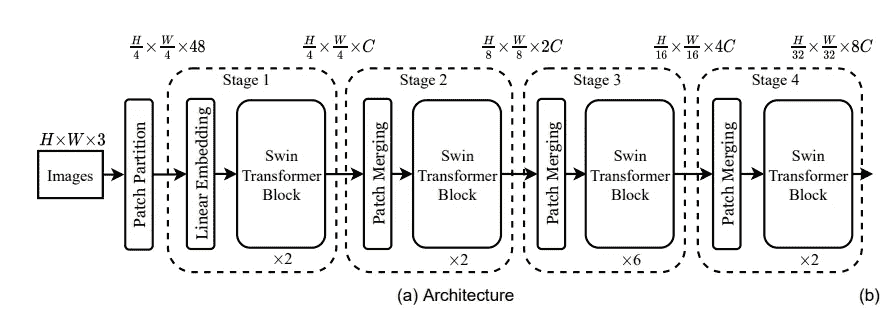
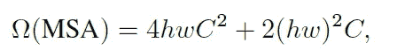
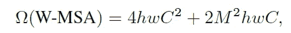
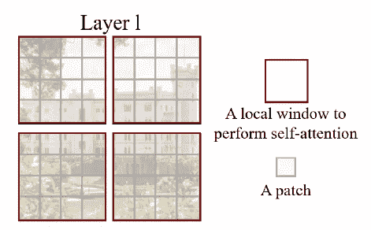
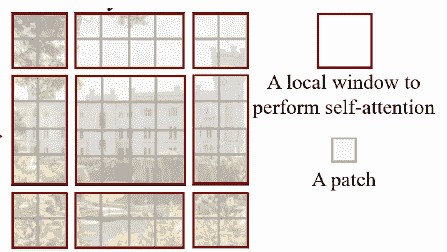
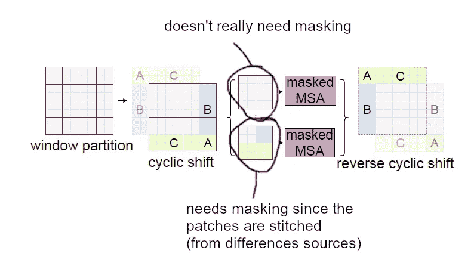
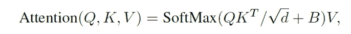
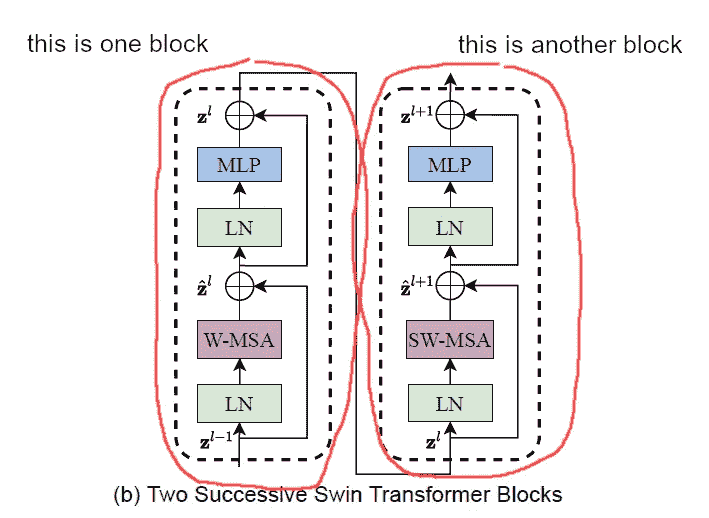

# 论文摘要:Swin 转换器:使用移位窗口的分层视觉转换器

> 原文：<https://medium.com/nerd-for-tech/paper-summary-swin-transformer-hierarchical-vision-transformer-using-shifted-windows-a6c09c34c79f?source=collection_archive---------0----------------------->

https://arxiv.org/abs/2103.14030

# 要点

*   多尺度特征提取。可以认为是采纳了 FPN 的想法。
*   将转换器操作限制在每个窗口内，而不是整个特征映射→允许保持整体的线性复杂度，而不是二次复杂度
*   应用移位窗口以允许窗口间交互
*   融合自我关注中相对位置信息

# 背景

变形金刚开始在图像领域被采用

以前的作品，如 VIT，DEIT 是一个很好的进步，但他们在一些地方缺乏，主要是

*   无法处理不同的图像比例
*   二次复杂度

这项工作将试图克服这些缺点

# 体系结构

对于输入图像，将 4x4 像素展平为一个矢量。因此，4x4 的非重叠面片，其中每个像素有三个 RGB 值，每个面片将被转换为长度为 4x4x3=48 的矢量。该向量将通过线性嵌入层，并被转换为具有维度 c。

这需要经过一个经过修改的变压器模块，称为“swin 变压器模块”,它有一些修改，将在后面描述。在这之后，我们仍然得到一个特征图，其中每个元素都有维度 c。这个变换器和它前面的线性嵌入层被称为“阶段 1”

从这一点开始，特征映射经历“面片合并+ swin 变换器块”的若干次重复，并且该过程每个都将被称为“阶段”。

面片合并是通过连接四个元素对 2x2 相邻面片进行分组，然后应用线性层。例如，第一次面片合并，由于输入要素地图的每个位置的矢量大小为 C，因此将 2×2 个面片连接成一个面片将得到长度为 4C 的矢量。它后面的线性层将通道大小从 4C 更改为 2C。此过程相当于将特征图的宽度和高度减少 2 倍的下采样。补丁合并后，应用 swin 变压器块。

正如你所见，每次应用“补丁合并+ swin 变压器块”，我们得到一个简化的功能图。这是重复 3 次，总的来说，我们得到 4 个不同比例的特征地图。

这是可以用于对象检测、分类或分割的主干结构。

# Swin 变压器组

那么 swin 变压器有什么特别之处呢？swin transformer 的核心有三个理念

*   将面片分割成多个窗口，并且仅在每个窗口内的面片内应用变换→这将限制变换的复杂性，从增加每个特征贴图的面片总数到窗口大小(每个窗口内的面片数)
*   将补丁切片到窗口中，第一次应用 transformer 后，窗口拆分会移动，然后再次应用 transformer→允许相邻窗口相互交互。
*   添加相对位置偏差

# 窗口分区

每个窗口将覆盖 MxM 个补丁，缺省值为 M=7。如果是普通的变形金刚多头自关注模块，复杂度会是

但是通过将变换限制到每个窗口区域，复杂度现在被降低并且依赖于 M。

MxM 补丁的分区从特征图的最左上角开始。下图显示了一个 4x4 分区的示例。

# 移位窗口划分

移位版本分区从(M/2，M/2)开始。下面的例子是当 M=4 时

剩余部分(不完全是 MxM 大小的分区)以循环的方式修补在一起。很难用语言来表达，所以下图将展示如何将剩余的部分缝合在一起。

这些“缝合”的窗口不是“纯的”，换句话说，区域实际上在实际位置上不相邻，因此当在该窗口上应用自我关注时，我们对每个子区域应用掩码，使得不相邻的子区域在自我关注期间不交换信息。

这种“拼接”方法的另一个优点是移位窗口划分的划分数量与应用正常窗口划分时的数量相同。如果我们不做拼接，而只是将剩余部分视为一个窗口，那么分区的数量将大于正常窗口分区的数量。当窗口尺寸小于特征图尺寸时，这种差异会变得显著。

对于拼接窗口的结果子区域，它需要恢复到原来的位置，所以请确保应用“反向循环移位”。

# 相对位置偏差

在应用 softmax 计算查询的值矩阵权重之前，作者将相对位置信息添加到 QK 乘积中。

当 MxM 窗口存在于特征地图时，x 轴或 y 轴的相对位置值将在范围(-M+1，M-1)内。为了整合这种相对位置信息，我们准备了具有形状(2M-1，2M-1)的可学习参数 matrix(B^。每个元素将代表一个向量，该向量代表相对的 x，y 位置差。实际相对位置偏差矩阵(b)将从 B^.采样

通过实验，没有任何偏见或使用绝对位置嵌入给出了低劣的性能。

# 窗口自我注意和转移窗口自我注意是连锁的

一个变压器块将由(窗口或移位窗口自关注模块+ MLP)组成。并且当顺序链接 swin 变压器时，自关注模块应该在窗口自关注和移位窗口自关注模块之间切换。下图显示了应用于 2 个 swin 变压器模块的规则示例。

# 小细节

*   在窗口 MSA(多头自我关注)或移位窗口 MSA 之后，应用 2 层 MLP (GELU 在中间)。MSA(窗口/移位窗口)和 2 层 MLP 的输入首先通过层规范。

# 架构变体

本文创建了 swin 变压器架构的几个变体，以便模型大小与 ViT/DeiT 模型或 ResNet-50、ResNet-101 相当。模型尺寸由 C(初始特征图的通道尺寸)的尺寸、每个阶段中的 swin 变换器块的层尺寸、窗口尺寸、MLP 层的扩展因子等控制。

在纸张中，窗口大小(M)固定为 7，MLP 层的扩展因子为 4，头部的尺寸为 32，下表显示了变体及其 C、swin 变压器块的层大小。

这些术语在这里以协商的方式使用，但是 swin 变压器模块的层大小=每个阶段中的 swin 变压器模块号。

# 实验

# 图像分类

在 imagenet 上测试。与变形金刚(VIT，DEIT)相比，Swin 变形金刚表现更好。与诸如 EfficientNet 之类的 conv 网络变体相比，它的性能稍低，但是考虑到 EfficientNet 是广泛架构优化的结果，作者指出 swin transformer 有潜力做得更好。

# 对象检测和实例分割

在 COCO 身上测试过。与改良的 DeiT 和 Resnet 主干网相比，Swin 变压器性能更好。