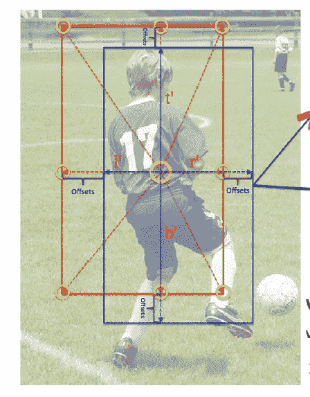
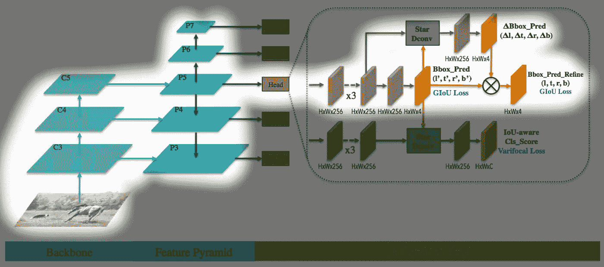
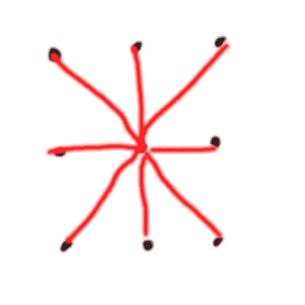
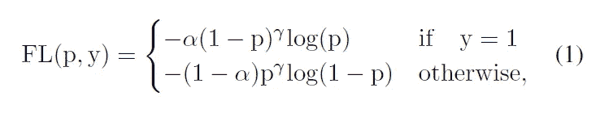
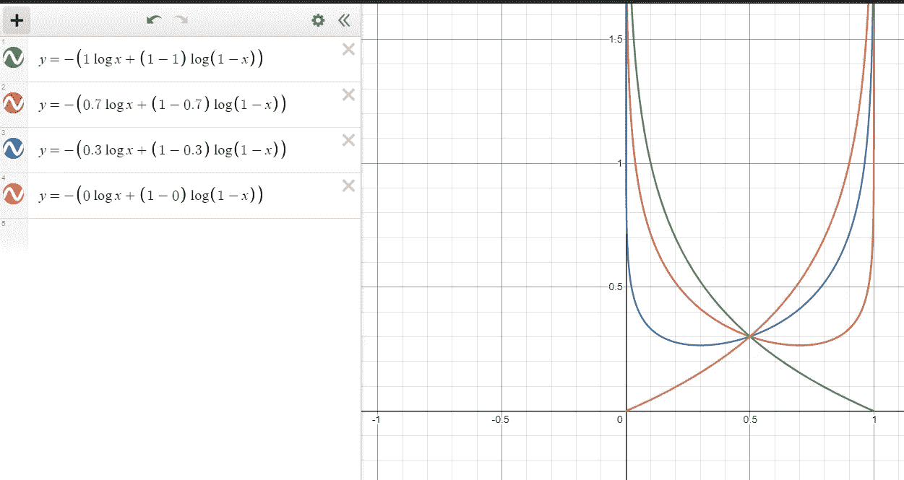
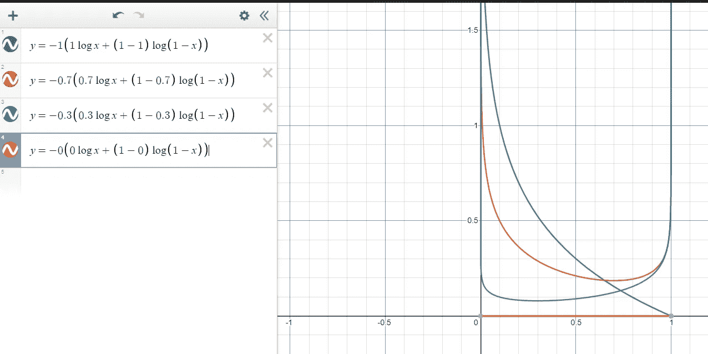
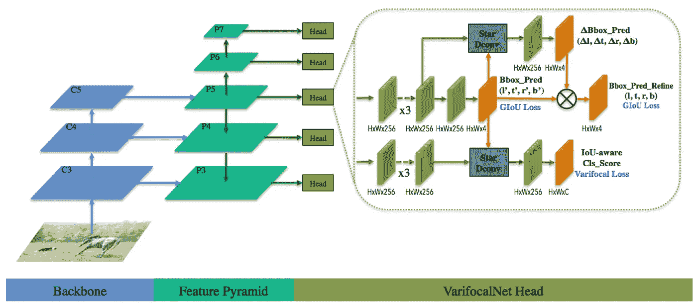
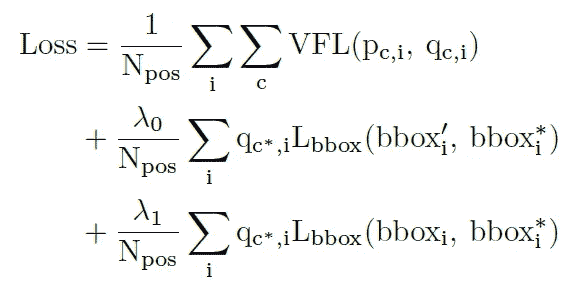
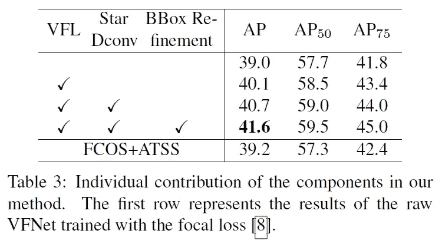

# 论文摘要:“VarifocalNet:一种 IoU 感知的密集对象检测器”(VFNet)

> 原文：<https://medium.com/nerd-for-tech/paper-summary-varifocalnet-an-iou-aware-dense-object-detector-vfnet-dab63cce2626?source=collection_archive---------5----------------------->

https://arxiv.org/abs/2008.13367

# 要点

*   另一种基于无锚点的目标检测网络
*   引入新的损耗，变焦距损耗，它是焦距损耗的分叉版本。从焦点损失做出一些改变，以进一步补偿正/负不平衡。
*   这项工作不是分别预测分类和 IOU 得分，而是预测代表这两者组合的单个标量。作者说，这种方法在进行 NMS 后处理时显示出更好的结果。
*   星形盒特征表示。

# 介绍

这部作品在 FCOS + ATSS 的基础上应用了新的理念。强烈推荐两种网络/方法的阅读。特别是，ATSS 是本文采用的正/负抽样方法，这有助于理解本文顺利。

FCOS 也是一个无锚点对象检测网络，其中每个特征图中的每个点预测对象类别和“中心性”。这种分别预测对象类别和表示 bbox 定位的一些标量(在这种情况下为“中心性”)的方法看起来不错且直观，但在进行 NMS 后处理时，它的表现并不太好。采用类似方法的其他网络通常使用分类标量作为置信度，或者将该置信度乘以“定位”标量(例如“中心度”)以将其用作排序标准。然而，根据作者的说法，这个值在 NMS 的表现并不好。

# IoU 感知分类分数(IACS)

因此，作者建议预测单个标量，该标量已经是对象分类和定位度量的乘积值，并在 NMS 中直接使用该值进行排名。作者提出了欠条意识分类得分(IACS)。这个方法将填充 gt 类对象的 IoU 值，而不是类的置信度值。IoU 值将是预测 bbox 和 gt bbox 之间的 IoU 值。在其他等级的槽中，gt 值应设置为零。需要注意的一点是 gt 类的 gt 值是动态的。

# 星形盒特征表示

关于对象类别和预测置信度的决定委托给 IACS。那么实际的包围盒坐标呢？针对这个问题，本文采用了“星形盒特征表示法”。

对于特征图中的每个点，网络通过预测 4 个值来预测初始 bbox:(l’，t’，r’，b’)，每个值代表来自给定点的初始 bbox 的左、右上、下值。然后对于每个点，收集左、右、上、下角和中点的 9 个点，以及给定点本身。收集这 9 个点，并在其上应用**可变形卷积**。使用这一新功能，预测 bbox 偏移，也是 4 个值:(dl，dt，dr，db)。更合适的名称是“比例因子”，因为最终(l，t，r，b)值是通过(dl** l’，dt** t’，dr * r’，db * b’)获得的。在论文中，这第二步被称为“边界框细化”，作者说这有助于预测的边界框更接近真实情况。

在这一点上，我很好奇实际的实现是如何处理 l，t，r，b 值的剪裁的，但是这部分在论文中没有提到。我想我必须检查这些小细节的代码实现。

我想知道为什么这种方法被称为“星形”,但我想我知道为什么。如果我们从中心点到边界的其他 8 个点画线，它有点像一颗星星。

# 变焦损失

回到 IACS。我们知道网络想要预测什么(IACS)，但是如何将焦点损失的“进化”版本包括进来呢？

焦点损失通过将预测值乘以 gamma 来很好地处理类别不平衡，公式如下所示。

这项工作借用了这个概念**只是**用于负样本的损失计算。对于阳性样本，它使用 bce 损失，但有一个区别:它将 bce 损失乘以 gt 值。这个修改版本的公式如下所示，我们称之为“变焦损失”。

对负样本使用焦点损失是有意义的，因为建议的网络将不可避免地对每个特征图中的每个点进行大量预测，这些预测最终甚至不会成为有效的对象框。这项工作很聪明，对阳性样品不采用这种聚焦方法，而采用 BCE 损失。

关于正样本损失的另一个巧妙之处是，它不是普通的 BCE 损失。地面真实值(=q)乘以 BCE 损失。让我们来看看这个小小的变化是如何使正样本损失对我们有利的。

对于普通 BCE 损失，损失值如下所示变化，其中图表根据实际值(=q)变化。

修正 BCE 损失的相同图表如下所示。

在普通版本中，不同 q 值的损耗图显示了以 q=0.5 为中心的对称行为。q=1.0 和 q=0.0 的损耗图是相同的，只是水平翻转了一下。

然而，对于修正的 BCE 损耗，q=1.0 和 q=0.0 的损耗图明显不同。对于 q=0.0，图形是平坦的。这条曲线不会出现梯度贡献。对于 q=1.0，该图与普通 BCE 损失中的图相同，并且该曲线将产生优化 q 值的梯度。像这样，我们可以看到损耗曲线在 q 值更接近 1.0 时有效，在 q 值接近 0.0 时变得没有意义。由于我们希望提高更多“确定”阳性样本的损失值，修正的 BCE 损失比普通 BCE 损失更有利。

# 整个网络结构

本文中提出的三个主要增强功能是

*   星形盒特征表示
*   变焦损失
*   IoU 感知分类分数

包含所有这些的网络结构如下所示。

主干和特征金字塔是从以前的作品中采用的，所有的新思想都被应用到附在每一层特征地图上的头部网络中。

论文称之为 **VFNet**

# 失败

整个损失是以下各项的加权和

*   变焦损失
*   最初预测的 bbox 损失
*   精炼 bbox 损耗

这可以用这样的公式表示:

每个符号的含义都写在标题中。有一点我不太明白 if why 用 N_pos 归一化，就是正样本(前景点)的个数。我认为直觉上这是正确的选择，但只是无法从理论上解释为什么这是正确的选择。

# 推理

该纸张使用 1333x800 的输入图像尺寸。当过滤输出框时，它经历以下步骤

*   移除最大 IACS 小于 0.05 的 bbox
*   为每个 FPN 级别选择前 1k 个 max_IACS 值框
*   应用阈值为 0.6 的 NMS

# 消融研究的收获

## 新思想的贡献

分析了三个组成部分(变焦损失、星形 bbox 表示、bbox 细化)的贡献，结果如下所示。

这三者都会带来改善。

## 变焦损失优于其他损失

本文还试验了变焦距损失是否优于普通焦距损失(FL)和广义焦距损失(GFL)。结果如下所示，我们可以看到，变焦损失比其他人更好。