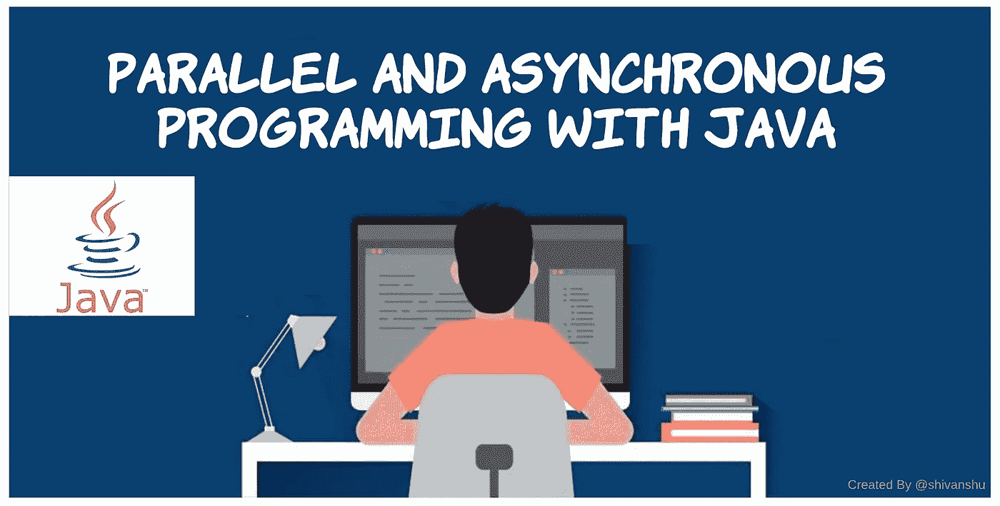
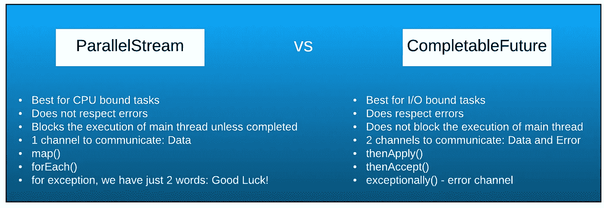

# 用 Java 进行并行和异步编程

> 原文：<https://medium.com/nerd-for-tech/parallel-and-asynchronous-programming-with-java-54278db2d839?source=collection_archive---------0----------------------->

Java 是一种很好的语言，它通过以编程方式创建轻量级进程(称为[线程](https://docs.oracle.com/javase/8/docs/api/java/lang/Thread.html))来提供顺序、并行和异步编程。它帮助我们编写一个高效的程序来实现某些目标。

让我们先了解一下程序的这 3 种方式是什么？

1.  **顺序程序:**给出了一个 **N** 任务的列表，程序依次挑选出这些任务中的每一个，并执行一些动作。假设每个任务需要 1 秒钟完成，那么我们的顺序程序将需要 N 秒钟完成。
2.  并行程序:我们对顺序程序不满意，我们想提高它的性能，这里并行程序使用线程来划分任务列表，线程开始并行处理这些任务，以便在更短的时间内完成。 ***这里并行程序等待每个线程完成它们的任务。***
3.  **异步程序:**它也像并行程序一样，利用线程在较短的时间内完成任务。但是，有一个区别，因为它不等待任务列表完成，任务是异步完成的，程序忙于做其他事情。

Java 1 有线程来进行并行编程。这个线程类有一个方法`void run()`，它不接受任何东西，也不返回任何东西。这带来了代码的可变性。开发人员需要创建线程来划分他的任务，以获得更好的性能。几年后， **Java 5** 提出了[**ExecutorService**](https://docs.oracle.com/javase/7/docs/api/java/util/concurrent/ExecutorService.html)，它在内部管理线程池，并提供了一种编写并行程序的抽象方法。它返回 [**未来**](https://docs.oracle.com/javase/7/docs/api/java/util/concurrent/Future.html) 对象。但是有一个问题，一旦我们对 future 对象应用 get 操作，future 对象就不再是 future 了，它就在那里阻塞执行。所以，我们需要一些别的东西来在 Java 中拥有一个纯粹的异步程序。我们开始吧。 **Java 8** 引入[**CompletableFuture**](https://docs.oracle.com/javase/8/docs/api/java/util/concurrent/CompletableFuture.html)来实现同样的事情。使用 parallelStream()和 CompletableFuture 可以实现并行和异步编程。

这些概念基于函数式编程。如果你不知道什么是函数式编程？我会推荐参考这篇 [**文章**](/@shivanshugoyal0111/the-new-aspect-of-java-with-functional-programming-d2ca6517d15e) 先了解函数式编程。

在后台，它们使用相同的线程池，数量等于`Runtime.getRuntime().availableProcessors()`。让我们了解一下 parallelStream 和 CompletableFuture 的区别:

> 确定为获得最佳性能而创建的线程数量的最佳方法。
> 
> 如果任务是 CPU 密集型的，那么`# of threads should be equal to and less than # of cores`。
> 
> 如果任务是 I/O 密集型的，那么`# of threads should be equal to and less than (# of cores / 1 — blockingfactor) where 0 ≤ blockingfactor < 1`
> 
> 一台机器的核心数量:`Runtime.getRuntime().availableProcessors()`
> 
> `ForkJoinPool.commonPool() returns parallelism value which is # of cores -1 as one is main thread itself`

## Java 中如何使用 parallelStream？

## Java 中如何使用 CompletableFuture？

completableFuture 可以有以下阶段之一:

1.  **已解决**(这是最终阶段，一旦实现，以后就不能修改)
2.  **被拒绝**或出错(这也是最终阶段)
3.  **待定**(仍在等待进入前两个阶段之一)

在 CompletableFuture 上使用 get()不是一个好主意，因为它阻塞了程序的进一步执行。

thenApply()、thenAccept()、thenRun()等是在 CompletableFuture 的解析阶段执行的方法。

> **CompletableFuture<T>是不朽的。他们永远不会死。**

在 CompletableFuture 的拒绝阶段，整个流程中的第一个 exceptive()方法被调用。**异常有两种处理方式:**

1.  展开异常:它只停留在错误通道中。
2.  记录异常并返回默认值以返回数据通道。

**如果尚未完成，可以使用 complete()** 方法将 **get()** 和相关方法返回的值设置为给定值。当该调用导致 CompletableFuture 转换到完成状态时，它返回 true，否则返回 false。

让我们用下面的例子来理解 complete()。

未来 1 和未来 2 有什么区别？

通过语句`future1.complete(20);`,我们将 future1 放入已解决阶段，future1.get()值为 20。然后，我们在终端中应用打印 20 的`future1.thenAccept(System.out::println);`。

通过语句`future2.complete(20);`，我们将 future2 放入已解决阶段，future2.get()的值为 20。然后，我们应用`future2.thenApply(data -> data * 2)`，它将 20 作为输入，并将其映射到 40，它被进一步传递给`thenAccept(System.out::println);`方法，后者将 40 打印到终端。

我们还有`**completeExceptionally(Throwable throwable)**`，可以在流水线出现异常的情况下使用。在下面的示例中，future 正在使用语句`future.completeExceptionally(new RuntimeException(“We are throwing exception”));`完成被拒绝的阶段，它查找第一个异常块并跳过其他已解析的阶段块，如`thenApply()` `Programming::*exceptionHandler*` 正在处理异常并通过向管道返回 0 来从中恢复。之后，`thenAccept(System.*out*::println)`消费响应，在终端上打印 0。

我们谈到了**解决**和**拒绝**阶段，那么**未决**阶段呢？有一条规则说“ ***没有超时*** ”我们永远不要在编码中执行某个东西。不幸的是，我们在 java 8 中没有这个超时 API，但 java 总是让我们开心，它在 java 9 中引入了[**completeOnTimeout()API**](https://docs.oracle.com/javase/9/docs/api/java/util/concurrent/CompletableFuture.html#completeOnTimeout-T-long-java.util.concurrent.TimeUnit-)。让我们看看它是如何工作的？

这条语句`future.completeOnTimeout(0, 2, TimeUnit.*SECONDS*);`等待 2 秒完成未来。如果它没有被语句`future.complete(*compute*(10));`完成，future 将被完成到 resolved 阶段，其中`future.get()`值为 0。

现在，我们有另外两件重要的事情要在未来讨论。

1.  撰写(类似于流中的[平面图](https://docs.oracle.com/javase/8/docs/api/java/util/stream/Stream.html#flatMap-java.util.function.Function-)
2.  组合(流中没有相应的 API)

我们来试着理解一下为什么这些东西在这里都有？我举一个 javascript 的例子来揭开它的神秘面纱。

`then(e -> function(e)); it always returns a promise`

现在 Javascript 是动态类型语言，而 Java 是静态类型语言。这个`function(e)`可以返回任何东西。它可能是任何数据或[承诺](https://javascript.info/promise-basics)。如果是数据，它被包装到一个承诺中并被返回，否则它被直接返回。但是，这种隐式的东西在 Java 中是无效的，因为返回类型在 Java 中很重要。让我们看看如何用 Java 实现它。

> **在 streams 中**
> 当函数返回数据时，我们使用 map()
> 当函数返回 stream 时，我们使用 flatMap()
> 
> **在 CompletableFuture** 中，当函数返回数据时，我们使用 thenApply()
> 当函数返回 CompletableFuture < T >时，我们使用 thenCompose()

`**thenCompose()**`等待 completableFuture(本例中为`add()`)完成，然后将结果传递给`thenAccept()`方法。

`**thenCombine()**`用于合并两个 completableFutures 的结果。它有两个参数，第一个是 completableStage，第二个是 BiFunction

我希望它有助于理解用 Java 进行并行和异步编程。感谢阅读！