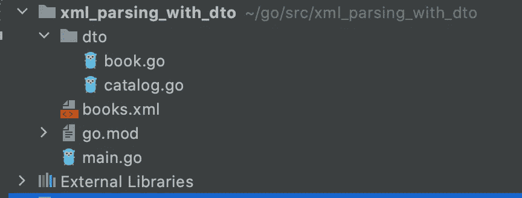
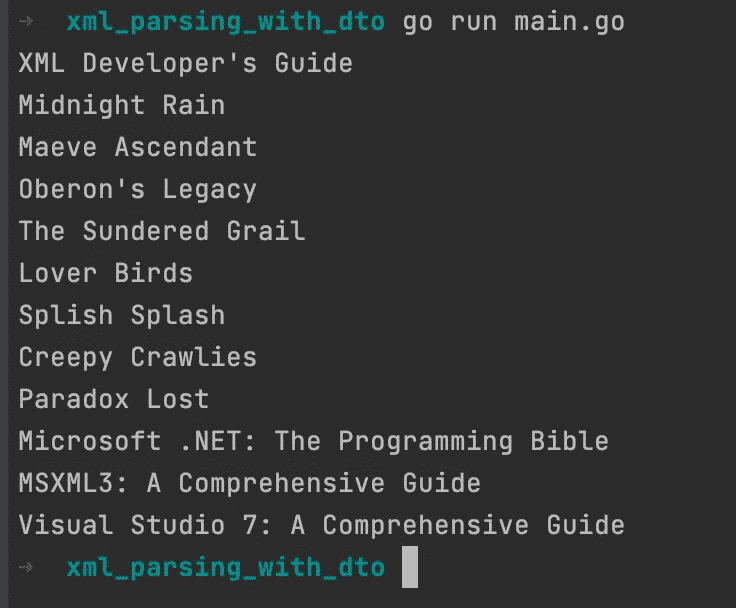

# 使用 DTO 模式通过 Golang 解析 XML

> 原文：<https://medium.com/nerd-for-tech/parsing-xml-via-golang-with-dto-pattern-c1b21ce661b5?source=collection_archive---------7----------------------->

大家好，在本教程中，我将向大家展示如何用 DTO 通过 Golang 解析 XML 文件。

**项目结构**



**Books.xml**

XML 文件包含每本书的作者、书名和价格等数据。

我们不需要额外的库来用 Go 解析 xml 或 json。Go 附带了很多有用的包。

让我们开始编码吧。

首先，我们用 **os** 包中的 **Open** 函数打开文件。我们使用 **Defer** 方法在完成后关闭文件。注意，用 defer 声明的方法将在 main 函数结束之前执行。

文件，错误:=操作系统。打开(“。/books.xml")
defer 文件。关闭()

之后，我们可以使用 ioutil 将这些文件转换成一个字节数组。 **ioutil** 是一个实现输入输出效用函数的包。

数据，_ := ioutil。全部读取(文件)

**数据传输对象**

我们的数据传输对象有两种结构类型。第一个叫做目录。它可以包含所有的书。另一本叫做那本书。它已经存储了每本书数据。

**解组**

“Unmarshal 解析 XML 编码的数据，并将结果存储在 v 指向的值中，该值必须是任意的结构、片或字符串。不适合 v 的格式良好的数据将被丢弃。

```
var catalog dto.Catalog
xml.Unmarshal(data, &catalog)
```

**检索值**

```
for i:=0; i < len(catalog.Books); i++{
   book := catalog.Books[i]
   fmt.Println(book.GetTitle())
}
```



如果你想检查代码，可以从[这里的](https://github.com/bariseser/golang_xml)库。

谢了。