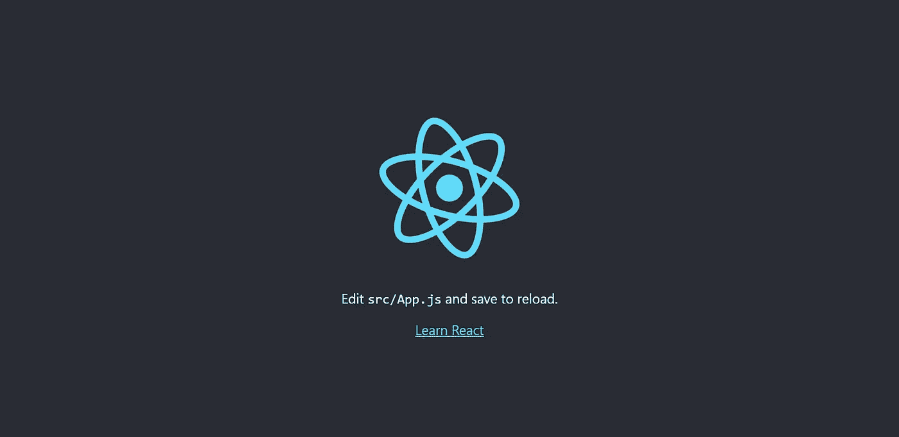
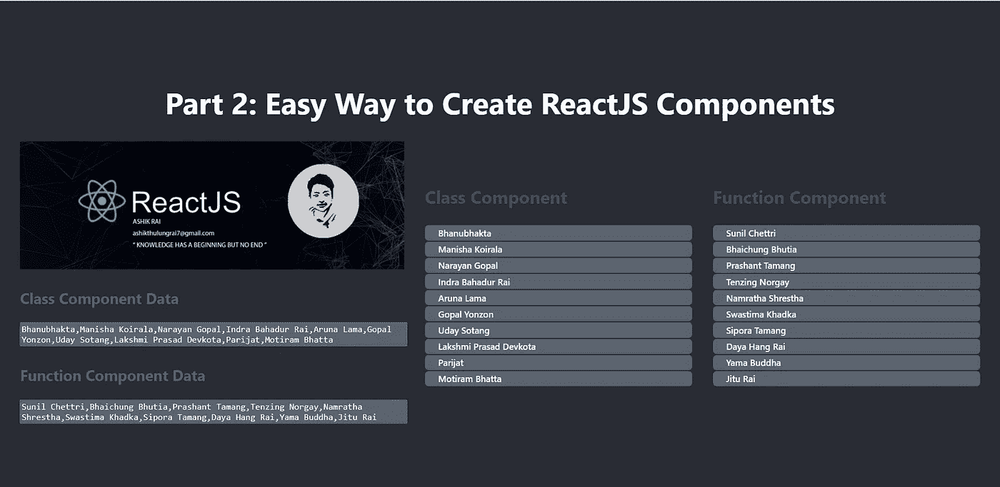
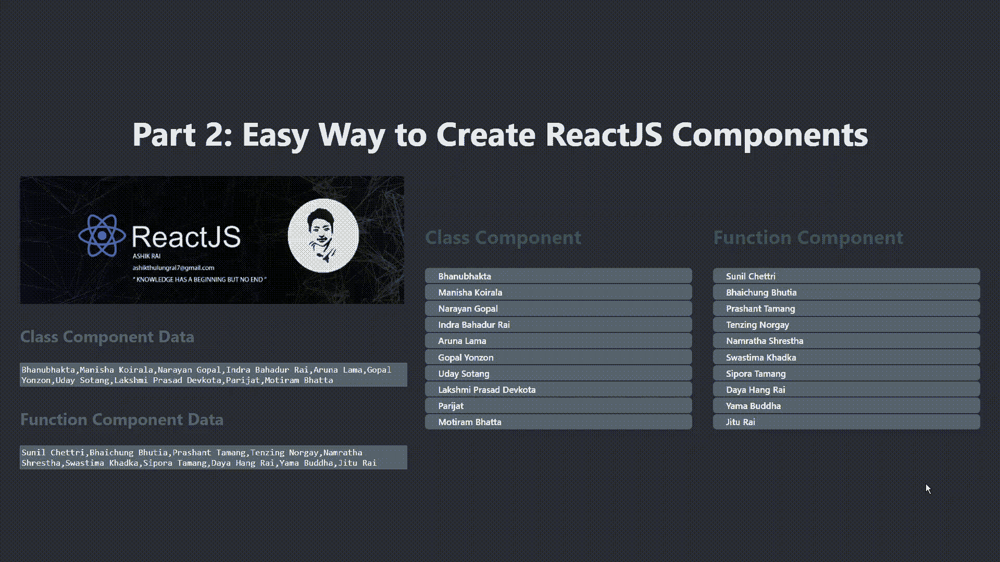

# 第 2 部分:创建 ReactJS 组件的简单方法

> 原文：<https://medium.com/nerd-for-tech/part-2-easy-way-to-create-reactjs-components-7d458b577c67?source=collection_archive---------13----------------------->


读者好，我们已经在第一部分 中学习了如何创建 ReactJS 应用程序，今天我们将学习:

1.  **简介(什么是 ReactJS 组件)**
2.  **如何创建 ReactJS 组件(函数和类组件)。**
3.  **如何导入和渲染 ReactJS 组件。**
4.  **如何将(PROPS)参数传递给 ReactJS 组件**
5.  **一瞥我们今天正在建造的东西**

# 其他 ReactJS 教程的快速链接

1.  第 1 部分:[如何创建一个新的 React App | by ki HSA Rai | Medium | Medium](/@ashikthulungrai7/how-to-create-a-new-react-app-3286a37e2189)
2.  第 2 部分:创建 ReactJS 组件的简单方法
3.  [如何使用 REACT BEAUTIFUL DND 库创建拖放组件&](/@ashikthulungrai7/drag-drop-react-beautiful-dnd-328e00797f27)

> 更多细节请参考 awesome built，ReactJS 文档:[链接](https://reactjs.org/)


图片来源:[链接](http://2000881-Joel-Spolsky-Quote-It-s-harder-to-read-code-than-to-write-it.jpg (3840×2160) (quotefancy.com))

# 1.介绍

ReactJS 架构允许我们将整个应用程序分解成许多组成整个复杂 ui 的小组件。OOPS 中的 Class 这样的组件是任何 ReactJS 应用程序的**构建块**。它是一段代码，主要允许应用程序的代码**可重用性和模块性**。

ReactJS 组件就像任何其他 JavaScript 函数一样，接受名为 **Props** 的输入，并根据输入决定应该在屏幕上呈现什么。因此，ReactJS 允许我们将整个应用程序分成多个更小的 ReactJS 组件，任何组件都可以独立地更新/删除/编辑/添加。

ReactJS 组件有两种类型:

1.  **功能组件**
2.  **类组件**

# 2.如何创建 ReactJS 组件



在第 1 部分中，我们刚刚创建了一个简单的 React 应用程序。运行服务器后，这是呈现的默认页面。

如图所示，我们需要编辑文件 App.js，因为这是 react 应用程序的根组件。

> 如果我们想要呈现一个 L **ist、JSON、Array 等**，其中数据结构作为 html 表是统一的，并且还允许一些 **UI 操作，如删除、编辑等**。我们可以遍历数据，这是一种标准的方法，然后**将渲染部分作为一个独立的 React 组件提取出来。**这允许我们分离关注点，代码可重用性，模块性，代码整洁性。



使用函数和类组件呈现的列表

让我们使用类组件创建上面的例子，然后我们也将使用函数组件做同样的事情。

> 在 ReactJS 中，任何组件名称都应该以大写字母开头。

# **2.1 类组件**

我们先为类组件创建一个新文件并添加所需代码，然后清理 **App.js** 文件，最后在 **App.js** 中导入并渲染

```
**// FileName: ClassComponent.jsx**import React from 'react';export class ClassComponentTable **extends React.Component** {
   **render()** {
      **const UserData** = ["Bhanubhakta", "Manisha Koirala", "Narayan Gopal", "Indra Bahadur Rai", "Aruna Lama", "Gopal Yonzon", "Uday Sotang", "Lakshmi Prasad Devkota", "Parijat", "Motiram Bhatta"] **return** (
         <div>
            <ol style={{ listStyle: 'none', textAlign: 'left' }}>
               <li>
                  <h3 style={{ color: "#4a4f59" }} >
                     Class Component
                  </h3>
               </li>
 **{UserData.map((data, index) => (**
                  <li key={index} className="items">
                     {data}
                  </li>
               ))}
            </ol>
         </div>
      )
   }
}
```

我们创建了一个名为 **ClassComponent.jsx** 的新文件，其中我们创建了一个名为 **UserData** 的常量列表变量，它包含了所有大吉岭和尼泊尔的流行面孔的**名称。**在 return 语句中，我们正在创建一个 **orderedList < ol > DOM 元素**和 **list-items < li >** 元素是通过使用 React **遍历 **UserData** 列表来创建的。map()** 函数。

> React ClassComponent 必须始终扩展 React。组件，并且在**呈现**语句中必须有一个**返回**语句。React 组件必须总是以**大写字母**开头，因为 React 将以**小写字母**开头的组件视为 **DOM 标签。**

# 2.2 功能组件

函数组件就像其他 JavaScript 函数一样，可能接收参数，也可能不接收参数，在 ReactJS 中我们称之为 props。**但与其他普通 JavaScript 函数不同，React Function-Components 返回 JSX 元素。**

```
**// FileName: FunctionComponent.jsx**import React from 'react';export **function FunctionComponentTable() {** const **UserData** = ["Sunil Chettri", "Bhaichung Bhutia", "Prashant Tamang", "Tenzing Norgay", "Namratha Shrestha", "Swastima Khadka", "Sipora Tamang", "Daya Hang Rai", "Yama Buddha", "Jitu Rai"]

 **return (**
      <div>
         <ol style={{ listStyle: 'none', textAlign: 'left' }}>
            <li>
               <h3 style={{ color: "#4a4f59" }}>
                  Function Component
               </h3>
            </li>
 **{UserData.map((data, index) => (**
               <li key={index} className="items">
                  {data}
               </li>
            ))}
         </ol>
      </div>
   )
}
```

我们创建了一个名为 **FunctionComponent.jsx** 的新文件，其中我们创建了一个名为 **UserData** 的常量列表变量，它包含了另一组**大吉岭和尼泊尔所有受欢迎面孔的名字。**返回语句内的代码类似于 Class-Component。

> React 函数组件必须有一个**返回**语句。

# 3 .**如何导入和渲染 ReactJS 组件。**

在上面的部分中，我们已经创建了类和函数组件，让我们将它们导入并呈现在我们的 **App.js 中。**

```
**// FileName: App.js**
import './App.css';import React from 'react'import { ClassComponentTable } from "./Part2/ClassComponent";
import { FunctionComponentTable } from "./Part2/FunctionComponent";function App() { **const UserData** = ["Bhanubhakta", "Manisha Koirala", "Narayan Gopal", "Indra Bahadur Rai", "Aruna Lama", "Gopal Yonzon", "Uday Sotang", "Lakshmi Prasad Devkota", "Parijat", "Motiram Bhatta"] **const UserData1** = ["Sunil Chettri", "Bhaichung Bhutia", "Prashant Tamang", "Tenzing Norgay", "Namratha Shrestha", "Swastima Khadka", "Sipora Tamang", "Daya Hang Rai", "Yama Buddha", "Jitu Rai"] **const banner =** "https://drive.google.com/uc?export=view&id=1A2gCRLZBSBvPveVJ5OE0F4psbi9V7JLS" **return (**
      <div className="App">
         <header className="App-header">
            <h1>Part 2: Easy Way to Create ReactJS Components</h1>
            <div style={{ display: 'flex', alignItems: 'center', justifyContent: 'center', padding: '0% 2% 0% 2%' }}>
               <div style={{ width: '40%' }}>
                  
                  <div>
                     <p style={{ color: '#5c636f', fontWeight: 700, textAlign: 'left' }}>
                        Class Component Data
                     </p>
                     <textarea readOnly style={{ resize: 'none', width: '100%', background: '#5c636f', color: 'white', fontSize: '17px' }} value={UserData} />
                     <p style={{ color: '#5c636f', fontWeight: 700, textAlign: 'left' }}>
                        Function Component Data
                     </p>
                     <textarea readOnly style={{ resize: 'none', width: '100%', background: '#5c636f', color: 'white', fontSize: '17px' }} value={UserData1} />
                  </div>
               </div>
               **<div style={{ display: 'flex', width: '60%', alignItems: 'center', justifyContent: 'center' }}>
                  <div style={{ width: '50%', }}>
                     <ClassComponentTable />
                  </div>
                  <div style={{ width: '50%', }}>
                     <FunctionComponentTable />
                  </div>
               </div>
            </div>**
         </header>
      </div>
   );
}export default App;
```

开始时，我们有四个导入，前两个是 ReactApp 中的标准导入，第三个是

```
import { ClassComponentTable } from "./Part2/ClassComponent";
```

我们正在从文件 ClassComponent 导入 **ClassComponentTable** ，在第四次导入中，我们正在导入 **FunctionComponentTable。**

```
import { FunctionComponentTable } from "./Part2/FunctionComponent";
```

我们还有两个名为**用户数据**和**用户数据 1** 的常量列表，它们的数据与类和函数组件中的数据相同。可变横幅有一个 **Google Drive 链接** ( *如果你想的话可以改变图片*)。我们在 textarea 中打印 UserData 和 UserData1，最后在最后一个 div 部分中，我们呈现了导入的类和函数组件。

> 在后面的文章中，我们将使用 textarea 在类和函数组件列表中删除和添加名字，使用 Props 和其他一些小的高级概念。

# 4.**如何将(PROPS)参数传递给 ReactJS 组件**

我们已经在 **App.js** 中定义了一个 textarea，稍后我们将使用它来添加、编辑和删除类和函数组件的名称。为了方便这样的操作，我们需要 App.js 中的数据，所以我们创建了两个常量变量 **UserData1 和 UserData2。**我们还在两个组件内部定义了相同的数据，因为我们需要数据来呈现。但是有一个**不必要的数据重复**如果 **App.js 和函数/类组件**可以共享相同的数据会更好。这样做不仅可以消除不必要的数据重复，而且使用 App.js 中的 textarea 添加、编辑和删除姓名的操作变得更加高效和简单。

如果我们将 App.js 中的数据作为参数传递给这两个组件，就可以做到这一点。props 代表术语属性。

**我们可以把 App.js 里的代码改成**

```
Change **<ClassComponentTable/> to 👇
<ClassComponentTable UserData={UserData}/>** and change **<FunctionComponentTable/> to 👇
<FunctionComponentTable UserData={UserData1}/>**
```

**将 ClassComponent.jsx 中的代码改为**

```
Change 
{UserData.map((data, index) => (
   <li key={index} className="items"> {data}</li>
))} to **👇****{this.props.UserData.map((data, index) => (
   <li key={index} className="items"> {data}</li>
))}**
```

**将 FunctionComponent.jsx 中的代码改为**

```
**// FileName: FunctionComponent.jsx**import React from 'react';export **function FunctionComponentTable(props) {
**   
 **return (**
      <div>
         <ol style={{ listStyle: 'none', textAlign: 'left' }}>
            <li>
               <h3 style={{ color: "#4a4f59" }}>
                  Function Component
               </h3>
            </li>
 **{props.UserData.map((data, index) => (**
               <li key={index} className="items">
                  {data}
               </li>
            ))}
         </ol>
      </div>
   )
}
```

# **5。一瞥我们今天正在建造的东西**

所以，今天我们学到了一些东西，比如:

1.  ***什么是 React 组件，功能类组件。***
2.  ***如何创建功能和类组件。***
3.  ***如何导入和渲染功能和类组件***
4.  ***如何在功能类组件*** 中传递道具并访问

在本教程中，我们已经成功地创建了一个 React 应用程序，其组件看起来像这样**👇。**

**该零件的代码可在分支名称 blog part 2:**【github.com】的 ReactJS-Ashik/ReactJS-Tutorial 找到

【完整代码请查看 github 链接:[react js-Tutorial/react js-Tutorial/src/part 2 at main react js-Ashik/react js-Tutorial(github.com)](https://github.com/ReactJS-Ashik/ReactJS-Tutorial/tree/main/react-js-tutorial/src/Part2)

如果您只想要这部分开发的代码，请*签出到同一个存储库中的分支* **BlogPart2** 。



用函数和类组件创建了 Reac 应用程序

[上一篇文章](/@ashikthulungrai7/how-to-create-a-new-react-app-3286a37e2189):如何用简单的步骤创建一个新的 React 应用

# *阅读更多我关于 React 应用程序开发和其他令人敬畏的 React 包的文章*

> 第 1 部分:[如何创建一个新的 React App | by ki HSA Rai | Medium | Medium](/@ashikthulungrai7/how-to-create-a-new-react-app-3286a37e2189)
> 
> 第 2 部分:创建 ReactJS 组件的简单方法
> 
> [如何使用 REACT BEAUTIFUL DND 库创建&拖放组件](/@ashikthulungrai7/drag-drop-react-beautiful-dnd-328e00797f27)
> 
> [Learning ReactJS:双向数据绑定|作者 KIHSA Rai | May 年 5 月| Medium](/@ashikthulungrai7/learning-reactjs-two-way-data-binding-5c5ce1ab9b3d)