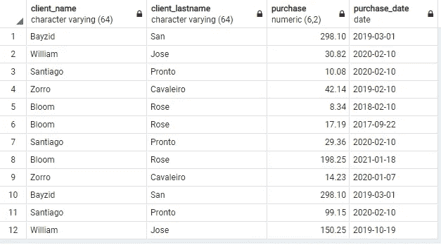
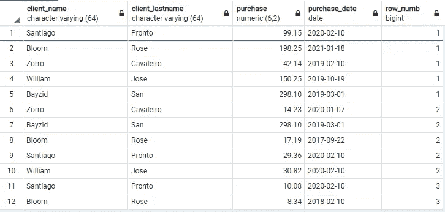
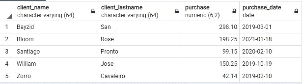

# PostgreSQL 中 PARTITION BY 子句的简单方法

> 原文：<https://medium.com/nerd-for-tech/partition-by-clause-in-postgresql-the-easy-way-10772ac41dfd?source=collection_archive---------2----------------------->

米切尔·卡万在 [Unsplash](https://unsplash.com/s/photos/light-background?utm_source=unsplash&utm_medium=referral&utm_content=creditCopyText) 上拍摄的照片

当您使用数据库时，当您想要删除数据中的重复项时，通常会遇到这种情况。在本教程中，我们将了解如何通过选择最高值来删除重复项。

# 介绍

假设我们有一个商店的顾客列表，我们想要每个顾客支付的最高价格。开始之前，让我们先来看看数据:

带有购买价格(购买)和购买日期(购买日期)的客户列表

如果我们以名为 William 的客户为例，他出现在第二行和第十二行。现在，我们希望筛选该表，使其只包含一个客户名称和他的最高价格。下一步是使用 PARTITION BY 子句。

# 分区依据子句

正如您在这个查询中看到的，我们按照从大到小的降序选择购买，然后我们只选择值为 **1** 的行号。

**ROW_NUMBER() OVER** 将给每一行一个连续的整数。由于我们使用的是 **PARTITION BY (client_name)** 它将使用客户端名称，并在每次找到相同的客户端时分配一个唯一的整数。为了更好地理解整数是如何分配的，请看下图:

正如您所看到的，对于同一个客户，基于**购买列**，我们有不同的**row _ number**。如果我们以名为 **Santiago Pronto** 的客户为例，他的最大购买额是 99.15 美元。**row _ number**为 1，因为我们对**购买列**进行了降序排序。他的第二大购买量是 2 辆，第三大购买量是 3 辆。

通过使用上面的查询，我们获得了没有重复值的最大购买量的客户名称:

我们可以通过使用带有 **max()函数**的 **group by** 来获得最高的购买，但是如果您想只按一列对您的值进行分组，并且仍然获得所有其他的值(例如 **purchase_date** ，您将需要使用 PARTITION BY 子句。

祝贺你完成这篇教程，我希望它至少能帮助你学到一两件事😃。