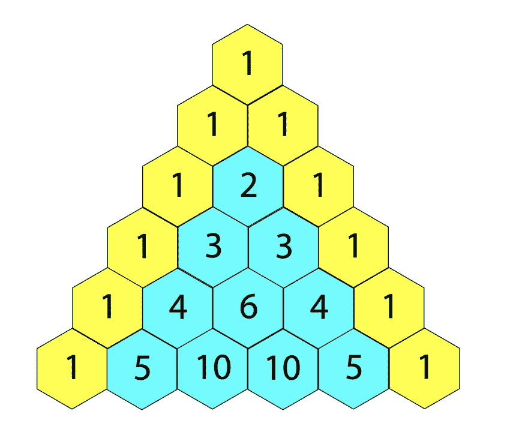
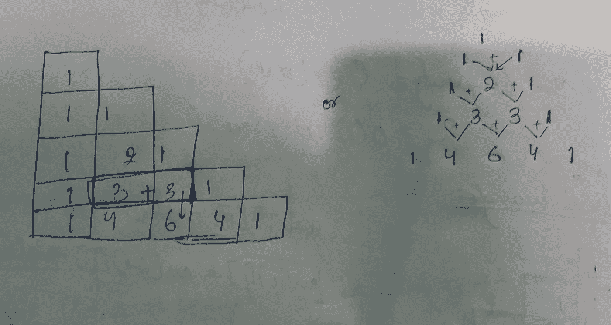

# 帕斯卡三角形

> 原文：<https://medium.com/nerd-for-tech/pascals-triangle-4acd190f6473?source=collection_archive---------2----------------------->

***(LeetCode Easy)***



给定一个整数`numRows`，返回**帕斯卡三角形**的前 numRows。

在**帕斯卡三角形**中，每个数字是它正上方的两个数字之和，如图所示:


**例 1:**

```
**Input:** numRows = 5
**Output:** [[1],[1,1],[1,2,1],[1,3,3,1],[1,4,6,4,1]]
```

**例 2:**

```
**Input:** numRows = 1
**Output:** [[1]]
```

**约束:**

*   `1 <= numRows <= 30`

```
**class Solution {
public:
    vector<vector<int>> generate(int numRows) {
        vector<vector<int>>r(numRows);

        for(int i=0 ; i<numRows ; i++)
        {
            r[i].resize(i+1);
            r[i][0] = r[i][i] = 1;

            for(int j=1 ; j<i ; j++)
                r[i][j] = r[i-1][j-1] + r[i-1][j];
        }
        return r;
    }
};**
```

代码如上所示。这个逻辑背后的主要直觉是 arr[I][j]= arr[I-1][j-1]+arr[I-1][j]，这意味着元素是它上面的元素和它上面之外的元素之和。我通过一个例子来解释一下:

看看模式是如何遵循的，我们还看到开始和结束元素都是 1，这对于所有行都是正确的。



现在让我们试运行一下上面的代码:

```
i =0, r[0].resize(1) ie. the first row will have 1 element
r[0][0] = 1
**Output : [[1]]**Now , i = 1, and j = 1
r[1][0] = r[1][1] = 1
**Output : [[1],[1,1]]**i = 2
r[2][0] = r[2][2] = 1i = 2, j = 1
r[2][1] = r[1][0] + r[1][1] = 1 + 1 = 2**Output : [[1],[1,1],[1,2,1]]**i = 3
r[3][0] = r[3][3] = 1i = 3, j = 1
r[3][1] = r[2][0] + r[2][1] = 1 + 2 = 3i = 3, j = 2
r[3][2] = r[2][1] + r[2][2] = 2 + 1 = 3**Output : [[1],[1,1],[1,2,1],[1,3,3,1]]**i = 4
r[4][0] = r[4][4] = 1i = 4 , j = 1
r[4][1] = r[3][0] + r[3][1] = 1 + 3 = 4i = 4, j = 2 
r[4][2] = r[3][1] + r[3][2] = 3 + 3 = 6i = 4 , j = 3
r[4][3] = r[3][2] + r[3]][3] = 3 + 1 = 4**Output : [[1],[1,1],[1,2,1],[1,3,3,1],[1,4,6,4,1]*****Time Complexity - O(n)
Space Complexity - O(1)***
```

希望这有所帮助！在那之前继续编码！！

敬请关注&订阅更多！！！💻🙌既然你喜欢看我的博客，为什么不请我喝杯咖啡，支持我的工作呢！！[https://www.buymeacoffee.com/sukanyabharati](https://www.buymeacoffee.com/sukanyabharati)☕