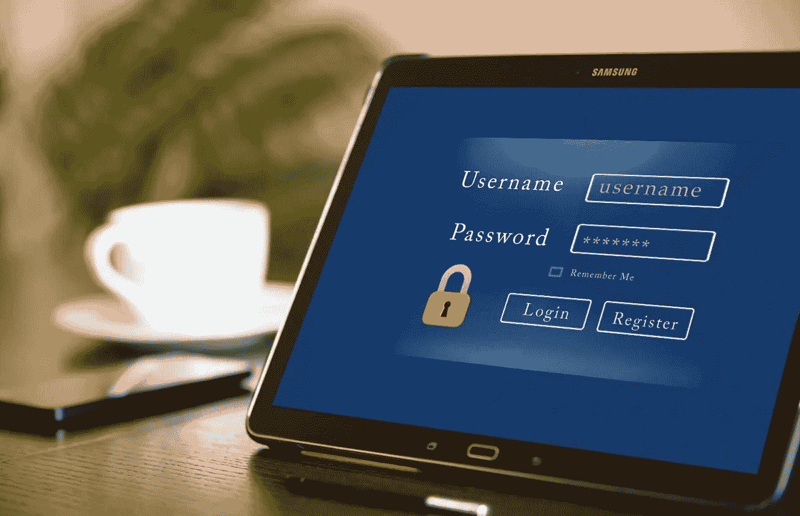

# 密码管理员:为什么？哪一个？

> 原文：<https://medium.com/nerd-for-tech/password-manager-why-which-one-3383107b5c68?source=collection_archive---------5----------------------->

[www.publicdomainpictures.net](http://www.publicdomainpictures.net)

您需要保护数据以及对应用程序和设备的访问。每一个应该有一个不同的唯一和强(长的意思，使用符号，数字和字母)密码。

# 住在有围墙的花园里，使用默认的应用程序

每个主要的操作系统和生态系统都有内置的密码管理器。如果你的数字生活…