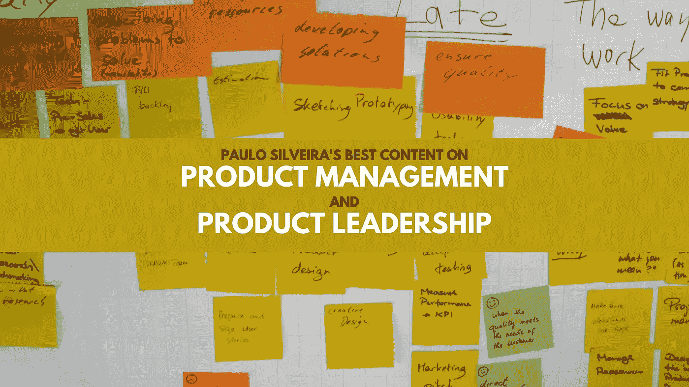

# Paulo Silveira 关于产品管理和产品领导力的最佳内容

> 原文：<https://medium.com/nerd-for-tech/paulo-silveiras-best-content-on-product-management-and-product-leadership-219764ef02a9?source=collection_archive---------2----------------------->

# 🎬我为什么要这么做？

*长话短说:让我更容易回忆起这些年来我读过的最好的产品管理相关内容。我有点这种超能力:没有主题，我没有好的内容推荐！*

# 🔝谁是好的产品经理？

*   【班丹·乔特·辛格(支付@ Booking.com，产品@ Gojek 前负责人)
*   [马蒂·卡甘(作者，硅谷产品组合伙人，前易贝、网景、Continuus 和惠普产品主管](https://www.linkedin.com/in/cagan/)
*   [拉维·梅塔(联合创始人@ Scale。此前 EIR @ Reforge，CPO @ Tinder，Product @脸书，猫途鹰，Xbox)](https://www.linkedin.com/in/ravimehta/)
*   Shreyas Doshi(快速发展的创业公司的顾问。ex-Stripe，Twitter，Google，Yahoo)
*   [罗汉·拉吉夫(Product @ LinkedIn)](https://www.linkedin.com/in/rohanrajiv/)
*   [Teresa Torres(作者、发言人、产品发现蔻驰)](https://www.linkedin.com/in/teresatorres/)
*   [蒂姆·赫比格(蔻驰产品管理部&顾问、发言人)](https://www.linkedin.com/in/herbigt/)

# ❓什么是好的产品经理？

*   [如何导航产品管理专业化(重组)](https://www.reforge.com/blog/product-specializations-pt2)
*   **⭐** [**如何成为一名巅峰产品经理(拉维梅塔)**](https://www.ravi-mehta.com/product-manager-skills/)
*   [产品管理的日益专业化(Reforge)](https://www.reforge.com/blog/product-specializations)
*   [成为一名伟大的产品经理需要什么(哈佛商业评论)](https://hbr.org/2017/12/what-it-takes-to-become-a-great-product-manager)
*   [为什么厨师和士兵能成为最好的产品经理(第一轮回顾)](https://review.firstround.com/why-soldiers-and-chefs-make-the-best-product-managers)

# 🧰:一个好的产品经理如何做产品管理工作？

## 0️⃣零比一

*   [最小可行产品不是产品，而是过程(Y 组合子)](https://www.ycombinator.com/library/4Q-a-minimum-viable-product-is-not-a-product-it-s-a-process)
*   [如何在客户调研访谈(产品谈话)中做笔记](https://www.producttalk.org/2016/02/how-to-take-notes-during-customer-research-interviews/)
*   **⭐** [**如何说话做用户(y 组合子)**](https://www.ycombinator.com/library/6g-how-to-talk-to-users)
*   [旅程规划方法:出发前要做的两个关键决定(尼尔森诺曼集团)](https://www.nngroup.com/articles/journey-mapping-approaches/)
*   [可视化管理的七个要素:在正确的时间获得正确的信息(Modus Institute)](https://www.modusinstitute.com/blog/seven-elements-visual-management)
*   [出货的时间价值(Brandon Chu)](https://blackboxofpm.com/the-time-value-of-shipping-6deaf8d7d565)
*   [拔河:平衡用户和企业的最佳利益(重组)](https://www.reforge.com/blog/balancing-user-vs-business)

## 📊产品成果

*   **⭐** [**在产品管理中使用 OKRs 的实用指南(蒂姆·赫比格)**](https://herbig.co/okrs-product-management/)
*   不要让你的北极星度量欺骗你
*   [帮助您定义产品指标的四个框架(产品联盟)](https://productcoalition.com/four-frameworks-to-help-you-define-product-metrics-ff5926ac1ea5)
*   你如何建立产品指标来评估成功？(吉布森·比德尔)
*   [寻找领先指标(托马斯·克里斯滕森)](https://tomchris.com/notes/snapshot~03ZrmQU2bZiFGsjN3iAi)
*   指标驱动的产品开发很难。
*   [OKRs ≠策略(双环)](https://blog.doubleloop.app/okrs-strategy/)
*   [用 NCTs 而不是 OKRs(重组)设定更好的目标](https://www.reforge.com/blog/set-better-goals-with-ncts-not-okrs)
*   [为什么大多数分析工作失败(重组)](https://www.reforge.com/blog/why-most-analytics-efforts-fail)
*   [没有实验，你就无法实现数据驱动](https://www.reforge.com/blog/you-cannot-be-data-driven-without-experimentation)

## 📈产品增长

*   [让货币化成为你的超能力(重整)](https://www.reforge.com/blog/making-monetization-your-superpower)
*   **⭐** [**货币化 vs 增长？**](https://www.reforge.com/blog/monetization-vs-growth-its-a-false-choice) 这是一个错误的选择
*   [新用户理论(陈楚翔)](https://andrewchen.com/the-adjacent-user-theory/)
*   [动力峡谷:从牵引到增长(再造)](https://www.reforge.com/blog/the-momentum-canyon)
*   **⭐** [**电力用户陷阱**](https://www.reforge.com/blog/the-power-user-trap)

## 1️⃣󠁎󠁎一到 n

*   [案例研究#4:产品是赌注(Basecamp 的 ShapeUp 方法)(Productify)](https://productify.substack.com/p/case-study-1-products-are-bets-shapeup)
*   [公关/常见问题解答如何帮助推出 AWS、Kindle 等成功产品& Prime Video (Colin Bryar)](https://coda.io/@colin-bryar/working-backwards-how-write-an-amazon-pr-faq)
*   **[**如何与设计师合作(朱莉·卓)**](/the-year-of-the-looking-glass/how-to-work-with-designers-6c975dede146)**
*   ****[**如何与工程师(朱莉卓)**](/the-year-of-the-looking-glass/how-to-work-with-engineers-a3163ff1eced)****
*   ****[产品发现:产品团队实用指南(Tim Herbig)](https://herbig.co/product-discovery/)****
*   ****[超越产品市场契合度的产品工作(再造)](https://www.reforge.com/blog/product-work-beyond-product-market-fit)****
*   ****[重新思考你的运营节奏(重整)](https://www.reforge.com/blog/operating-cadence)****
*   ****[证据的阶梯:从客户访谈和产品实验中获取更多价值(产品对话)](https://www.producttalk.org/2017/03/ladder-of-evidence/)****
*   ****[发展稀有产品的策略(冰镇理论)(重整)](https://www.reforge.com/blog/strategies-to-grow-infrequent-products)****
*   ****[行业工具:看看 99designs 上的发现技术堆栈(产品讲座)](https://www.producttalk.org/2021/12/tools-99-designs/)****
*   ****[为什么那么多创业公司会把产品营销搞砸？(重整)](https://www.reforge.com/blog/why-startups-get-product-marketing-wrong)****
*   ****[为什么这个机会解决方案树正在改变产品团队的工作方式(产品对话)](https://www.producttalk.org/2016/08/opportunity-solution-tree/)****
*   ****[你的产品导向营销指南(Kyle Poyar)](https://kylepoyar.substack.com/p/your-guide-to-product-led-marketing)****

## ****⚙️产品效率****

*   ****[亚马逊让产品更无缝的杀摩擦战术(首轮点评)](https://review.firstround.com/amazons-friction-killing-tactics-to-make-products-more-seamless)****
*   ****[消灭产品僵尸:五步法(关注产品)](https://www.mindtheproduct.com/killing-product-zombies-a-five-step-approach/)****
*   ****[毫无疑问地做出产品决策——我从 Twitter 和 Slack 学到的经验(第一轮评估)](https://review.firstround.com/make-product-decisions-without-doubt-my-lessons-from-twitter-and-slack)****
*   ****[向上管理——从 Credit Karma 和 Lyft (Reforge)的扩展团队中吸取的经验教训](https://www.reforge.com/blog/managing-up)****
*   ******⭐******

## ****📝产品生涯****

*   ****[永远进化的 OBE ya:bubble Bahn(Modus Institute)](https://www.modusinstitute.com/blog/always-evolving-obeya)****
*   ****[像发展产品一样发展你的职业生涯](https://www.reforge.com/blog/grow-your-career-like-you-grow-product)****
*   ******⭐** [**影响=环境 x 技能:如何做职业决策(重整)**](https://www.reforge.com/blog/how-to-make-career-decisions)****
*   ****[逆向面试:如何选择你的下一家公司](https://www.reforge.com/blog/reverse-interview)****
*   ****[为什么画地图会让你思维敏捷(产品演讲)](https://www.producttalk.org/2016/01/why-drawing-maps-sharpens-your-thinking/)****

# ****🤔一个好的产品领导如何做产品领导的事情？****

## ****📧产品招聘****

*   ******⭐** [**寻找、审核并关闭最佳产品经理(第一轮评审)**](https://review.firstround.com/find-vet-and-close-the-best-product-managers-heres-how)****
*   ****[Trello 的产品领先于一个 10 人的产品组织](https://review.firstround.com/trellos-product-lead-on-the-unique-ramp-to-a-10-person-product-org)****

## ****💾数据驱动的产品决策****

*   ****每个人都认为他们在根据结果进行管理。下面是实际操作的方法。(产品谈)****
*   ****[如何设置 KPI 和目标(Y 组合子)](https://www.ycombinator.com/library/6j-how-to-set-kpis-and-goals-sus-2019)****
*   ****[KPI 树:如何弥合客户行为、产品指标和公司目标之间的差距(佩特拉·威尔)](https://www.petra-wille.com/blog/kpi-trees-how-to-bridge-the-gap-between-customer-behavior-product-metrics-and-company-goals)****

## ****🗺️产品战略****

*   ****[TBM 4/52:带示例的可操作帖子(树/循环提示)(John Cutler)](https://cutlefish.substack.com/p/tbm-452-an-actionable-post-with-examples)****
*   ******⭐**[**dhm 模型(Gibson Biddle)**](https://gibsonbiddle.medium.com/2-the-dhm-model-6ea5dfd80792)****
*   ******[**【产品策略栈(reforge)】**](https://www.reforge.com/blog/the-product-strategy-stack)******
*   ****[您如何看待基于项目的路线图与基于结果(基于指标)的路线图？(吉布森比德尔)](https://askgib.substack.com/p/what-do-you-think-about-project-based)****

## ****🔧产品流程****

*   ****[构建增长:产品、流程和团队(重组)](https://www.reforge.com/blog/growth-system)****
*   ****[产品是增长的未来——原因如下(重整)](https://www.reforge.com/blog/freemium-product-future-of-growth)****
*   ****[运行产品评论人们其实很期待(丹尼尔·斯莱特)](https://www.linkedin.com/pulse/running-product-reviews-people-actually-look-forward-daniel-slate/?articleId=6495536486342098944)****
*   ****[扩展产品交付:高绩效产品团队的“肮脏”秘密(重组)](https://www.reforge.com/blog/scaling-product-delivery)****
*   ****[LinkedIn 产品回顾会议的 4 项原则(Deep Nishar)](https://coda.io/@deepnishar/the-4-principles-of-linkedin-s-product-review-meetings)****
*   ******⭐******
*   ****[企业产品为何错失成长(再造)良机](https://www.reforge.com/blog/enterprise-growth)****