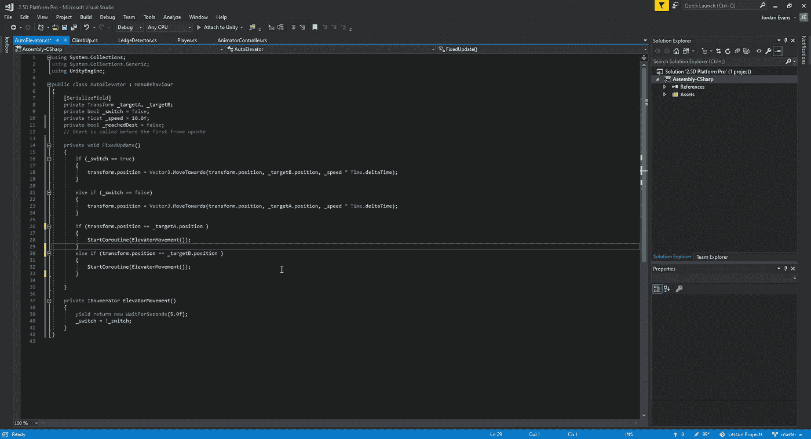
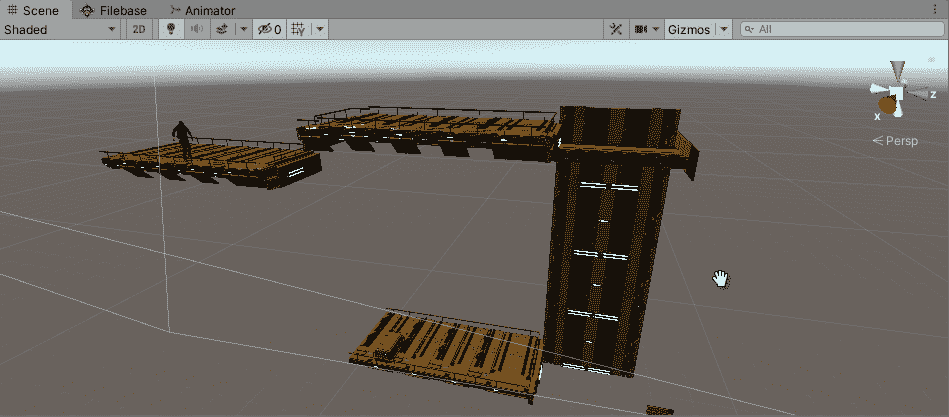
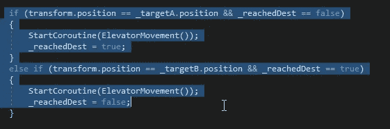
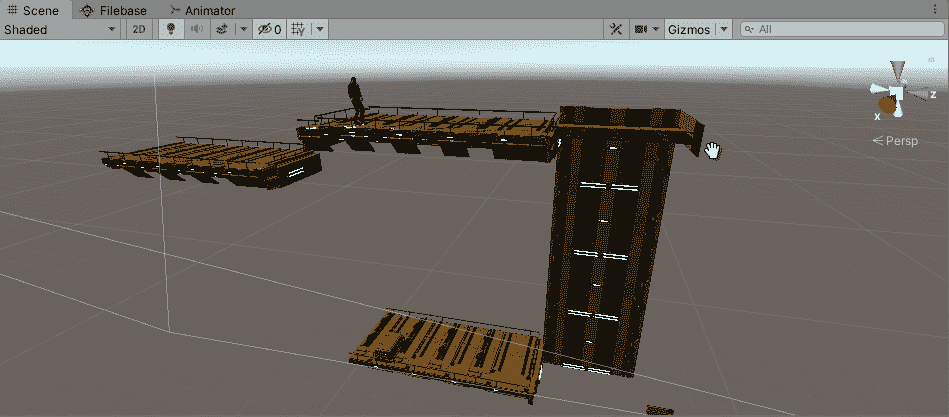

# 暂停自动电梯

> 原文：<https://medium.com/nerd-for-tech/pausing-the-auto-elevator-aa3a61c63d96?source=collection_archive---------14----------------------->

当我在建造我想建造的球场时，我想我会花一些时间来研究我们如何创造一种替代的电梯方法，在这种方法中，它可以无限地上下移动，但在到达目的地时会暂停 5 秒钟。为了做到这一点，我们可以像以前一样用之前的电梯方法[在这里](/nerd-for-tech/creating-an-elevator-in-unity-790986d7d31)构建代码。
然而，由于我们不依赖于按钮来打开和关闭它，我们不需要添加链接到控制面板或任何东西。当着手这样做时，我们将需要构建一个协程，以便我们可以使用 WaitForSeconds 方法，但是我们不想让它永远运行，因为我们只需要调用它一次。
首先，让我们看看如何构建我们的代码:

我们所做的是告诉 Unity，我们想要在点 A 和 B 之间切换，当我们到达该点时，我们将想要有我们的布尔切换，以便我们可以返回到另一个方向。一旦我们设置了 2 个点，我们就可以看到游戏中的情况了:

如我们所见，我们的电梯在目的地卡住了。这样做的原因是因为该方法被多次调用，当我们稍微移动时，它会激活我们的语句来切换 true 和 false。为了解决这个问题，我们需要创建一个新的布尔值，这样我们就可以锁定语句，防止它不断刷新自己:

我在这里所做的只是让协程只在两个语句都正确时被调用。这将使我们在目的地不再结巴，并创造一个与我们的电梯来回顺畅的流程:

现在我们有了一个流畅的电梯，我们可以回到游戏的其余部分了。