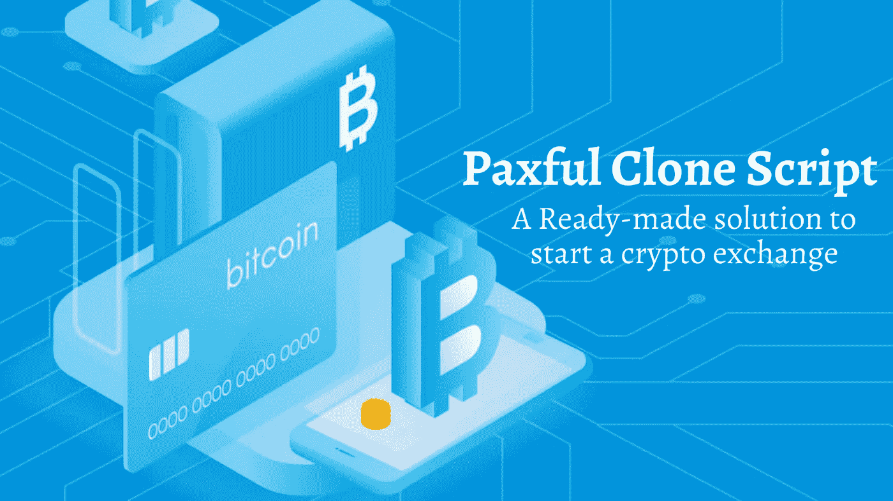

# Paxful 克隆脚本—启动加密交换的现成解决方案

> 原文：<https://medium.com/nerd-for-tech/paxful-clone-script-a-ready-made-solution-to-start-a-crypto-exchange-ad330c2de73b?source=collection_archive---------8----------------------->

加密货币统治着数字领域。投资者和企业家希望投资加密货币，并积极寻找有助于他们成为亿万富翁的最佳选择。开始一个加密交易业务总是保持在加密领域的最佳赚钱机会的顶端。市场上有许多加密交易所。但是选择正确的将有助于实现你的商业梦想。

许多加密爱好者现在更喜欢 P2P 加密交换，如 Paxful。这是因为他们可以在没有中介的情况下即时交易他们的加密货币。由于许多密码爱好者正在转向像 Paxful 这样的 P2P 密码交易所，并愿意在一周内推出他们自己的像 Paxful 这样的 P2P 密码交易所。

如果你是这些人中的一员，你可以买一个 Paxful 克隆脚本，像 Paxful 一样启动你的加密交换。

## Paxful 是最佳选择，为什么？

**安全交易**—Pax ful 克隆脚本方便了即时交易，并保证了高度的安全性。

**集成托管服务** —通过托管服务实现安全可靠的交易。

**KYC/反洗钱** —针对非法活动提供更高的安全性。

**多种货币支持** —它允许您列出和交易多种加密货币。

**高投资回报率** —一个人可以从多种渠道赚钱，包括硬币上市、交易费和其他。

## **什么是 Paxful 克隆脚本？**

[**Paxful 克隆脚本**](https://www.clarisco.com/paxful-clone-script) 是一个经过测试、随时可用的加密货币兑换脚本。它具有内置功能和高级高层架构设计，准确反映了流行的 P2P 加密交换平台 Paxful 的属性和功能。Paxful 克隆脚本包附带一个 Paxful 克隆应用程序和网站脚本。它还配备了最新的技术插件和属性。白色标签的 Paxful 克隆脚本允许您对其进行定制，以满足您的业务需求。

## **现成 paxful 克隆脚本的特性**

集成加密钱包

多支付支持

托管服务

多币种承兑

多语言支持

完整的源代码访问

场外交易

推送通知和提醒

前卫 UI/UX

争议管理系统

动态贸易引擎

实时统计

交叉交易

IEO 一体化

## **Pax ful 克隆脚本的安全特性**

1.KYC/反洗钱验证

2.加密您的钱包

3.双因素认证器

4.更新您的软件

5.多重签名认证

6.离线交易签名

7.对安全的控制

8.密码更新警报

9.安全文件传输协议(SFTP)

10.反网络钓鱼软件

11.防火墙集成

12.CSRF 保护

## **使用 paxful 克隆脚本的优势**

准备发射

马上开始开发

不需要技术援助

简单定制

节省时间和金钱

当你使用 Paxful 的克隆脚本创建一个 P2P 加密货币交易所时，你会得到这些好处。

下面这个问题将会立即触发你的思维。

## **我怎样才能通过启动一个像 Paxful 这样的加密交换平台来赚钱？**

*   交易费用
*   广告费
*   取款/存款费用
*   上市费

这些是使用 paxful 克隆脚本在加密货币业务中产生高 ROI 的一些方法。

## **我在哪里可以得到最突出的 Paxful 克隆脚本？**

如果您正在寻找能够提供所有好处和功能的最佳加密货币交易所克隆脚本提供商，那么我会建议您与 Clarisco Solutions 握手。他们是快速增长的 [**加密货币交易所开发公司**](https://www.clarisco.com/cryptocurrency-exchange-development) ，提供最好的 paxful 克隆脚本，在不影响平台质量的情况下，赋予您所有需要的定制。他们的解决方案易于使用，提高了资产管理和访问的便利性。他们的现场演示将向您展示该解决方案是否适合您。

***为什么不试一试？***

[**预定 paxful 克隆脚本**](https://www.clarisco.com/contact) 免费试玩