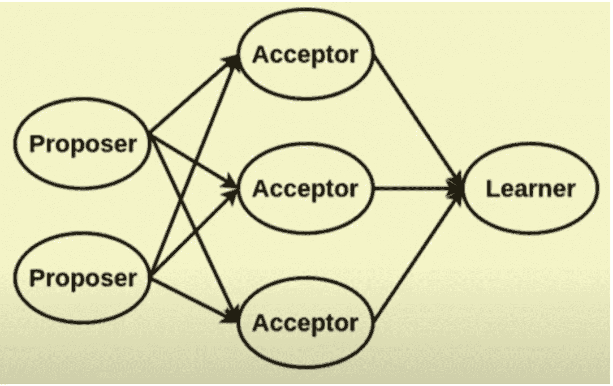
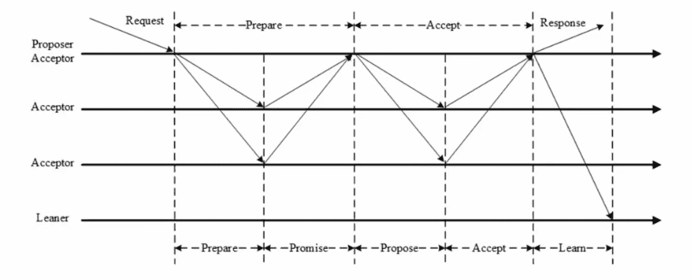
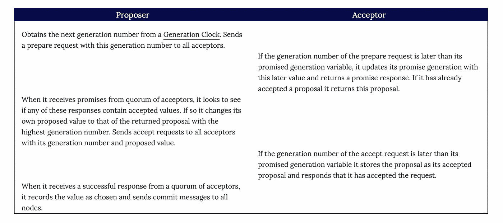

# 分布式系统中的 Paxos 算法

> 原文：<https://medium.com/nerd-for-tech/paxos-algorithm-a71d6fe7be97?source=collection_archive---------2----------------------->

# 问题

当多个节点共享状态时，它们通常需要在特定的值上达成一致。有了[领导者和](https://martinfowler.com/articles/patterns-of-distributed-systems/leader-follower.html)追随者，领导者决定并将其价值传递给追随者。但是如果没有领导者，那么节点需要自己确定一个值。(即使有领导者-追随者，他们也可能需要这样做来选举领导者。)

领导者可以通过使用[两阶段提交](https://martinfowler.com/articles/patterns-of-distributed-systems/two-phase-commit.html)来确保副本安全地获得更新，但是如果没有领导者，我们可能会让竞争节点试图聚集[法定人数](https://martinfowler.com/articles/patterns-of-distributed-systems/quorum.html)。这个过程更加复杂，因为任何节点都可能发生故障或断开连接。某个节点可能会在某个值上达到仲裁，但在能够将该值传递给整个集群之前会断开连接。

# 解决办法

Paxos 算法是由 Leslie Lamport 开发的，发表在他 1998 年的论文兼职议会中。Paxos 分三个阶段工作，以确保尽管部分网络或节点出现故障，但多个节点仍同意相同的值。前两个阶段的作用是围绕一个价值建立共识，最后一个阶段将共识传达给剩余的复制品。

*   准备阶段:建立最新的[生成时钟](https://martinfowler.com/articles/patterns-of-distributed-systems/generation.html)并收集任何已经接受的值。
*   接受阶段:为这一代提出一个值供副本接受。
*   提交阶段:让所有副本知道已经选择了一个值。

在第一阶段(称为**准备阶段**，提议值的节点(称为**提议者**)联系集群中的所有节点(称为**接受者**)并询问它们是否会承诺考虑其值。一旦法定人数的接受者回复这样的承诺，提议者就进入第二阶段。在第二阶段(称为**接受阶段**)中，提议者发出提议值，如果法定人数[【1】](https://martinfowler.com/articles/patterns-of-distributed-systems/paxos.html#footnote-flexible-paxos)的节点接受该值，则该值被**选择**。在最后阶段(称为**提交阶段**，提议者可以将选择的值提交给集群中的所有节点。

在最初的 paxos 论文( [1998](http://lamport.azurewebsites.net/pubs/pubs.html#lamport-paxos) 和 [2001](https://lamport.azurewebsites.net/pubs/paxos-simple.pdf) )中，没有提到提交阶段，因为算法的重点是证明只选择单个值就足够了，即使只有提议者集群节点知道所选择的值。但是在实践中，所有的集群节点都需要知道所选择的值，并且需要一个提交阶段，在该阶段中，提议者将决定传达给所有的集群节点。

# 细节

帕克索斯流

## 协议流程示例为顺序图(**必读)**

[5 个分布式节点的 Paxos 算法](https://martinfowler.com/articles/patterns-of-distributed-systems/paxos.html)。我已经阅读了网上的多个链接，但发现这是最有帮助的，因为它使用序列图解释了流程并涵盖了多个场景。

这里解释的 Paxos 协议建立了对单一价值的共识(通常称为单法令 Paxos)。像 [Cosmos DB](https://docs.microsoft.com/en-us/azure/cosmos-db/introduction) 或 [Spanner](https://cloud.google.com/spanner) 这样的主流产品中使用的大多数实际实现都使用 paxos 的一种修改，称为 multi-paxos，它被实现为[复制日志](https://martinfowler.com/articles/patterns-of-distributed-systems/replicated-log.html)。

[【Cassandra】](http://cassandra.apache.org/)使用 Paxos 实现轻量级交易。

所有的共识算法，如 [Raft](https://raft.github.io/) (这将是未来的后 WIP)都使用类似于基本 Paxos 的基本概念。以类似的方式使用[两阶段提交](https://martinfowler.com/articles/patterns-of-distributed-systems/two-phase-commit.html)、[法定人数](https://martinfowler.com/articles/patterns-of-distributed-systems/quorum.html)和[生成时钟](https://martinfowler.com/articles/patterns-of-distributed-systems/generation.html)。

# 问题

有几个问题与 Paxos 算法有关。为了理解这一点，我假设您已经花了足够的时间在 Martin Fowler 的博客或其他材料上理解算法的示例工作。

**决斗领袖** 想象一下 2 个或 2 个以上节点同时发起提案的情况。这会导致死锁情况，其中 2 个节点/副本被选为提议者，并且每个都提议了一个具有给定数量的提交，但是失败了，并且都尝试了一个更大的数量并且再次失败？这可能会成为一个阻碍，我们的副本可能永远不会收敛。

**活锁** 假设集群中存在网络故障，每个接受者接受不同的值。如果没有能力在以后的回合中改变它们的值，就不会有任何进展，并且你有一个“活锁”。这是另一种死锁情况，其中复制品不能更新它们的值，因为提议者不能在提议中更新所有节点都能同意的公共值。

# 多 Pax OS:Pax OS 的另一个版本

多 Paxos 选举一个首领，由首领发起提议。由于零竞争，活锁问题被消除。
如果所有提案都是领导发起的，可以跳过准备阶段，将两阶段流程改为一阶段流程，提高了效率。
多派克斯并没有一个独一无二的领导者。相反，它允许多个领导在不影响安全的情况下同时提出请求。在极端情况下，它会退化为基本的 Paxos。

# 结尾注释

通过这篇文章，我试图提供对 Paxos 算法的高层次理解。这是分布式系统世界中的一个重要算法。如上所述，实践中使用了不同的版本或临时版本，即 cassandra、spanner 和 cosmos 数据库。提供了一些相关的链接，但是在线参考资料非常丰富。

希望这有所帮助。如果你在帖子中发现任何不一致的地方，请在评论中告诉我。感谢阅读！！！