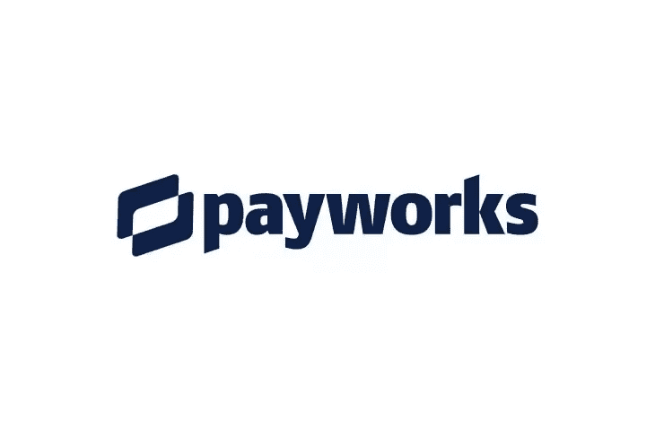
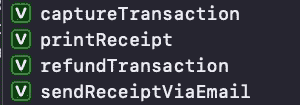

# Payworks - PayButton swift 版本

> 原文：<https://medium.com/nerd-for-tech/payworks-paybutton-swift-version-3dcc8653af03?source=collection_archive---------8----------------------->



集成 Payworks 支付网关——Objective-C 中的 PayButton 可能是一项简单的工作，因为他们有 Objective-C 中的文档。我必须将 Objective-C 中的代码转换为 swift。

当时并没有那么难。坦率地说，这很有趣。现在他们有了斯威夫特的页面。但我仍然想与其他开发者分享这项工作，因为社区中没有太多关于 iOS 版 swift 中 Payworks 集成的内容。

让我们开始吧…

# 第一步:

首先你需要处理豆荚。将以下内容放入 pod 文件中。

```
source 'https://github.com/CocoaPods/Specs.git'
source 'https://bitbucket.org/payworks/io.payworks.repo.pods.git'
use_frameworks!

target :"<your-app-target>" do
    pod 'payworks',           ''
    pod 'payworks.paybutton', ''
end
```

安装吊舱。

# **第二步:**

如下所示创建 mPosUi 对象。我们目前有。TEST，dummy ID & secret key 作为本教程的参数。你需要改变它。活，输入真实的 ID 和你拥有的秘钥。

```
let mPosUi = MPUMposUi.initialize(with: .TEST, merchantIdentifier:"ID",merchantSecret:"secret")
```

# 第三步:

基于你所拥有的设备，你需要在两者之间做出选择。用如下所示的所需参数实现 TCP 或外部附件参数。输入设备连接的远程地址。据我所知，港口还是老样子。

**用于通过 WiFi 或以太网的 Verifone 阅读器**

```
// When using Verifone readers via WiFi or Ethernet, use the following parameters:let accessoryParameters = MPAccessoryParameters.tcpAccessoryParameters(with: .verifoneVIPA,remote:"192.168.254.123",port:16107,optionals:nil)
```

**用于蓝牙米乌拉**

```
//When using the Bluetooth Miura, use the following parameters:let accessoryParameters = MPAccessoryParameters.externalAccessoryParameters(with: .miuraMPI, protocol: “com.miura.shuttle”, optionals: nil)
```

***注:*** 如果需要配置 ingenico，告诉我。我也补充一下。

# 第四步:

在交易参数中，我们需要传递金额和货币。剩下的就看你的了。

```
let transactionParameters = MPTransactionParameters.charge(withAmount: NSDecimalNumber(string: "100"),currency:MPCurrency.USD,optionals:{ (optionals:MPTransactionParametersOptionals!) inoptionals.subject = “Automobile Purchase”optionals.customIdentifier = “yourReferenceForTheTransaction”
```

# 第五步:

使用我们创建的 mPosUi 对象配置 navigationBarTint 和 navigationBarTextColor 的外观。我总是使用 colorLiteral，这是一种选择颜色的友好方式。

```
mPosUi.configuration.appearance.navigationBarTint = colorLiteral(red: 0.05154533684, green: 0.1255731881, blue: 0.2839779854, alpha: 1)mPosUi.configuration.appearance.navigationBarTextColor = colorLiteral(red: 1.0, green: 1.0, blue: 1.0, alpha: 1.0)
```

# 第六步:

配置终端参数，我们创建的附件参数应该已经传递到这里。根据需要配置摘要功能。您可以通过电子邮件发送收据、退款、打印收据或捕捉交易。



```
mPosUi.configuration.terminalParameters = accessoryParametersmPosUi.configuration.summaryFeatures = MPUMposUiConfigurationSummaryFeature.sendReceiptViaEmail
```

# 第七步:

最后，使用 mPosUi 对象创建带有事务参数的事务 viewcontroller。使用完成处理程序中的 MPUTransactionResult 来了解批准状态。

```
let viewController:UIViewController! = mPosUi.createTransactionViewController(with: transactionParameters,completed:{ (controller:UIViewController,result:MPUTransactionResult,transaction:MPTransaction?)inself.dismiss(animated: true, completion:nil)let alert = UIAlertController(title: "Result", message: "", preferredStyle: .alert)let alertAction = UIAlertAction(title: "OK", style: .default, handler: nil)alert.addAction(alertAction)if result == MPUTransactionResult.approved {alert.message = "Payment was approved!"} else {alert.message = "Payment was declined/aborted!"}self.present(alert, animated: true, completion: nil)})
```

🎥**查看此视频，了解它应该如何工作。**

***就这样了伙计们，我该离开了。***

供你们测试的 swift 项目示例:

[https://github.com/Rajaikumar-iOSDev/Payworks-Swift](https://github.com/Rajaikumar-iOSDev/Payworks-Swift)

[](https://github.com/Rajaikumar-iOSDev/Payworks-Swift) [## rajaikumar-IOs dev/Payworks-Swift

### 这是 payworks 支付网关 SDK 与 iOS-Swift 集成的演示。单击中型徽章阅读…

github.com](https://github.com/Rajaikumar-iOSDev/Payworks-Swift)