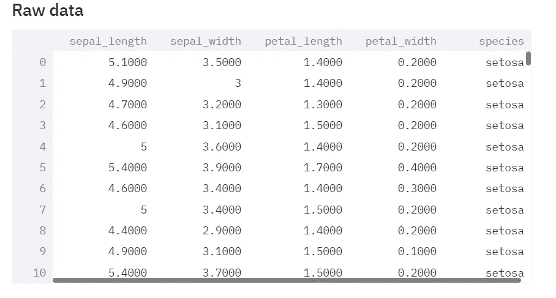
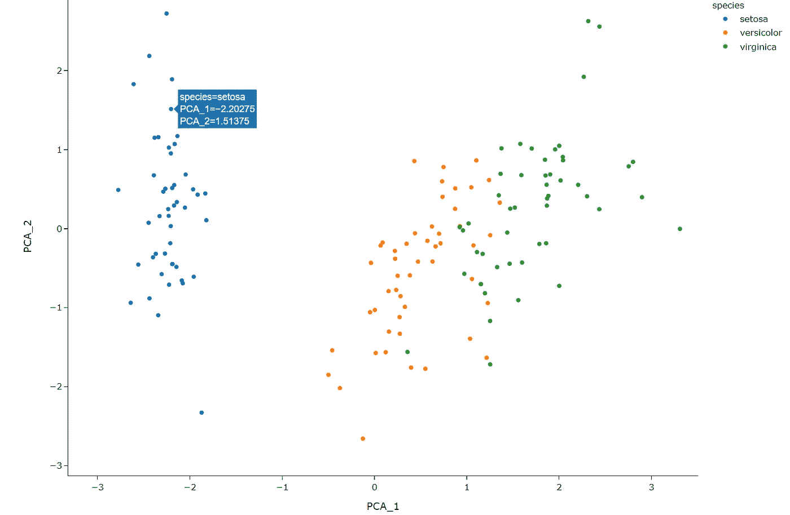
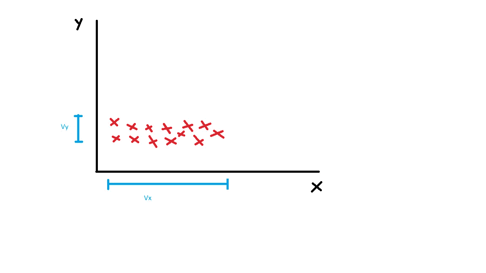
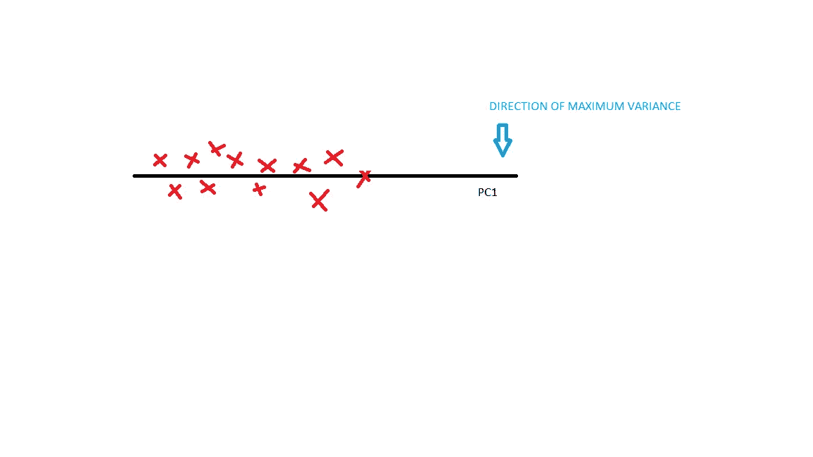
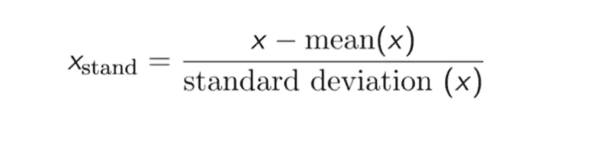
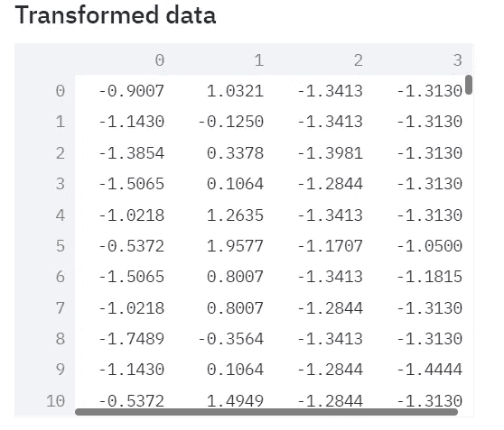
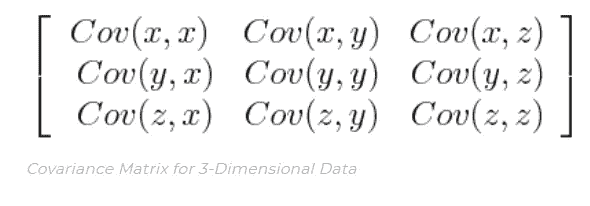
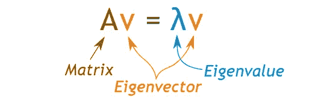
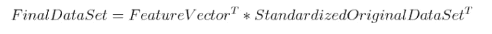
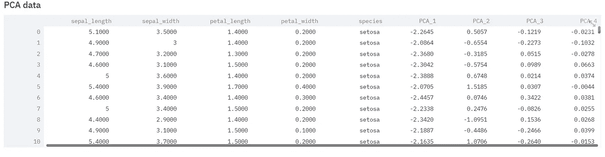

# 使用 Streamlit web 应用程序进行 PCA 降维和可视化

> 原文：<https://medium.com/nerd-for-tech/pca-for-dimentionality-reduction-and-visualization-with-with-streamlit-web-app-931c7049d399?source=collection_archive---------12----------------------->

主成分分析(PCA)是一种维度缩减和可视化技术，其中包含大量维度(大于 3)的数据集可以被缩减以用于在 2D 尺度上绘图，或者简单地缩减数据集中的维度数量。

艾萨克·史密斯在 [Unsplash](https://unsplash.com?utm_source=medium&utm_medium=referral) 上拍摄的照片

例如，让我们考虑虹膜数据集，这里我们有 4 列(加上一个目标变量—“*物种*”)，即*萼片 _ 长度、萼片 _ 宽度、花瓣 _ 长度、花瓣 _ 宽度*。这是一个四维数据集。现在的问题是我们如何在 2D 尺度上想象这个？

这就是使用 PCA 等技术的地方。使用 PCA，可以在 2D 尺度上可视化这个 4 维数据集，以提供对数据的更多洞察。

PCA 之后:

这里使用主成分分析将整个 4D 数据绘制到 2D 标度上。我们可以看到存在清晰的聚类，这提供了对数据的更多洞察。

您可以在这里找到我在 PCA 上的 web 应用程序:

[https://share . streamlit . io/kssubhodh/PCA-streamlit/main/PCA-app . py](https://share.streamlit.io/kssubhodh/pca-streamlit/main/pca-app.py)

## 更深入的探讨:

PCA 旨在找到方差最大的方向，并将数据点投影到该向量上以获得主分量。这些主要组件可以用于*可视化*，这将是这篇博客的主要焦点。

进行 PCA 主要有两种方法*方差最大化*和*距离缩减*。我们将通过相关的例子更深入地研究方差最大化方法

## 但是首先:为什么是方差？

方差给我们提供了 ***价差*** 的数据。差异越大，包含的信息就越多。用最大的*传播/方差*保持方向给了我们最多的信息

例如:让我们考虑需要简化为 1D(线)的 2D 数据

这里，沿 X 轴( *Vx* )的方差(扩散/信息)远大于沿 Y 轴( *Vy* )的扩散。因此，点被投影到 X 轴上以获得主分量(方差最大的方向)。这里，本质上，我们保留了最大方差的方向。关于如何获得主成分的详细步骤将在博客中进一步解释。

这里的数据从 2D 规模减少到 1D 线。

# 执行 PCA 的步骤

## 1 .列标准化

**数据标准化**是重新调整一个或多个属性的过程，使它们的**平均值为 0，标准差为 1** 。这样做是为了消除每个列的缩放比例的影响。

示例:如果您有两个特征，一个范围从 0 到 1000，另一个范围从-1 到+1，在计算 PCA 时，第一个特征是首选的，因为它具有较高的方差(扩散)。为了防止这种情况发生，我们对每一列进行了标准化。

标准化后，每个列/特征对分析的贡献相等，并将转换为相同的比例(平均值= 0，标准差= 1)

标准化公式:

iris 数据集的列标准化后:

## 2.协方差矩阵

下一步是创建协方差矩阵。这告诉我们不同输入变量之间的关系。协方差矩阵包含每对输入变量的协方差得分。

这里协方差分数的符号很重要:

*   **如果为正，则**:两个变量同时增加或减少(正相关)
*   **如果为负，则**:一个增加，另一个减少(反向相关)

沿着对角线的协方差分数包含方差值，即 Cov(x，x) = var(x)等

## 3.特征向量，特征值

下一步是计算协方差矩阵的特征向量和特征值。

*   特征向量给出了最大方差的方向，因此给出了主分量。特征值给我们提供了解释方差的百分比或每个主成分中包含的方差量的信息。
*   特征向量和特征值总是成对出现。因此，对于一个 4 维数据集，有 4 个特征向量和值对。当协方差矩阵的相应特征对基于它们的值以降序排序时，第一特征向量(最高特征值)对应于第一主分量或具有最高方差的方向。

## 4.将点投影到顶部特征向量上

现在我们已经计算出了特征对，并且找到了方差最大的方向，那么我们如何使用它来降低维数或者绘图呢？

我们必须将现有的点投影到新的向量(特征向量)上，以获得主分量。在点的投影之后，我们获得最终的数据集(具有主成分),其可以用于可视化/维度缩减的目的。

***示例*** :在 iris 数据集(4-D)中，执行步骤 1-4 后，我们现在有了顶部主成分(总共 4 个)。我们的目标是在 2D 表面上可视化这个 4 维数据集。因此，我们仅取前 2 个主成分(它们具有最高的方差，因此给我们最多的信息)并投影这些点以获得 2D 可视化。

***在执行步骤 1-4 并获得新矢量和原始数据的点积(投影)后，获得最终数据集*** 。这里我们得到了最终的主成分(PCA_1-PCA_4 ),它既可以用于可视化，也可以用于降维。

使用 PCA_1 和 PCA_2 后的 2D 可视化(具有前 2 个最高方差/扩散的主成分) :

# PCA 的缺点

1.  **自变量变得更难解释**:对数据集实施 PCA 后，你原来的特征会变成主成分。主成分是原始特征的线性组合。主要成分不像原始特征那样可读和可解释。
2.  **信息损失:**虽然主成分试图覆盖数据集中特征之间的最大方差，但如果我们不仔细选择主成分的数量，与原始特征列表相比，它可能会丢失一些信息。
3.  **数据标准化是 PCA 之前必须的:**你必须在实现 PCA 之前将你的数据标准化，否则 PCA 将无法找到最优的主成分。
4.  PCA 不能很好地处理高度聚集的数据，并且不能保留数据中的现有模式。

***你可以在这里参考我的 web-app 主成分分析演示:***

[https://share . streamlit . io/kssubhodh/PCA-streamlit/main/PCA-app . py](https://share.streamlit.io/kssubhodh/pca-streamlit/main/pca-app.py)

***Github 对 app 的回购:***

 [## kssubhodh/PCA-streamlit

### 简化演示主成分分析的网络应用程序链接到应用程序…

github.com](https://github.com/kssubhodh/PCA-streamlit) 

***Python 为 PCA 提供了一个易于实现的模块，同样可以在这里找到:***

 [## sk learn . decomposition . PCA-sci kit-learn 0 . 24 . 2 文档

### 主成分分析。使用数据的奇异值分解进行线性降维…

scikit-learn.org](https://scikit-learn.org/stable/modules/generated/sklearn.decomposition.PCA.html) 

感谢阅读。希望这篇博客对你有所帮助。

你可以在 linkedin 上联系我:

 [## 印度卡纳塔克邦本加卢鲁工程学院

### 在世界上最大的职业社区 LinkedIn 上查看 Subhodh KS 的个人资料。Subhodh 有一个工作列在他们的…

www.linkedin.com](https://www.linkedin.com/in/subhodh-ks-8b993b177/)