# 主成分分析第 1 部分:拉格朗日乘数。

> 原文：<https://medium.com/nerd-for-tech/pca-part-1-the-lagrangian-d66732b573ed?source=collection_archive---------6----------------------->

PCA 算法是降维方面最重要的算法之一，但是真正理解这个过程需要某种数学准备，所以我认为最好在一系列文章中解决这个问题，这是第 1 部分。

对于这个主题，您应该知道什么:

1.  多元微积分基础

我们将关注的第一个工具是拉格朗日乘数。

拉格朗日乘子试图解决以下问题:我们如何基于某些约束找到局部最大值或最小值？为了更具体，让我们举一些例子:

假设我们希望最大化一个矩形的周长，并限制该矩形的坐标位于单位圆内，即

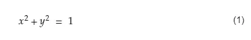

最优化问题的约束

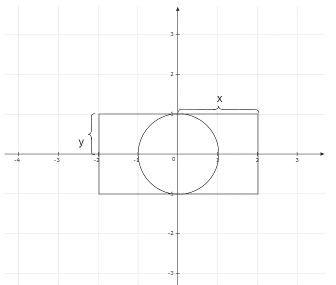

让我们定义一个函数，它代表我们要进行优化的目标函数:

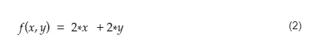

我们可以用函数的形式来写约束语句:

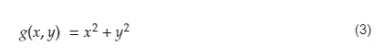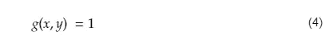

既然我们恰当地陈述了问题，我们可以设法考虑如何优化这个问题。

拉格朗日乘数的直觉很简单，但非常强大。给定一个我们想要优化的函数***【f】***和一个约束函数 **g** ，我们需要找到 ***f*** 和 **g** 的梯度在哪里对齐(该点将是局部最大值或最小值)，并且比例因子被称为拉格朗日乘数。

****免责声明*:在这一部分，我强烈鼓励你寻找一些关于这个图形解释的视频(例如，Khan Academy 或 3Blue1Brown ),因为我承认，如果你以前从未见过这些，只看这个图形是很难理解的。***

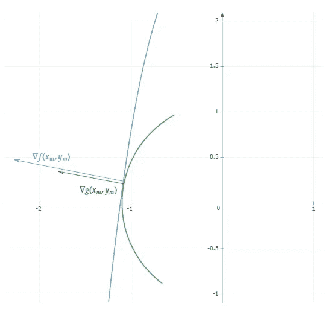

将这个概念应用到我们的例子中，我们需要求解这组方程:

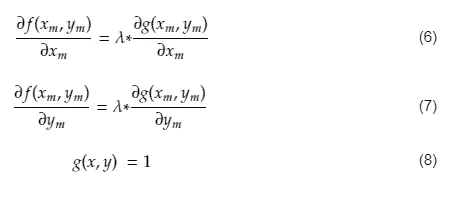

在实际求解这些方程之前，有可能以更紧凑和矢量的形式写下所有方程(当手动求解方程时，这没有帮助，但计算机可以很好地处理矢量格式的方程)。

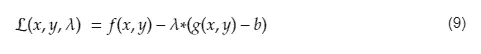

其中 b 是对 **g.** 的常数约束

为什么这个定义有用？答案在下面的等式中:

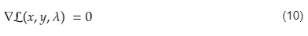

如果我们解开这个方程，我们会发现它与方程(6)、(7)和(8)的形式相同，但形式更加简洁、紧凑和易于使用。计算梯度时，我们有:

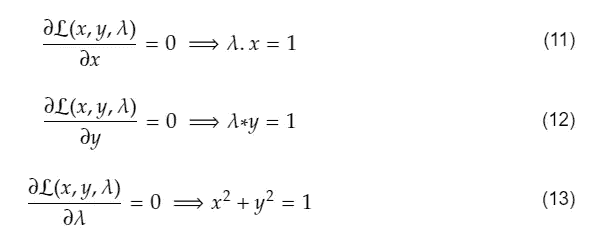

方程(10)的解

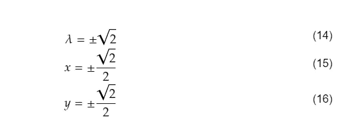

方程(10)的解

就这样，我们找到了约束优化问题的解。尽管这个例子非常简单，但它包含了拉格朗日乘数及其用法背后的基本思想。

接下来会有一点剧透:

在 PCA 的上下文中，当我们试图优化向量上投影的方差并将解决方案限制到一组特定约束时，拉格朗日乘数非常有用。

对于 PCA，计算拉格朗日乘数适合于计算局部最大值的责任:

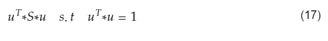

其中 S 是协方差矩阵，*是我们需要优化的向量。*