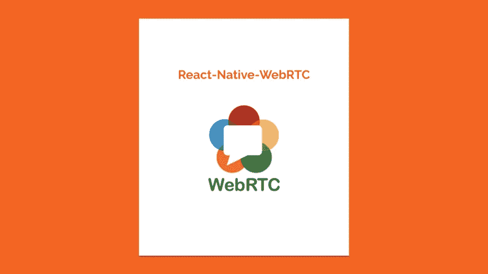
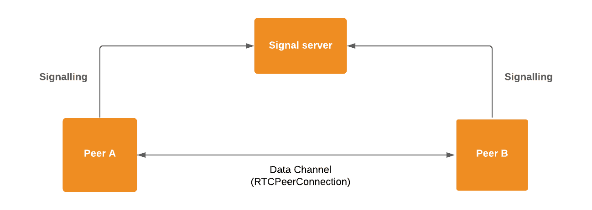
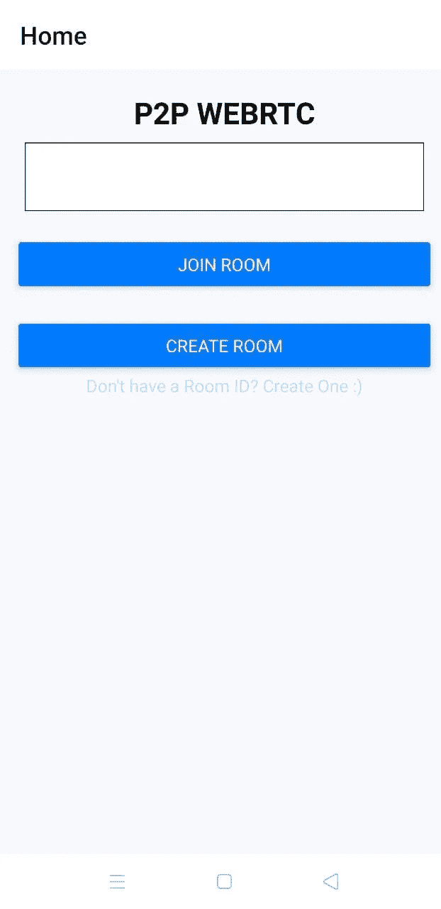
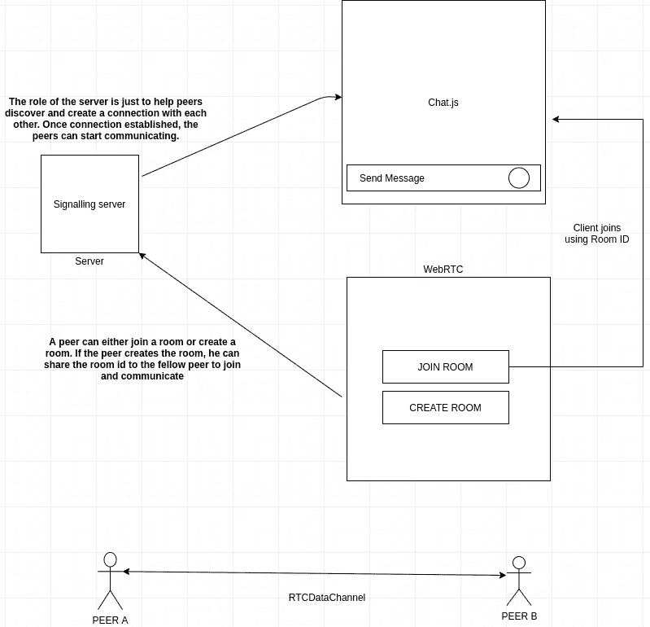
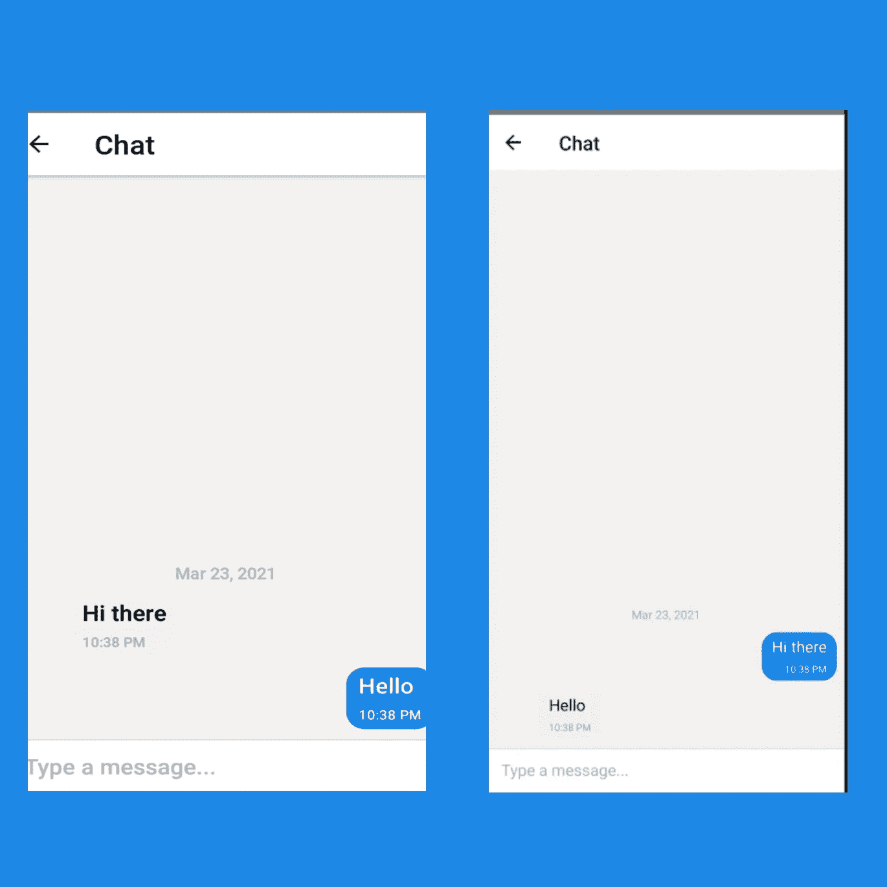

# 使用 WebRTC 和 React Native 的点对点聊天应用程序

> 原文：<https://medium.com/nerd-for-tech/peer-to-peer-chat-app-using-webrtc-and-react-native-6c15759f92ec?source=collection_archive---------0----------------------->

你有没有想过使用一个不依赖中央服务器的聊天应用？



嘿各位开发者！今天我们将使用 react-native 开发一个对等聊天应用程序，利用 [WebRTC](https://webrtc.org/) 的能力。这篇文章的灵感来自于我在 GSoC 之前为 [AOSSIE](https://gitlab.com/aossie) 组织所做的研究，我们正在那里开发一个类似的应用程序。

现在，我们先试着从高层次理解核心概念，然后我们将深入挖掘代码。那么，WebRTC 到底是什么？WebRTC 代表 Web 实时通信。这是一个免费的**开源**项目，通过简单的 API 为网络浏览器和移动应用提供实时通信。WebRTC 技术是 Google 在 2011 年 5 月作为开源项目发布的。现在让我们试着理解 WebRTC 是如何工作的，以及对等体之间的连接是如何建立的。为了更好地理解，我将试着把这些概念分成几点。

# **信令**

首先，为了让对等体能够相互聊天，我们需要在它们之间架起一座连接或一个通道，让它们能够开始交流。并且，为了在对等体之间建立通信，我们需要知道我们必须为谁建立连接。上面提到的所有功能都由信令服务器处理，信令服务器使用一组底层协议来发现对等体并协商/终止它们之间的连接。信令交换配置信息并管理对等体/设备之间的连接。

**简而言之，信令使一个对等点能够在网络中找到另一个对等点，并在它们之间建立通信通道。**



# RTCPeerConnection

对等连接是 WebRTC 的核心。它为对等体提供了一种无需中间服务器就能与其对等体建立直接连接的方式。它处理 SDP(会话描述协议), SDP 负责对等体之间的信息交换，包括协商、编解码器实现、NAT 穿越、数据包丢失和数据传输。

# rtcdataschannel

RTCDataChannel 是对等体相互通信的网络通道。RTCDataChannel 负责所有非视听实时数据的交换。因为我们正在开发一个聊天(文本)应用程序，所以我们将使用这个数据通道。它为开发者提供了一种快速安全的点对点传输数据的方式。WebRTC 通过 **UDP** (用户数据报协议)传输数据。RTCDataChannel 允许对等体之间直接进行双向数据传输。

# **击晕和转动服务器**

STUN 代表 NAT 的会话遍历实用程序，它允许客户端发现网络中其他对等体的公共 IP 地址以及它们后面的 NAT 类型。在大多数情况下，STUN 服务器用于连接建立，并且一旦连接建立，数据就直接在对等体之间流动。

TURN 代表在特定情况下 STUN 服务器无法在对等体之间建立连接时，使用 NAT 周围的中继进行遍历。

# 编解码器

在通过对等连接发送数据/媒体之前，必须对其进行压缩。原始音频和视频太大，无法通过互联网有效发送。同样，通过对等连接接收媒体后，必须对其进行解压缩。媒体编解码器(编码器-解码器)就是这样做的。

我们可以将 WebRTC 的工作步骤总结如下:
1 .发起对等方**向**提供到信号服务器的连接。

2.接收对等体**从信号服务器接受**发起对等体的提议。

3.接受提议后，两个对等体共享彼此的配置信息，并协商它们之间的连接。

4.一旦协商完成，RTCPeerConnection 就建立起来了，对等体现在可以使用这个连接互相聊天了。

> 注意:这些概念只是冰山一角。WebRTC 中使用了更多的细节和底层协议。但是，我已经向你们展示了一个高度抽象的版本。如果你想深入了解 WebRTC，请告诉我，我很乐意写一篇关于它的文章。

# 先决条件

*   对 [React-Native](https://reactnative.dev/) 库的基本了解
*   [WebRTC](https://developer.mozilla.org/en-US/docs/Web/API/WebRTC_API) 的基础知识
*   [插座的知识](https://www.tutorialspoint.com/unix_sockets/what_is_socket.htm)

现在，让我们尝试在代码中模拟上面提到的几点。因此，为了实现代码，我们将使用库 **react-native-webrtc** ，它是 react-native 的 webrtc 模块。让我们做一个反应式的项目。我将在这里使用 **react-native-cli** 。所以，打开你的终端，写下:

```
react-native init p2p
```

接下来，我们将安装依赖项。

```
yarn add @react-navigation/native
yarn add @react-navigation/stack
yarn add react-native-webrtc
```

我们将使用 react-navigation 在不同的屏幕之间导航。现在，根据 react-navigation 的[文档](https://reactnavigation.org/docs/getting-started/)，我们需要为 react-navigation 安装额外的依赖项。

```
yarn add react-native-reanimated react-native-gesture-handler react-native-screens react-native-safe-area-context @react-native-community/masked-view
```

> 注意:如果你使用低于 0.60 的 react-native 版本，使用` **react-native link** 命令链接依赖项。

为了发现网络中的对等点并在它们之间建立连接，我们需要一个信号服务器。所以，让我们先写我们的信号服务器的实现。我将使用同样的快速和插座。因此，我们需要在我们的项目中安装它们。所以，在你的终端里:

```
yarn add express
yarn add socket.io
yarn add socket.io-client
```

现在，在根文件夹或任何其他文件夹(没关系)中创建一个文件`server.js`,并添加以下代码。我为代码的解释部分添加了注释。

在我们实现应用程序逻辑之后，套接字连接将变得更有意义。因此，我们的应用程序将以如下方式工作。发起方将创建一个房间。这个房间(代码)将与接收方共享(有点像谷歌会议)，他/她将在他/她的应用程序中输入房间代码。通过这种方式，接收和发起对等端都将加入房间，并可以相互聊天。

因此，在主屏幕上，我们将有一个简单的文本字段，用户可以在其中输入/创建房间代码。因此，在 **src/screens** 目录中创建一个 Home.js 文件，并添加以下代码:

主屏幕的代码非常简单。我们添加了一个文本字段，让对方可以输入房间代码。否则，我们有一个`Create Room`按钮为发起对等体创建一个新房间。我们的主屏幕看起来会像这样:



主屏幕

因此，如前所述，发起对等体将简单地生成一个房间，并与接收对等体共享房间 id/代码。接收方将在提供的字段中输入代码，然后他们将进行 p2p 连接。



现在，我们将制作一个聊天 UI 并实现 WebRTC 逻辑。对于聊天 UI，我们准备用[**react-native-gifted-chat**](https://github.com/FaridSafi/react-native-gifted-chat)**。**那么，我们来安装这个库吧。

```
yarn add react-native-gifted-chat
```

现在，让我们在`src/screens`目录下创建一个聊天屏幕`Chat.js`，并实现聊天 UI 和 WebRTC 逻辑。在`Chat.js`中添加下面的代码。同样，我添加了注释来解释代码实际上在做什么，还添加了一些引用。

哼，phew 相当长的实现。现在，我们要做的最后一件事是更新`App.js`文件，这样我们就可以向用户显示我们的主页和聊天屏幕。让我们跳转到`App.js`文件，按如下方式进行更改:

最后，我们完成了我们的 P2P 应用程序。只要使用`node signal.js`启动信号服务器，我们就可以开始了。请记住在`signal.js`中提供您的网络的`IP ADDRESS`，以便应用程序可以与服务器通信，以便在本地运行。否则，您也可以托管信号服务器。



P2P 消息传输

这是我们使用 react-native 和 webrtc 进行的点对点消息传输。实现很长，有点乱，有什么问题请尽管提。你可以在 [LinkedIn](https://www.linkedin.com/in/rits1272/) 、 [Twitter](https://twitter.com/Rits1272) 和 [Instagram](https://www.instagram.com/rits1272/) 上和我联系。

你可以从这里找到应用程序的源代码:

[](https://github.com/Rits1272/Peer-to-Peer-Chat/tree/main/p2p) [## rits 1272/点对点聊天

### 一款点对点消息应用。通过在 GitHub 上创建帐户，为 rits 1272/点对点聊天开发做出贡献。

github.com](https://github.com/Rits1272/Peer-to-Peer-Chat/tree/main/p2p) 

我希望你喜欢这篇文章，并从中学到一些有价值的东西。所以，下一篇文章再见，永远不要忘记加上分号；)-再见