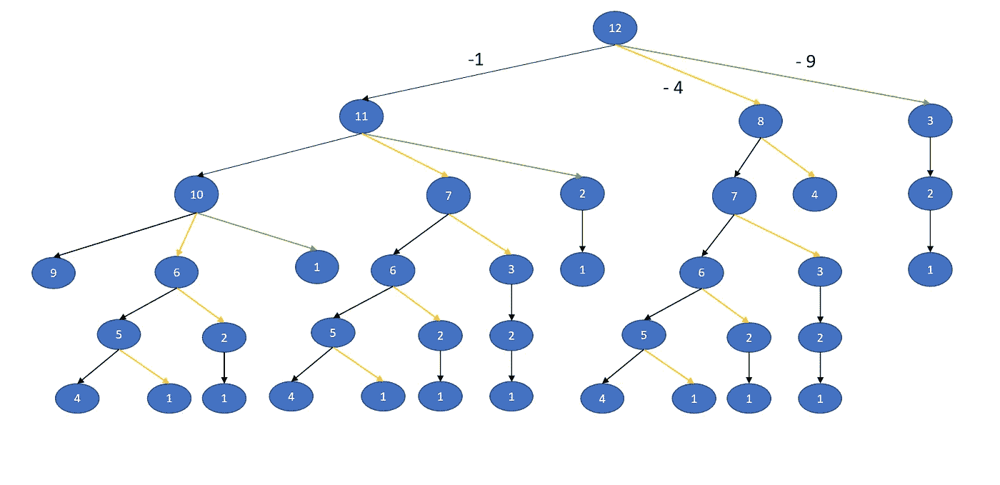
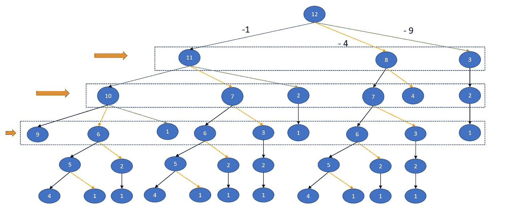
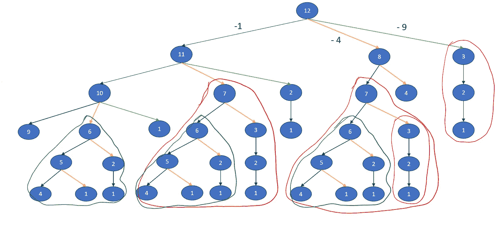
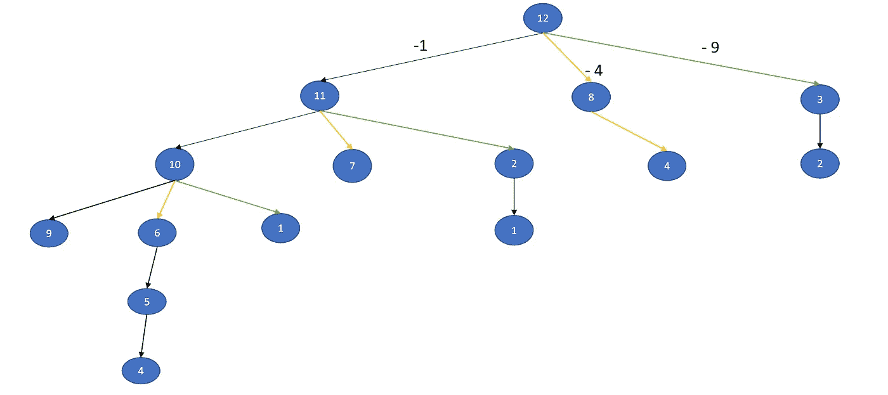
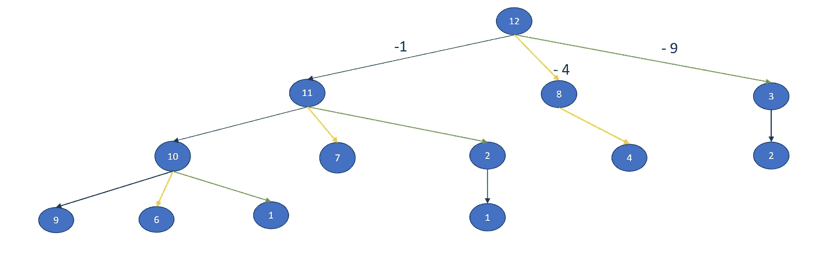
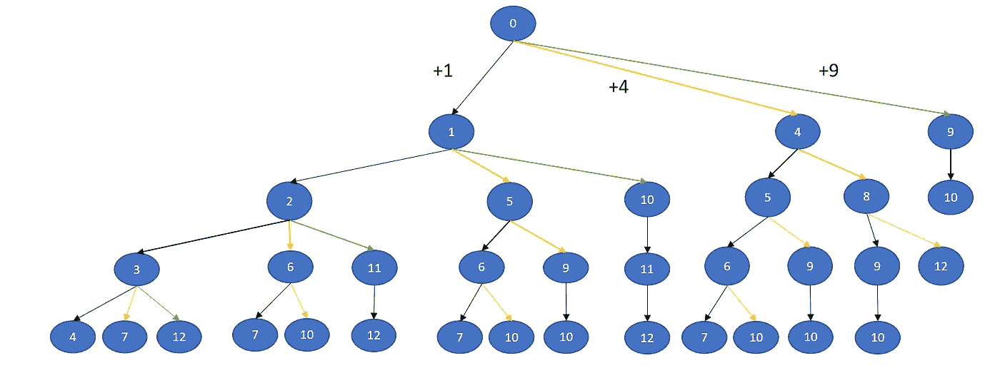

# 完美正方形——Python 程序

> 原文：<https://medium.com/nerd-for-tech/perfect-squares-python-program-b82fff87916f?source=collection_archive---------12----------------------->


[Sharon McCutcheon](https://unsplash.com/@sharonmccutcheon?utm_source=unsplash&utm_medium=referral&utm_content=creditCopyText) 在 [Unsplash](https://unsplash.com/s/photos/squares?utm_source=unsplash&utm_medium=referral&utm_content=creditCopyText) 上拍摄的照片

## 问题:

给定一个整数`n`，返回*与*和`n`之和的最小的完美平方数。

**完美平方**是整数的平方；换句话说，它是某个整数与自身的乘积。例如，`1`、`4`、`9`和`16`是完美的正方形，而`3`和`11`不是。

## 方法:

强力方法建议使用递归函数来寻找所有完美平方的组合，这些完美平方的总和达到目标。然后找出有最小长度的组合的长度。但这只对少数人有效。对于更大的数字，它将抛出 TLE。

我们使用自顶向下的方法来解决这个问题。我们从给定的数字开始，一直减去小于这个数字的完美平方。我们这样做，直到我们达到零。我们以 12 为例。所以小于 12 的完美平方是 1，4，9。所以在任何时候，我们都可以把数字减少 1，4 或者 9。这个过程将生成下面的决策树。



我们试着在每一层看看我们是否达到了一个数字，要么是零，要么是一个完美的平方。



在生成的树中，我们注意到我们有许多重复的子问题。



如果我们去除子问题，我们得到下面的树。



如果我们在任何水平上得到一个零或完美的平方时就中断这个过程，这将进一步减少计算量。



## 代码实现:

```
import math, collections
def numSquares(n):
    pf_sq = set([x**2 for x in range(1, math.ceil(n ** 0.5) + 1)])
    if n in pf_sq:
        return 1
    seen = {n}
    queue = collections.deque([(n, 0)])

    while queue:
        target, count = queue.popleft()
        if target == 0: 
            return count
        if target in pf_sq: 
            return count + 1
        for square in pf_sq:
            new_target = target - square
            if new_target == 0: 
                return count + 1
            if new_target in pf_sq: 
                return count + 2
            if new_target not in seen and new_target > 0:
                queue.append((new_target, count + 1))
                seen.add(new_target)print(numSquares(11))
```

在上面的解决方案中，我们使用了一个队列来实现 BFS 遍历。

上例迭代中的队列值:

```
(12,0)
(11,1), (8,1), (3,1)
(8,1), (3,1), (10,2), (7,2), (2,2), (4,2)
```

seen (set)是为了避免重复计算。

## 方法 2:



在这种方法中，我们从[0]，[1，4，9]，[2，5，10，5，8，10]开始构建，直到达到目标。

## 方法 2: DP

在这种情况下，我们从较小的目标建立目标。

```
def numSquares(n):
    dp = [n]*(n+1)
    dp[0] = 0
    dp[1] = 1

    for target in range(2, n+1):
        tmp = int(math.sqrt(target))
        for s in range(tmp, 0, -1):
            sq = s*s
            dp[target] = min(dp[target], dp[target - sq] + 1)
            if dp[target] == 2 or dp[target] == 1: 
                break
    return dp[n]
```

编码快乐！！