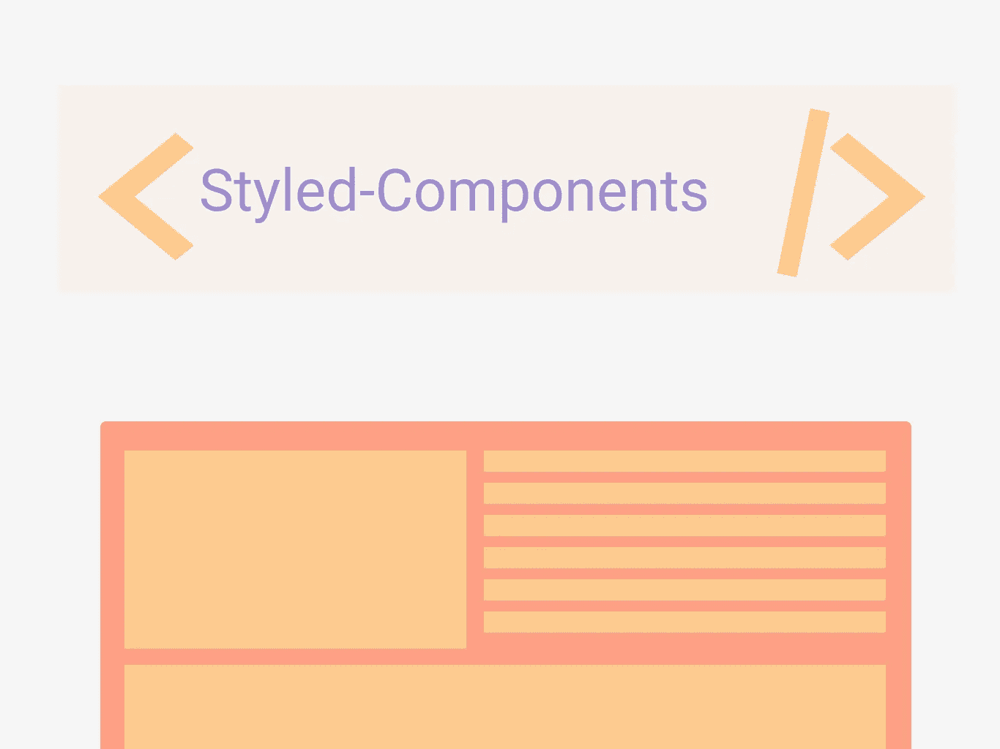

# React 的完美样式库

> 原文：<https://medium.com/nerd-for-tech/perfect-styling-library-for-react-933c533bd1f4?source=collection_archive---------14----------------------->

让我们讨论一下为什么 styled-components 是完美的样式库，然后是 tailwind 和 Emotion。



访问我们的网站([我在阅读](http://ihatereading.in/creativity)

设计 react 组件的样式通常并不容易，但是如果你有一个第三方库，那么你的大部分工作就变得容易了，我总是倾向于使用第三方 UI 库来简化开发。一定要看看我关于完美 UI 库的文章

```
[***https://medium.com/nerd-for-tech/perfect-ui-li***](/nerd-for-tech/perfect-ui-library-with-react-813f41704584?source=your_stories_page-------------------------------------)…
```