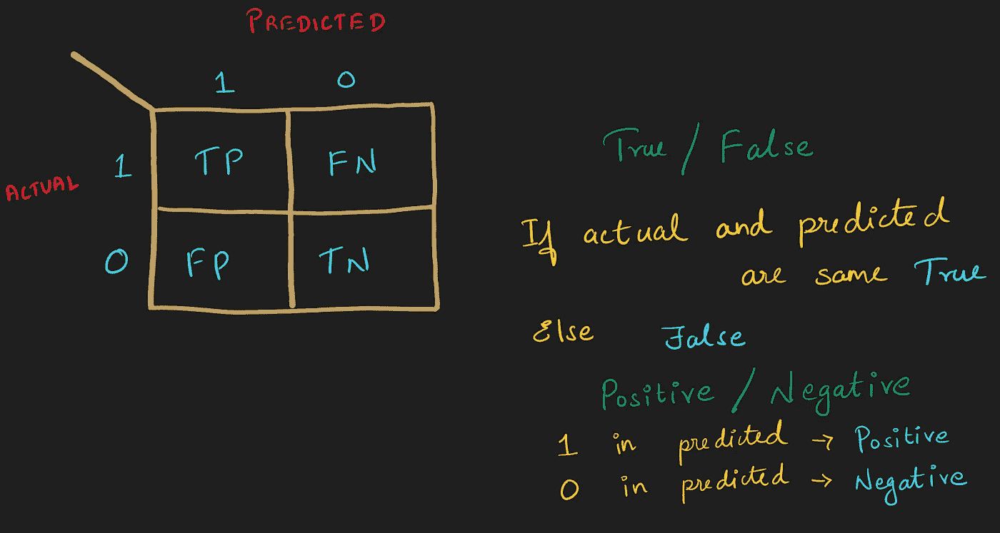
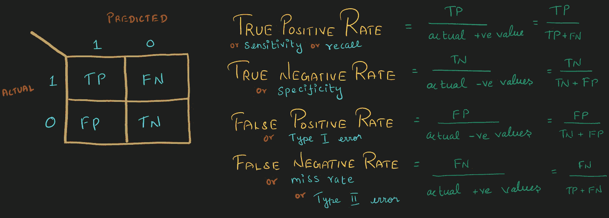
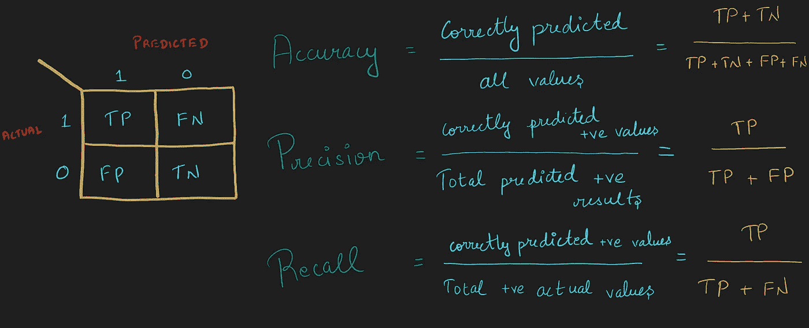
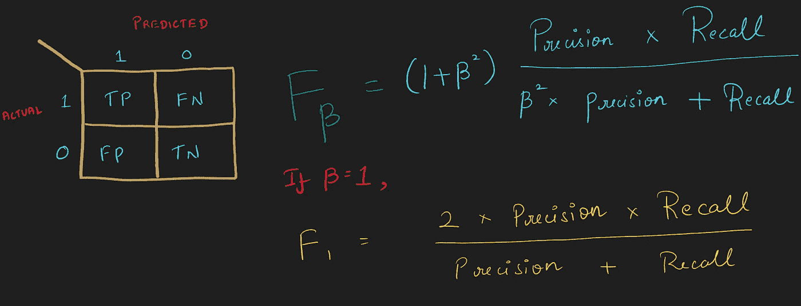
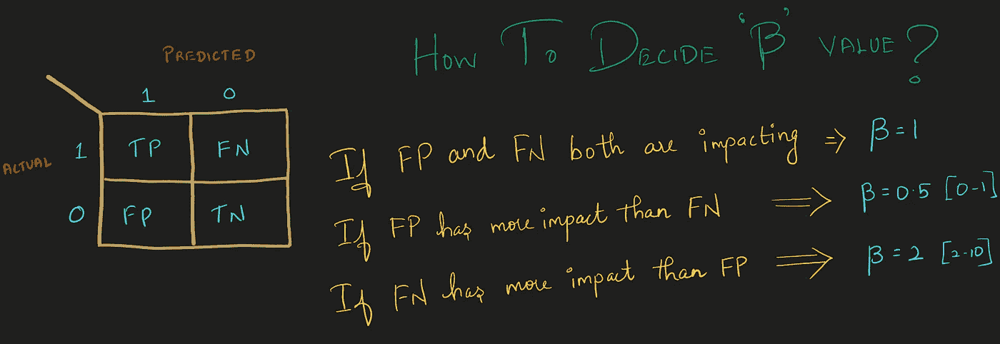

# 分类模型的性能度量

> 原文：<https://medium.com/nerd-for-tech/performance-metrics-for-classification-models-b5602c21315b?source=collection_archive---------13----------------------->

必须考虑模型的性能，以便为我们的数据选择最佳模型。为特定场景选择特定的性能指标也很重要。在这篇博客中，我将解释

*   混淆矩阵
*   跨国激进党，FPR，TNR，FNR
*   第一类和第二类错误
*   敏感性、主观性和失误率
*   精确度和召回率
*   阳性预测值
*   fβ分数

以及何时使用它们。看起来是一长串？但这是一个简短的博客。

## 混淆矩阵:

这个矩阵有助于表示分类结果。这种表示有助于分析模型的性能。

混淆矩阵

在构建混淆矩阵时，遵循以下步骤以避免混淆，

1.  上图**“实际”**在左边，**“预测”**在上面。有些人可能会交换这一点并制造混乱矩阵。如果你是数据科学的新手，你可能会感到困惑，所以当你看到矩阵表示时，一定要注意实际和预测的位置。遵循上图中提到的单一方法，反之亦然，但坚持一种方法，直到你熟悉混淆矩阵
2.  要在矩阵中定位 TP，FP，FN，TN，请遵循以下两个步骤:

*   如果实际值和预测值相同，则**为真**，否则**为假。**
*   如果预测标题为正(上图中的 1 ),则为**正。**如果预测标题为负(上图中为 0 ),则为**负**

## TNR、TPR、FNR、FPR:

TNR、TPR、FNR、FPR

TPR 和 TNR 是相似的。顾名思义，我们将 TP 和 TN 除以相应的实际值+ve 和-ve。

FPR 和 FNR 是不同的。我们将 FP 除以 FPR 的实际值-ve，将 FN 除以实际值+ve。

这四个比率无非是 TP、TN、FP、FN 的比率计算。

**注:**

1.  TPR 又称**灵敏度和召回率。**
2.  TNR 也被称为**特异性。**
3.  FNR 也被称为**失效率和第二类错误**。
4.  FRP 是**I 型误差。**

## **准确度、精密度和召回率:**

**注意:**我们不能使用**准确性**作为所有数据集的衡量标准。准确性只对平衡数据集有效。如果数据集不平衡，我们的模型可能会有偏差，因此使用**精度、召回和 F beta 评分。**

有时，即使数据集是平衡的，基于我们工作的领域，我们也选择精度、召回率和反馈，而不是准确度。

准确度、精确度和召回率

## **精度**

在**所有值**中，有多少值**被我们的模型正确预测**。

## **精度:**

在**总预测阳性**结果中，有多少是**阳性。**

也被称为**阳性预测值(ppv)。**

**精度的应用:**

**垃圾邮件检测—** 如果一封邮件不是垃圾邮件并被归类为垃圾邮件，我们将会错过一封重要的邮件。我们应该减少 FP。当 FP 值影响我们的模型时，重点是提高**精度。**

## 回忆:

在**总的正实际值**中，我们将**正确预测为正**的值有多少。

**召回申请:**

**癌症预测—** 如果一个人没有癌症，而我们的模型说他/她患有癌症，那么就没有风险，因为在进一步的测试中，这个人可能知道他/她没有癌症。如果一个人患有癌症，而我们的模型显示他/她没有癌症，那么这个人的生命就有很大的风险。我们应该减少 FN。当 FN 值影响我们的模型时，重点是增加**回忆。**

## f 测试分数:

在某些情况下，我们需要同时考虑 FP 和 FN 值。在这种情况下，我们使用 F Beta 分数作为我们的性能指标。

**F** - **beta 评分**是精度和召回率的加权调和平均值

fβ分数

仍然有一些情况，即使我们同时考虑 FP 和 FN，在这两者中，我们可能需要给予其中一个更大的重要性，而给予另一个较小的重要性。这些不同情况可以通过选择适当的β值来处理。这是选择β值的指南，

默认的 **beta** 值为 1.0，与 **F** 测量值相同。较小的**β**值，例如 0.5，在计算分数时，给予精确度更大的权重，给予回忆更小的权重，而较大的**β**值，例如 2.0，给予精确度更小的权重，给予回忆更大的权重。

谢谢:-)