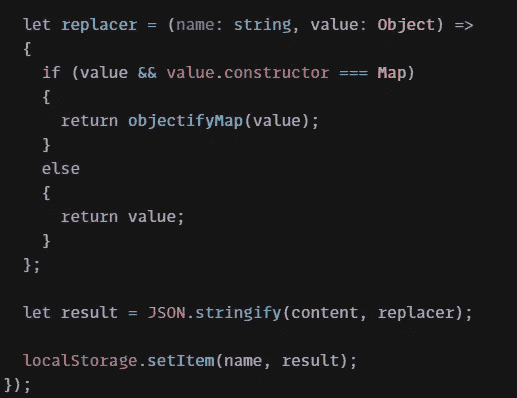
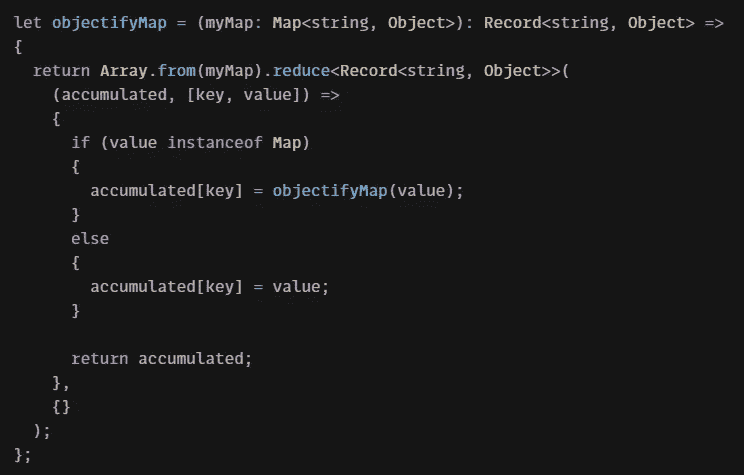
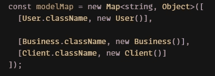
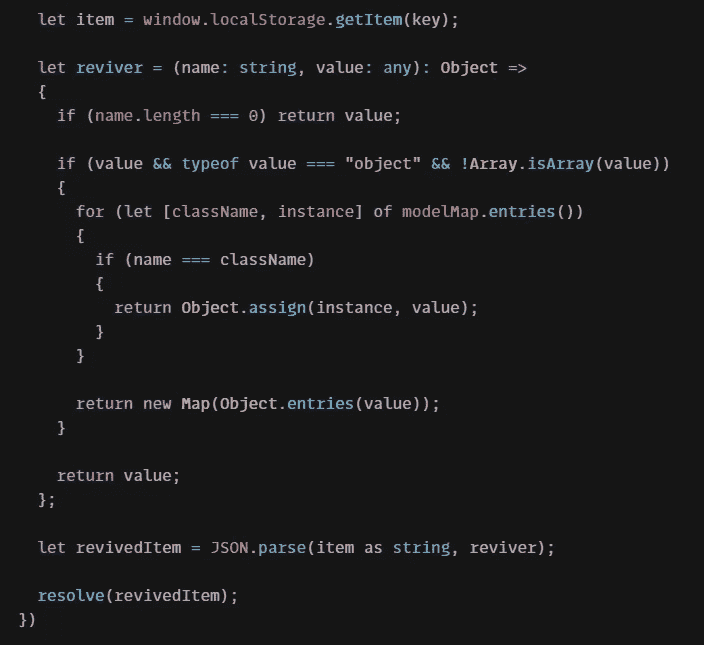

# 用 mobx-persist-store 持久化复杂的地图对象

> 原文：<https://medium.com/nerd-for-tech/persist-your-complex-map-object-with-mobx-persist-store-8530deb017aa?source=collection_archive---------11----------------------->

图片由[约翰·马可·阿诺](https://unsplash.com/@johnmarkarnold)在 [Unsplash](https://unsplash.com/) 上拍摄

如果你曾经持久化过你的 MobX 存储，那很可能是在 **mobx-persist** npm 模块的帮助下，这个模块现在已经随着 [**MobX 6**](https://mobx.js.org/README.html) **的新发布而严重过时了。**因此，对于目前正在使用最新 MobX 版本的人来说，持续使用上述库是一个禁区。你现在可能会说，“*但是我不想写我自己的代码，也不想回到那个旧版本的 MobX，用那些讨厌的装饰者；我想使用一些可爱的 npm 模块来为我做所有的工作！*”，你说得对，因为现在有一个模块就是专门做这个的:[**mobx-persist-store**](https://github.com/quarrant/mobx-persist-store)**。**

这个故事**不应该**成为如何开始使用这个库的指南！制作它的人写了一份关于如何开始的很好的指南。

但是就像每一个年轻的 npm 模块一样，总会缺少一些东西。你在他们的指南上寻找你需要的小东西，然后***噗*，**你意识到在当前版本中它不是现成的。

这正是最近发生在我身上的事。我不得不保留我的`UserStore`,它有一个内部有一个`Map`、以`Object`为值、以`enum`常量为键的类。你可以自己试试！我用的是`mobx-persist-store 1.0.0`。

更详细地说:用户可以有一个以上的具有特定功能的角色。

所以，经过一段时间的研究(反复试验…)，我想出了解决我的问题的**解决方案**:

填充地图，刷新……用户还在！

首先，我们定义了`RootStore`、`StoreContext`、`StoreProvider`和`useStores`钩子，以确保我们得到的是`RootStore`的最新实例。其次，我们然后定义领域模型和其他存储；我的情况是`UserStore`。

现在真正的部分开始了！我们用`makeAutoObservable`使我们的`UserStore`可观察，用`makePersistable`函数可持久。如果我们的存储有内部没有任何复杂对象类型的类，我们就可以用默认的方法使我们的存储持久化。这里的情况不是这样，所以我们必须定义我们的项目**如何存储**，**如何移除，**和**如何从选择的本地存储中读取**(`localStorage`，`sessionStorage`，`localForage` …)。

我们如何存储我们的`Map`是一个简单的方法；我们调用传递了`replacer`函数的`JSON.stringify`方法，该函数检查传递的值是否为`Map`，如果是，则在那个`Map`上再次调用它，否则返回原始值。

JSON.stringify 方法的 Replacer 函数

嵌套对象的递归帮助器

项目移除是使用默认方法完成的。

现在是阅读部分；如果我们要水化这样的存储，我们必须知道在所说的`Map`中存储的是什么类型的对象。不幸的是，我们不能使用`instance.constructor.name`,因为我们的类名很可能会因为代码的缩减而改变。所以为了避免这种情况，我们必须定义一个返回类名的方法(是的，我知道😬)或者创建一个`enum`来保存同样的东西(*挑选你的毒药*)。这样一来，我们现在可以创建类名的`Map`作为键，创建这些类的“空”实例作为值。

**最后一步**:我们调用传递了`reviver`函数的`JSON.parse`函数。该函数的工作是检查传递的名称是否与我们新创建的`Map`中的名称相匹配。如果是这样，我们可以将所有的值赋给该类的“空”实例。

JSON.parse 方法的 Reviver 函数

🎉恭喜你。您现在正在保存您的商店😃。请在评论中分享你的想法，或者如果你知道如何做更好，请发布 codesandbox！