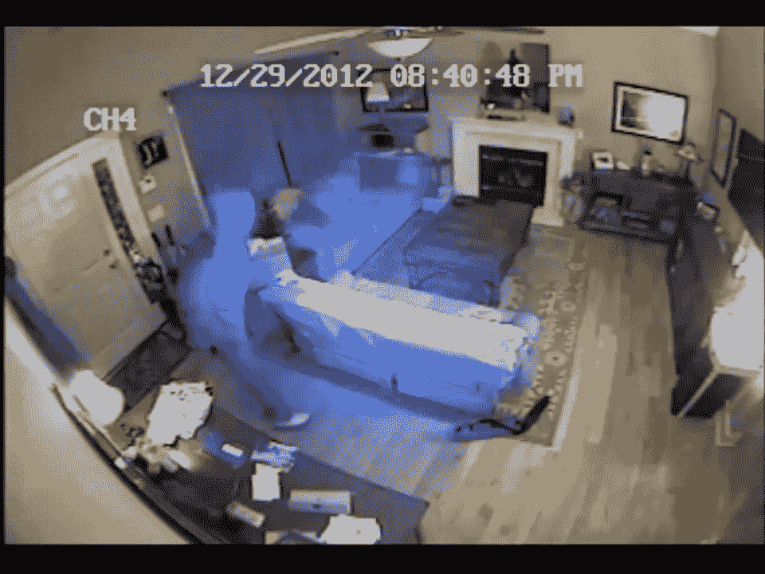
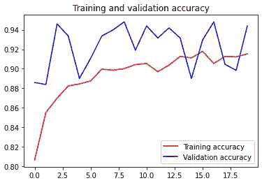
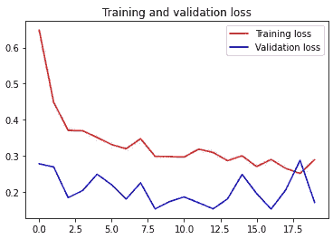

# 基于闭路电视监控视频的人员分类

> 原文：<https://medium.com/nerd-for-tech/person-classification-using-cctv-surveillance-video-84aa70a4c296?source=collection_archive---------10----------------------->

在这篇文章中，我想分享一下我的 Google Bangkit Capstone 项目。该项目是关于空屋监测应用程序，可以发送通知，如果有人在房子里。

有时，当我们需要让房子空着去度假时，我们会让房子无人看守。我们使用可以通过应用程序监控的闭路电视摄像机，但我们需要一直监控镜头，因为传统的闭路电视监控应用程序通常无法检测到人的存在。我的团队设计了一个系统，使用机器学习方法来分类现场是否有人，以防止在空房子里发生犯罪。

空房子的闭路电视录像

# 图像分类

我们使用图像分类的方法来实现我们设计的解决方案。图像分类通过定义一组目标类(要在图像中识别对象)并使用标记的示例照片训练模型来识别它们来工作。[1]

这个项目中只有两个类，person 和 no person。因此该项目将使用图像进行二值分类。

进行分类有几个步骤

1.  准备数据集
2.  建立神经网络模型
3.  使用收集的数据集训练模型
4.  测试模型。

# 准备数据集

基于我们想解决的问题，我们需要一个房子里的监控录像。我从 YouTube 视频和 CCTV 录像中收集数据，然后使用这个脚本一帧一帧地分割视频

按帧分割视频的脚本

我为 1 帧定制了 3 秒的切片，以减少多次捕获的相似帧。总共获得 2394 帧，然后分成 80%用于训练，20%用于验证。训练和验证文件的路径结构如下:

# 建立神经网络模型

在这个项目中，我使用迁移学习的方法来实现图像分类算法。InceptionV3 用作预训练模型来对图像进行分类。

Inception v3 是一种广泛使用的图像识别模型，已被证明在 ImageNet 数据集上获得了超过 78.1%的准确率。该模型是多年来多名研究人员开发的许多想法的结晶。它基于原始论文:[“重新思考计算机视觉的初始架构”](https://arxiv.org/abs/1512.00567)，作者 Szegedy 等人。艾尔。[2]

要导入 Inceptionv3 的代码段

上面的代码将把 Inceptionv3 模型导入到我们的 colab 中，然后打印模型摘要以查看层是如何排列的。输入设置为 256x256 像素，3 色通道(RGB)

对于这个项目，我只使用 InceptionV3 模型，直到“混合 7”层，然后展平为 1 维。扁平化模型进入密集层，具有 1024 个隐单元和 ReLu 激活函数。

我使用了 20%的下降层来减少过度拟合，然后输出设置为单个 sigmoid 层。使用 RMSprop 编译的模型具有 0.0001 学习率、二进制交叉熵损失(因为它是二进制分类)和准确性度量。

# 培养

在训练模型之前，我们需要将数据集上传到笔记本中。为了使它更容易，我已经将数据集上传到驱动器中，所以它只需要安装到我们的笔记本上

上传图像后，我们需要做图像增强。我使用 ImageDataGenerator 通过实时数据增强生成批量张量图像数据。

一切准备就绪后，我们开始训练吧！

经过 20 个纪元的训练，结果如下:

培训和验证准确性

培训和验证损失

该模型在某些时候往往有点过拟合，正如在训练精度略大于验证精度时所看到的那样。这是意料之中的，因为缺乏数据集的多样性。为了解决这个问题，我认为增加数据的多样性会有所帮助。

# 测试

视频测试通过逐帧分类图像来完成。为此，我们需要运行以下代码

在我们填充我们的框架之前，我们需要对它进行预处理。我们必须确保格式已经是 RGB 格式，像素大小调整为 256x256 像素。然后我们归一化帧值。

如果预测值> 0.5，则被分类为包含帧的人。结果如下:

分类结果

该模型成功地对帧上的人进行了分类。

对于这个项目，我已经创建了一个使用 FastAPI 在 GCP 部署模型的 API。如果你感兴趣，你可以在这里查看

链接到[笔记本](https://colab.research.google.com/drive/1i0gQkQnIVvdY5a4rlJhT30DmhoFNMGR4?usp=sharing)

我和我的朋友一起参与了这个项目，欢迎访问[https://fragitya . medium . com/person-classification-on-CCTV-video-21 BC 0 c 7 Fe 24 e](https://fragitya.medium.com/person-classification-on-cctv-video-21bc0c7fe24e)

**来源:**

[1][https://developers . Google . com/machine-learning/practica/image-class ification](https://developers.google.com/machine-learning/practica/image-classification)

[https://cloud.google.com/tpu/docs/inception-v3-advanced](https://cloud.google.com/tpu/docs/inception-v3-advanced)