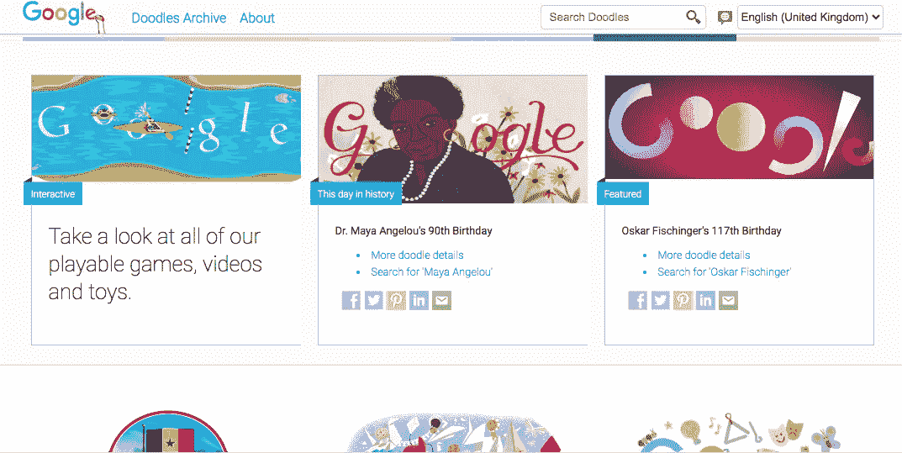

# 个性化和独立日

> 原文：<https://medium.com/nerd-for-tech/personalization-and-independence-day-d296cf28d294?source=collection_archive---------19----------------------->

塞内加尔独立日美食

个性化是这项技术试图实现的目标。像我这样的人会做这样的事情。互联网使用更多的个性化，人工智能和从我们的在线行为中收集的数据取得的进展将使我们越来越觉得我们在线消费的内容是专门为我们制作的。但个性化永远不可能做到极致，因为像处理和存储能力这样的物理限制将使它达到渐近水平。那么我们将得到的不是个人化，而是部落化，一小群看起来、感觉和品味都一样的人。生活不是这样的，我们每个人都有独特的性格，这是区别于其他人的关键，但我们将设计的算法很难达到这种个性化的粒度水平，我们可以称之为[拟人化](https://seths.blog/2021/03/errors-in-personification/)。

谷歌从一个非常简单的用户界面开始，但通过要求设计师和插画师通过一项挑战带来谷歌标志的主题设计，试图早期实现这个简单用户界面的个性化。自从他们开始这个实验以来，谷歌从未停止过它，这现在是搜索引擎的一个关键区别因素。谷歌的这些个性化标识被称为涂鸦。

你可以在这里得到它们。

作为这篇文章的特色图片，主题是塞内加尔独立日，这个西非国家就在美国东部的前面。

祝所有塞内加尔人独立日快乐

谷歌涂鸦网站