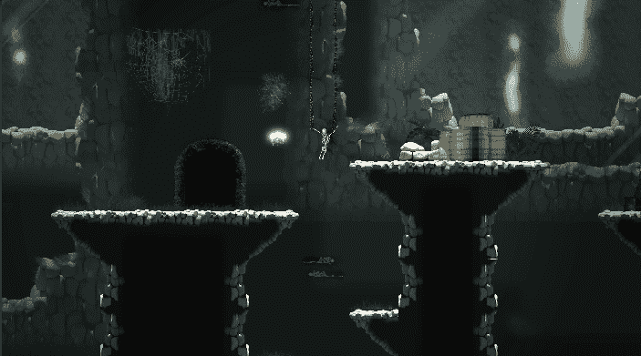
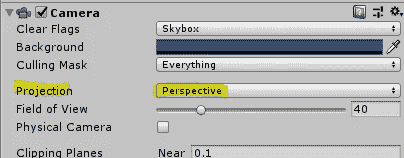
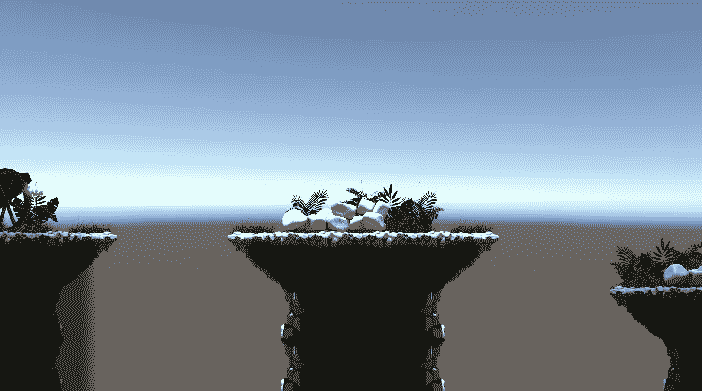
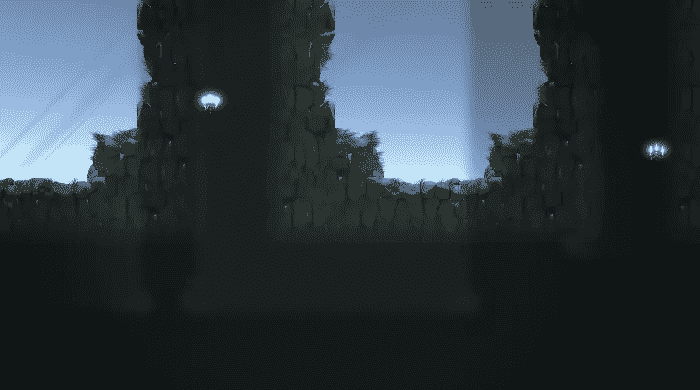
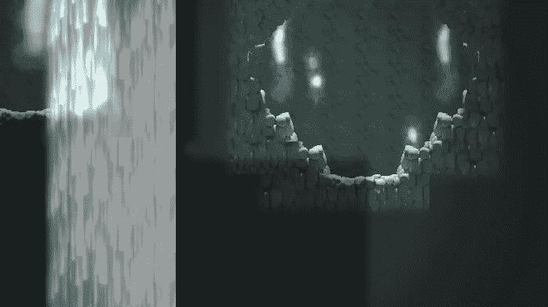

# 透视视差

> 原文：<https://medium.com/nerd-for-tech/perspective-parallax-e3248978705f?source=collection_archive---------16----------------------->

目标:用我们的背景创建一个视差效果。

瀑布的视角尤其引人注目。

为了达到视差效果，我们必须确保我们的相机处于*视角*模式。

接下来，我们将设置不同图层的 *z 位置*。z 位置的*越大，*离摄像机越远。**

以下是中使用的设置。上面的 GIF:

前景的 z 位置为 0。

黑色洞穴背景的 z 位置为 1。

瀑布和灰色洞穴背景的 z 位置为 3。