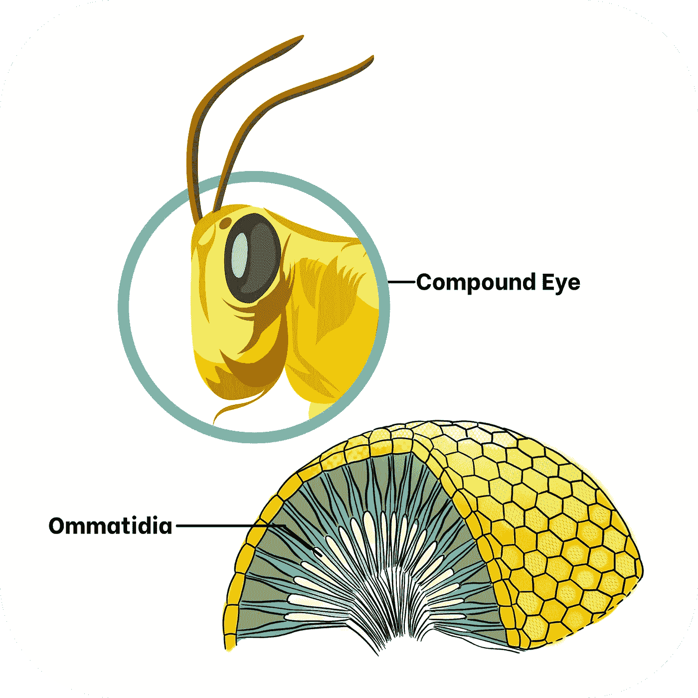
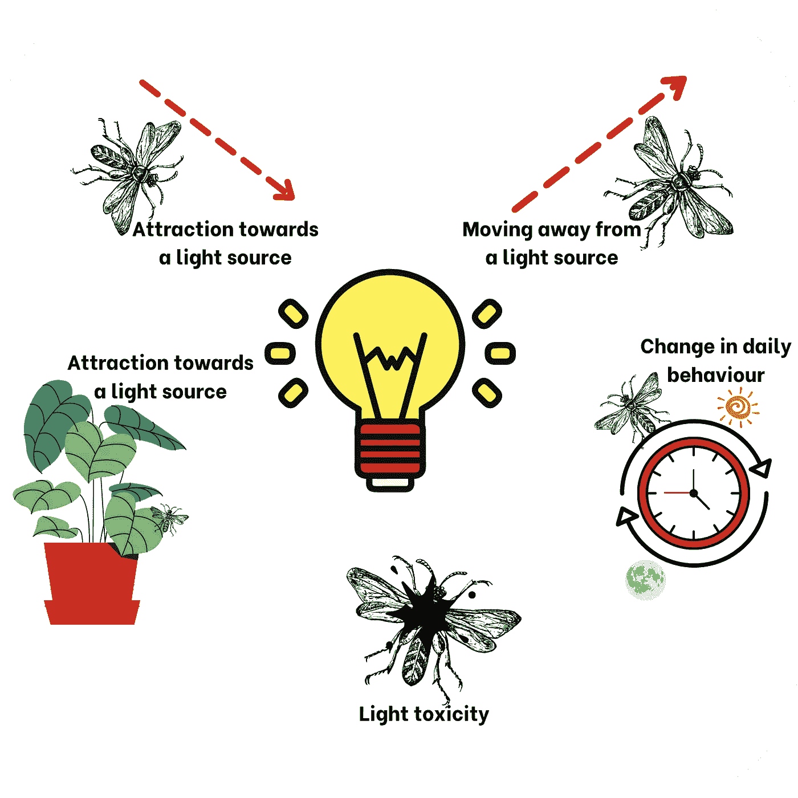
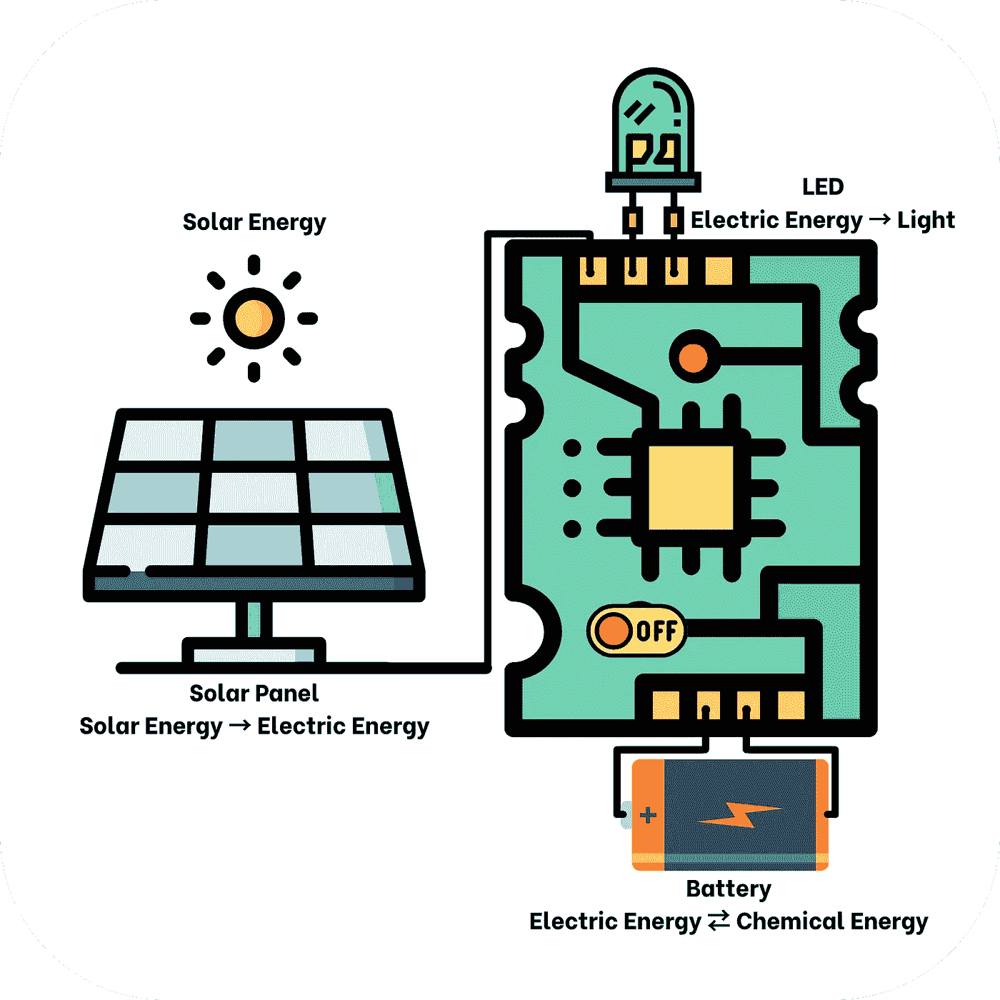
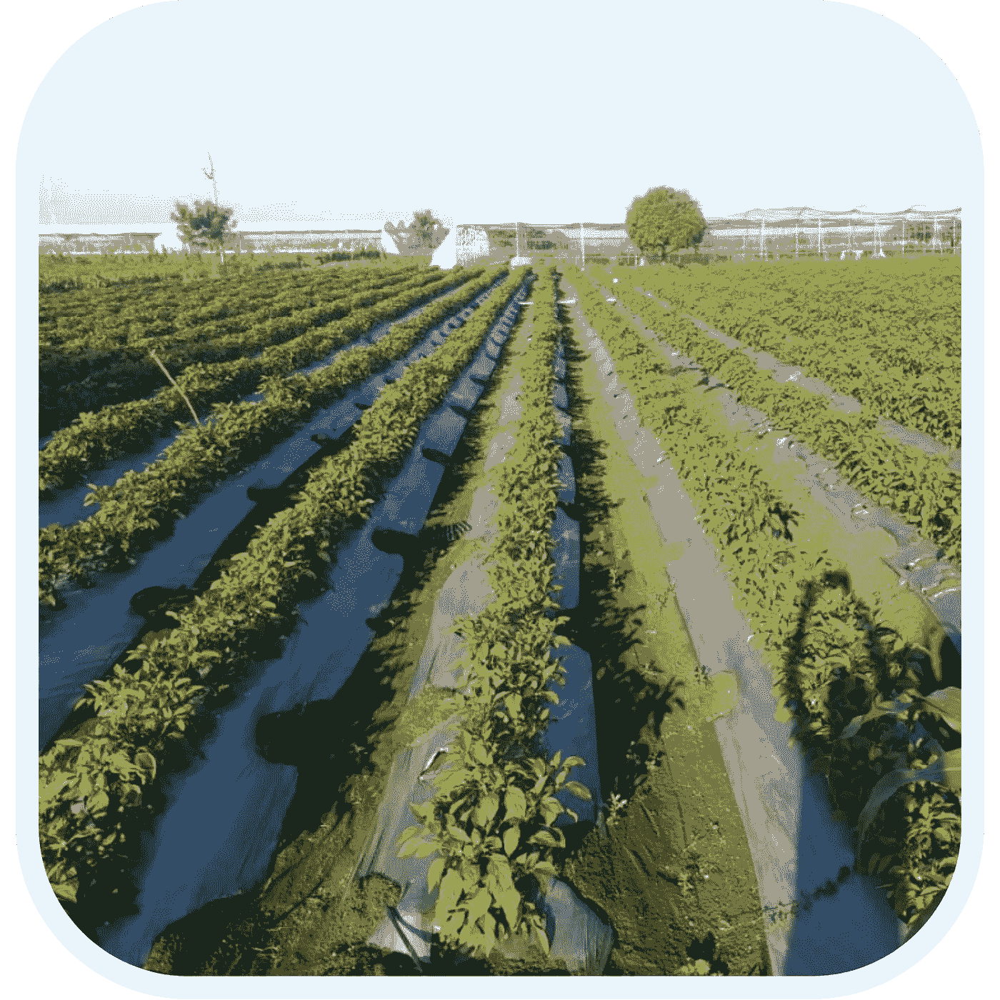
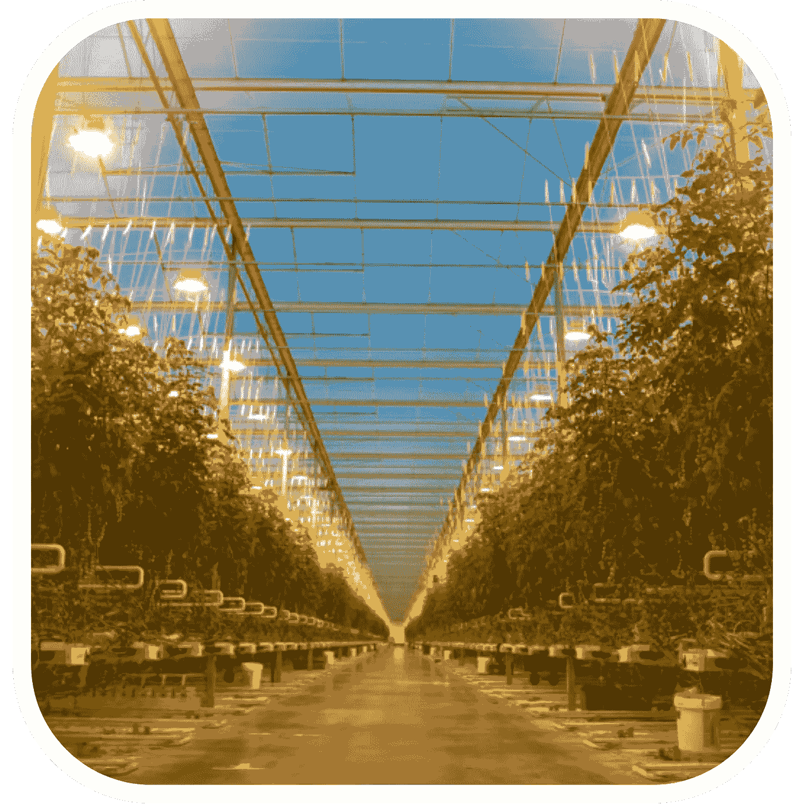

# 使用光响应的害虫管理

> 原文：<https://medium.com/nerd-for-tech/pest-management-using-photoresponse-8df4bea8b034?source=collection_archive---------25----------------------->

印度的害虫控制主要基于农用化学品，这加剧了我国的健康退化。在农业生态系统中，正在使用对所有生命形式有害的致癌添加剂。这种情况吸引了研究人员对非化学害虫管理技术的发展的关注。

如今，在午餐或晚餐时，我们经常发现煮熟的蔬菜里面有固体部分。一部分蔬菜由于在生产过程中使用了人造原料而变坏了。虽然一瞬间改变整个系统是不可能的，但生态友好的替代品肯定是一条出路。

涉及光响应的技术已经被用于对付住宅害虫，但是这种系统还没有在农业土地上进行大规模的测试。

图一。昆虫眼睛的解剖

## 首先，让我们看一下昆虫解剖学。

复眼——角膜、晶状体和感光细胞组成了微小的独立感光单元，可以区分亮度和颜色。

小眼(单数:小眼)——小眼一起工作以给出镶嵌图像。(图 1)这些复眼高度敏感，甚至可以捕捉紫外线。

图二。昆虫对光源的一般反应。

## 昆虫对光谱的反应

人类可以看到 400 纳米到 700 纳米的光谱。相反，大多数昆虫只能看到 300 纳米到 450 纳米的光。为了吸引害虫，380-420 纳米的范围是最好的，因为这是 UV-A 光的核心范围，这是引诱昆虫的最重要的方面之一。(图 2)

## led 在害虫管理中的适用性

发光二极管或 led 因其效率和寿命而越来越受害虫控制的欢迎。根据一些研究，发射 UV-A 光谱(370 纳米–410 纳米)、蓝色(460 纳米)或其混合物的发光二极管对害虫有吸引力。

图 3。使用生态友好措施实施光响应技术。

## 与实施有关的问题

渗透到耕作区的配电系统的不足是使用光陷阱来追踪甚至控制灌溉作物害虫的一个严重障碍。研究人员已经实现了一个自主光诱饵系统，该系统使用光伏太阳能为电子设备供电，以解决这一障碍。它将安装低能耗的发光二极管作为光源。(图 3)在此之前，所有计划和制造的自主式诱虫灯都使用 BL 荧光灯，这需要一个大型电池组来供电。

## 害虫管理的其他方法是什么？

图一。银色反光 mulchin [1]

银色地膜——在塑料地膜中发现了驱虫剂的性能，金属银色阳光闪烁在顶部表面。(图片 1)银色覆盖物通过将阳光反射到树冠下侧来增加光合作用。银色覆盖物的反射表面增加了光线的强度，这阻止了聚集在树叶阴影下的昆虫。阳光反射覆盖物，照亮叶子的下部，影响昆虫的趋光性。(图 2)

图二。在农场使用黄灯[2]

使用黄光——晚上在果园里使用黄光光源可以有效阻止破坏。(图 2)这种方法利用了这样一个事实，即当昆虫在晚上接触到超过一定亮度的光线时，它们的复眼会像白天一样适应，抑制夜间飞行、吮吸水果中的液体和繁殖等特征。(图 2)

## 你可能会问，为什么是“利用光响应进行害虫管理”？

它降低了农药的年平均成本，同时通过消除有害化学物质改善了作物健康。随着虫害的减少，农产品的平均年浪费也可以减少。例如，2020 年的蝗灾对农民本已艰难的生计造成了巨大影响。在当前疫情局势下，印度农民需要廉价有效的方法来帮助他们收割。此外，由于不使用杀虫剂，这些作物在食用时产生任何有害化学效应的风险较低。

图 3。卡纳塔克邦使用的太阳能灯陷阱[3]

## 印度的未来范围

太阳能诱虫灯已经被用作一种环保措施，也是南印度农场“印度制造”活动的一部分。(图 3)这些设备发出的光抑制了昆虫复眼中的小眼区域。(图 1)

**参考文献**

> [https://www . steviashantanu . com/physical-methods-of-stevia-pest-control](https://www.steviashantanu.com/physical-methods-of-stevia-pest-control)
> 
> Masami S，Ken-ichiro H (2013)昆虫对光的反应及其在害虫管理中的应用应用昆虫学和动物学第 48 卷:413–421 页
> 
> 加拿大 https://www.refrigeratedfrozenfood.com/articles/98311-32 英亩温室的自然新鲜农场开张了
> 
> 爱德华多·RH、古斯塔沃·CK、代博拉·DZ、麦孔·WC、布鲁诺·B、耶尔斯·RN(2018)不同波长的发光二极管(led)对南美稻水象甲的吸引力 Arq。本月的生物。第 85 卷，刊号 0020- 3653
> 
> [https://www . manufacturing . net/operations/article/13163285/害虫控制诱饵](https://www.manufacturing.net/operations/article/13163285/pest-control-the-lure-of-lights)

**由** [**苏瓦**](https://www.linkedin.com/in/suvrashaw/) **和** [**苏迪普塔**](https://www.linkedin.com/in/sudipta-sarkar-6b14b5207/) **带着爱。💚**

该项目的 GitHub 微型网站—[https://github.com/suvrashaw/PMuPr](https://github.com/suvrashaw/PMuPr)